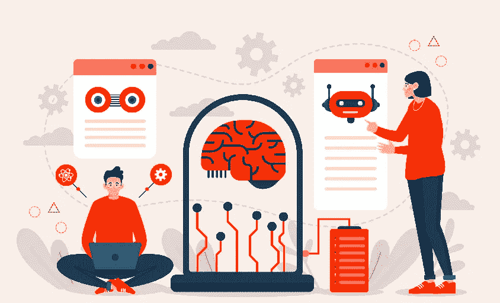

# 人工智能正在对当今企业产生重大影响的 3 个令人兴奋的领域。

> 原文：<https://medium.com/codex/3-exciting-areas-where-artificial-intelligence-is-having-a-significant-impact-on-businesses-today-87b25f18df0c?source=collection_archive---------10----------------------->

来源:freepik 创建的设计向量—[www.freepik.com](http://www.freepik.com)

# 随着人工智能影响全球几乎每个行业，一些领域开始崭露头角。

人工智能正在扰乱我们的生活方式，在过去几年中，它在商业转型中发挥了关键作用。