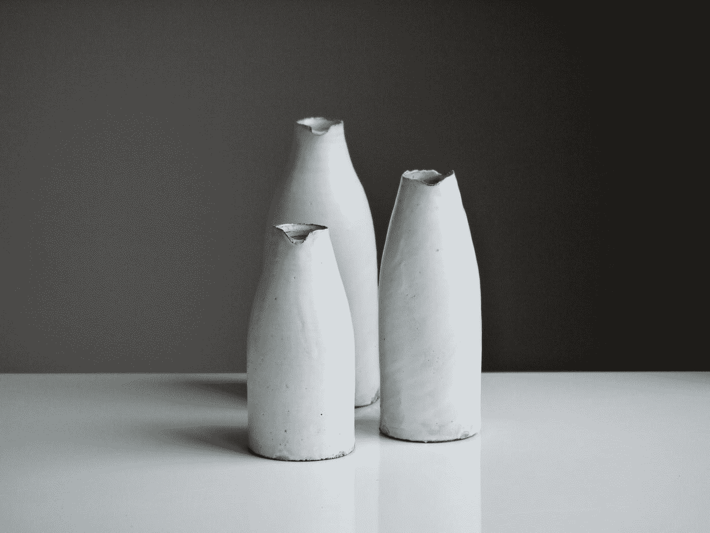
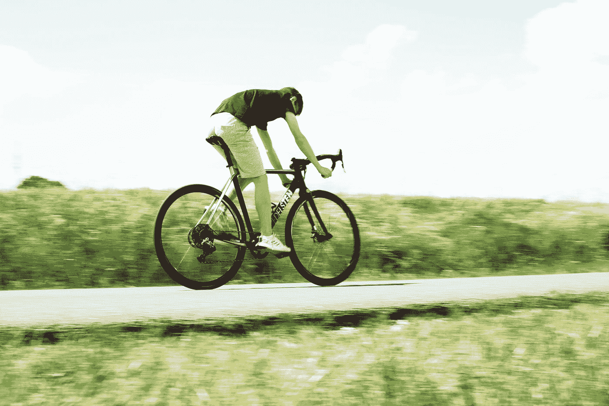

# 求职面试中 3 个有趣的问题解决方法

> 原文：<https://medium.com/codex/3-fun-problem-solving-questions-in-a-job-interview-2df6bc49ce98?source=collection_archive---------8----------------------->

## 让我们测试一下你解决问题的能力

乔希·里默尔在 [Unsplash](https://unsplash.com?utm_source=medium&utm_medium=referral) 上的照片

一个月前，我参加了一家法国银行和当地一家中型企业的面试。在两次面试中，我都被要求解决一些问题。他们是为了测试我解决问题的能力。我想这是最近 it 职位面试的一个新趋势，因为我的工作主要需要良好的逻辑思维。

撇开谦虚不谈，我能够正确地回答所有的问题。大概我的脑细胞那次清醒多了。我成功地收到了两家公司的工作邀请，但我在一家跨国公司找到了工作。

我觉得给我的解题题很好玩，所以想和大家分享一下。

他们来了！

# 灯泡挑战

Aurélien Lemasson-Théobald 在 [Unsplash](https://unsplash.com?utm_source=medium&utm_medium=referral) 上拍摄的照片

假设有一个房间挂着三个灯泡。它们都工作正常。

每个灯泡都有一个开关。所有三个开关都位于室外，距离房间 5 米。

如果你只有一次进入房间看灯泡的机会，你怎么知道哪个开关是哪个灯泡的？

你必须识别每个灯泡的开关。

# 加仑水挑战

[Tom Crew](https://unsplash.com/@tomcrewceramics?utm_source=medium&utm_medium=referral) 在 [Unsplash](https://unsplash.com?utm_source=medium&utm_medium=referral) 上拍照

假设给你一个 4 加仑的水罐和一个 3 加仑的水罐。两个投手都没有测量标记。

还有一个可以取水的水龙头和一个可以倒水的水槽。

使用两个水罐，你怎样才能准确地将 2 加仑的水倒入 4 加仑的水罐中？

请记住，除了两个水罐，你没有其他容器。

# 自行车挑战

马库斯·斯皮斯克在 [Unsplash](https://unsplash.com?utm_source=medium&utm_medium=referral) 上拍摄的照片

假设你有一辆崭新的自行车和一个备用轮胎。

每个轮子最大可以行驶 500 公里。

有了新自行车和一个备用轮胎，你能行驶的最大距离是多少？

那么，怎么样？你能解决它们吗？有趣又有挑战性，对吧？

我希望你玩得开心！如果你还在解，我知道你能行！但是，如果你需要知道答案，请在评论区告诉我。

祝你好运，感谢你的阅读！