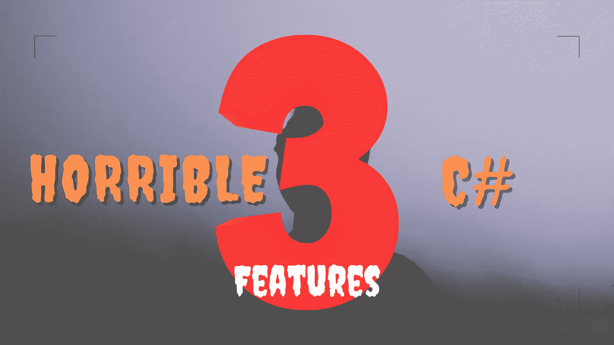

# 为了保住工作，你应该避免使用 C#中的 3 种可怕技术

> 原文：<https://medium.com/codex/3-horrible-techniques-in-c-you-should-avoid-to-save-your-job-bc52b8ba5183?source=collection_archive---------1----------------------->

## 别碰这些东西。

图片由[作者](http://www.arnoldcode.com)制作

这篇文章更适合万圣节前后的时间。

但是下面的结构会让你毛骨悚然。我不得不在一年中的任何时候警告他们。由于任何开发人员的不同偏好和习惯，代码看起来总是不同的…