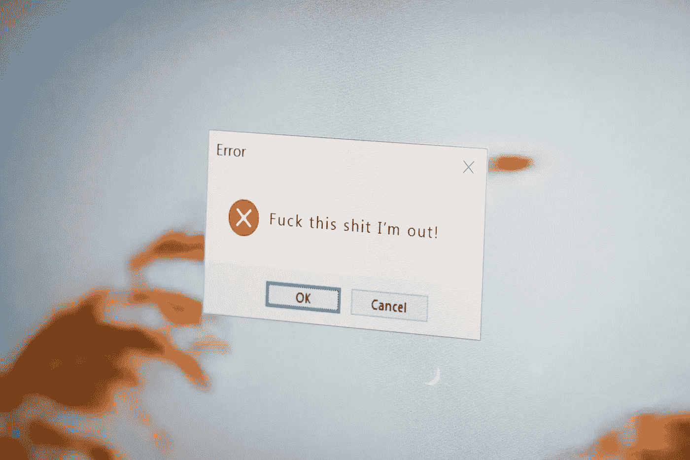
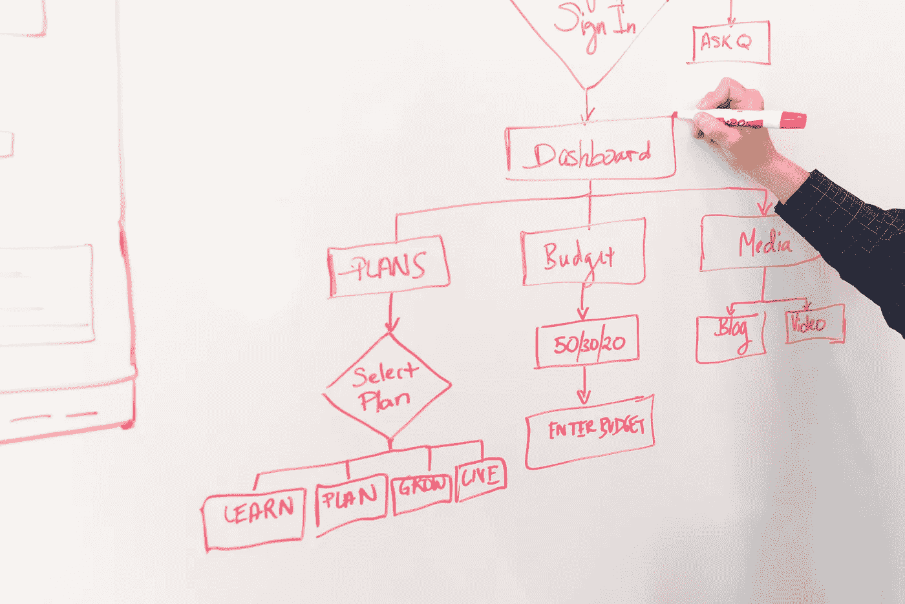

# 开发人员必须具备的 3 个重要的非技术性问题解决技能

> 原文：<https://medium.com/codex/3-important-non-technical-problem-solving-skills-a-developer-must-have-7892936ec731?source=collection_archive---------4----------------------->

吉尔·Á·阿尔瓦雷斯在 [Unsplash](https://unsplash.com/s/photos/skills?utm_source=unsplash&utm_medium=referral&utm_content=creditCopyText) 上的照片

鉴于软件开发人员和程序员之间的区别实际上是不存在的，程序员/开发人员必须学习他/她的公司正在开发的应用程序的许多方面。

除了技术方面，当谈到解决问题的技巧时，人们还必须更加关注错误的人的方面。

在这篇文章中，让我列出三个我认为非常重要并且需要一段时间培养的技能。

## 识别人为错误

照片由[农 V](https://unsplash.com/@californong?utm_source=unsplash&utm_medium=referral&utm_content=creditCopyText) 在 [Unsplash](https://unsplash.com/s/photos/error?utm_source=unsplash&utm_medium=referral&utm_content=creditCopyText)

通常，在较低(非生产)环境中提出的缺陷最终成为测试数据或测试场景的问题。

在取出所有日志并将 IDE 切换到调试模式之前，请分析和评估情况。

场景有效吗？测试数据准确吗？

最糟糕的是，确保在产生缺陷的环境中，正确的代码是可用的。

***需要什么技能？*** 清楚了解业务需求。

## 了解组件

照片由[克里斯蒂娜@ wocintechchat.com](https://unsplash.com/@wocintechchat?utm_source=unsplash&utm_medium=referral&utm_content=creditCopyText)在 [Unsplash](https://unsplash.com/s/photos/software-development?utm_source=unsplash&utm_medium=referral&utm_content=creditCopyText) 上拍摄

作为一名程序员，你已经按照需求进行了编码，单元和集成测试，并部署到测试环境中。

你的代码现在不工作了，你将如何解决这个问题？

对应用中涉及的不同系统和软件组件有一个基本的了解。

您的代码可能因为以下假设情况而无法工作，

1.  外部系统的响应不符合预期。
2.  来自某个第三方 API 的响应失败，您的代码从未执行。
3.  产生了异步消息，但是编写代码的消费者服务没有消费消息，也没有执行代码。

> 有趣的事实:第三种情况发生在现实中，我的代码被一个天才毫无理由地还原了。我当时不知道如何识别:D 的卡夫卡问题

这些问题中的任何一个以及更多的问题都可能在现实生活中发生，您应该对应用程序中涉及的多方有一个基本的了解。

***需要的技能？*** 一个 wiki 页面来记录应用程序架构和理解组件的基本技能。

## 隔离错误

照片由[乌苏拉·德雷克](https://unsplash.com/@ursuladrake?utm_source=unsplash&utm_medium=referral&utm_content=creditCopyText)在 [Unsplash](https://unsplash.com/s/photos/island?utm_source=unsplash&utm_medium=referral&utm_content=creditCopyText) 拍摄

在使用任何技术专家来解决问题之前，尽可能地隔离问题。

从基本问题开始，比如，

1.  什么时候注意到这个问题的？这是从什么时候开始的？日志或监控工具可以帮助您识别这一点。
2.  那时有什么变化吗？数据库迁移发生了吗？有代码部署吗？那段时间有没有发生什么软件补丁？那段时间有定期维护吗？从最基本的问题开始。
3.  如果它与代码部署相关，请检查提交历史并验证新的更改。如果是修补，请验证使用相同产品的任何其他服务。
4.  如果数据检索失败，请验证数据是否已从应用程序中正确保存，等等。

大多数问题隔离过程与您开发软件或编程概念的技术能力没有直接关系。它更多的是关于你对应用程序中各部分的基本理解。

如果 x 和 y 消耗 z，而 y 不工作，那么验证 x 是否工作正常，如果是，很可能是 y 的问题，如果不是，那么检查 z。

在我的职业生涯中，到目前为止，我已经调试了很多软件问题，其中一些是在我没有直接参与的系统和服务中。我的管理层在让我参加任何生产分类电话会议时对我的信任是我有能力将问题缩小到其根源。如前所述，我很少把这种能力归因于我的专业技能&这都是分析能力。

***需要什么技能？*** 逻辑推理。

## 结论

希望这篇文章对你有用。让我知道一些你在工作中用来解决申请问题的非技术技能。