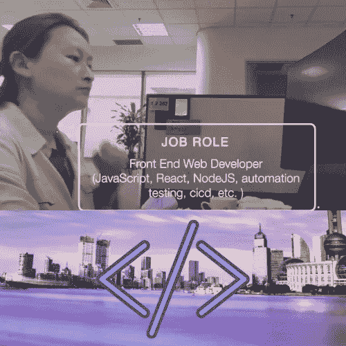

# 作为一名网站开发人员，我在 3 年的旅程中学到了 3 个重要的经验

> 原文：<https://medium.com/codex/3-lessons-i-learnt-while-being-a-web-developer-for-three-years-df3b265eaedc?source=collection_archive---------18----------------------->

## 在不同的工作岗位上学习和成长。

我的第二份开发工作是在中国上海做前端 web 开发。(2020–2022)(图片由[李冠仪](https://medium.com/u/9f2dc23bfffa?source=post_page-----df3b265eaedc--------------------------------)提供)

我学到的经验希望能节省你的时间和精力，帮助你应对工作中的压力。

# 第 1 课:理解初级 Web 开发人员的基本知识