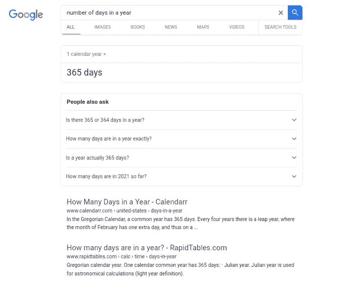

# 4 分钟了解谷歌繁忙的大脑

> 原文：<https://medium.com/codex/3-minutes-into-googles-big-busy-brain-c86529733867?source=collection_archive---------26----------------------->

# 谷歌是怎么想的？

像我一样，你可能总是想知道谷歌大脑内部是什么样子的，以及到底是什么东西保存了数百万条结果，当你点击搜索按钮时，这些结果就在你的指尖上。

经过几年的思考和几个月的研究，我终于也理解了谷歌框架背后的一些概念，我将在本文中分享我的经验。

注意:在写这篇文章的时候，我假设你对 SEO 一无所知，所以这是很基本的理解(哦，你对 SEO 很熟悉？太好了！).

# 一开始，谷歌创造了…

这一切都始于几年前，当时谷歌加入了雅虎的行列，在互联网上提供资源网络。那时的事物还很幼稚，大多数最酷的技术还没有诞生。

在那个时候，你需要某种超能力来让谷歌明白“石头”可能意味着一块矿石，一个名人甚至是一部电影(哈哈！这似乎太不可能了)。

事情在 2012 年变得有点有趣，当时谷歌开发了知识图，这意味着谷歌开始从“字符串”理解“事物”，即它可以在看到字符 A 的任何地方理解 A，并可以在 AB 和 ABC 之间建立一些真正的联系。

还不明白吗？当你搜索“岩石”时，谷歌知道你可能指的是 1995 年尼古拉斯·凯奇主演的电影《道恩·强森》,或者只是一块简单的矿石，但它不知道它们之间有什么联系。

因此，它只提供给你足够的信息，让你在搜索引擎结果页面点击几下就能找到你要找的东西。

快进到 2015 年，推出了 Google Rankbrain(也叫 Google Brain)。这个版本使用机器学习人工智能系统来处理结果，而不是简单地显示单词相关的搜索。

Rankbrain 试图通过比较单词和它们在内容中的用法来理解单词之间的关系，它还试图分析搜索结果，寻找最适合搜索术语的单词。

由于其机器学习能力，系统还可以通过为您提供更好的结果来学习和进化。当新词出现时，谷歌会将它们输入其人工智能系统。

因此，当你搜索“一年中的天数”时，Rankbrain 理解单词的用法，并在 SERP 上显示正确的答案，而不是跟随链接。

下一次改进发生在 2019 年，当时推出了 BERT(来自变压器的双向编码器表示)。该系统不仅理解单词的用法，还考虑了上下文和意义。

它使用预先训练的模型来训练理解搜索词的上下文，这意味着你可以键入许多单词(长尾关键词)，谷歌将理解上下文和意义，以显示你想看到的内容。

总之，谷歌的发展经历了大脑活动模式的三大变化:

1.  知识图:从字符串到理解事物(实体)。
2.  Rankbrain:从理解实体到这些实体之间的关系。
3.  伯特:从关系到背景和意图。

# 外卖

本质上，谷歌首先突出显示你搜索中的所有字符(字母、数字、符号)，理解那些字符代表什么(实体)，在它可以访问的所有实体之间建立联系，然后比较其用法和伴随的实体，以了解上下文。

就是这样！这可能会让你感到难过，因为谷歌似乎不太关心你，但当你问“我在平安夜应该穿什么”时，它就是这么想的。

如果你喜欢读这篇文章，请随时参与并关注我。如果你有问题，可以在评论里留下，我会回答你的。

*我也不会介意你在我的下一篇文章中放弃一个你想让我讨论的话题(只要你明白我的意思)。*