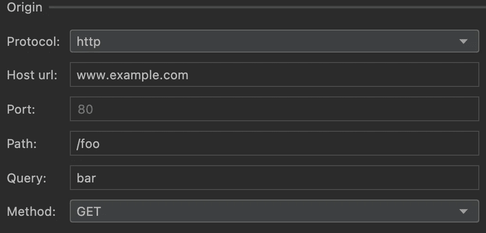

# 3 个新的 Android Studio 工具来提高工作效率

> 原文：<https://medium.com/codex/3-new-android-studio-tools-to-boost-productivity-390d4bbfff49?source=collection_archive---------1----------------------->

## 将提高您工作效率的 Android Studio 工具

我将在下面列出的 Android Studio 工具不仅能提高生产率，还能帮助编写更健壮的代码。

由[艾萨克·史密斯](https://unsplash.com/@isaacmsmith?utm_source=medium&utm_medium=referral)在 [Unsplash](https://unsplash.com?utm_source=medium&utm_medium=referral) 上拍摄的照片

下面列出的 Android Studio 工具目前可以在 IDE 的预览版中作为实验特性使用。并且总是建议在预览版旁边安装一个稳定版。这里列出了 Android studio 的预览版:[https://developer.android.com/studio/preview](https://developer.android.com/studio/preview)

所以，事不宜迟，我们将浏览列表:

# 1.实时编辑:

随着 Android Studio Electric Eel 的发布，ive Edit 已经具备了一系列新功能。这项功能最初是打算作为 Android Studio Flamingo Canary 版本的一部分，但我看到这项功能也通过了 ee 测试版。因此，我们不必等到 AS Flamingo 的发布，就可以亲自体验这一特性。附加当前发行说明的代码片段:

Android Studio 的发行说明片段

## **什么是 Live Edit？**:

使用 Live Edit，我们现在可以立即将可组合函数中的代码更改部署到模拟器或实际设备上。这是实时工作的，所以如果更改仅限于可组合的功能，就不需要再次运行应用程序。

## 实时编辑的主要优势:

该功能最大限度地减少了编写和构建应用程序之间的上下文切换，使您能够专注于编写代码，而不会中断。

来源:[https://developer.android.com](https://developer.android.com)

## **启用实时编辑:**

如果您正在使用 Jetpack Compose 创建您的应用程序 UI，Live edit 可以帮助您快速调整/修复 UI，而无需每次都运行完整的构建。
在 IDE 中，导航到设置以启用实时编辑。

1.  在 Windows 或 Linux 上，导航到**文件** > **设置** > **编辑器** > **实时编辑**。
2.  在 macOS 上，导航到**Android Studio**>**首选项** > **编辑器** > **实时编辑**。
3.  在 IDE 中，打开加载可组合视图的启动器活动
4.  运行你的应用程序，然后点击编辑器右上角的 **Split** 打开预览
5.  您应该会在编辑器的右上角看到**实时编辑**绿色勾号

来源:https://developer.android.com

## **限制:**

Live Edit 有自己的一套限制，下面列出了一些限制。Live Edit 专注于 UI 和 UX 相关的代码更改。Live Edit 不支持诸如方法签名更新、添加新方法或类层次结构更改等更改
2。实时编辑需要运行 API 级别 30 或更高的物理设备或模拟器。
3。不可组合的函数在设备或仿真器上实时更新，并触发完全重组。完全重组可能不会调用更新的函数。对于不可组合的函数，您必须触发新更新的函数，或者再次运行应用程序。
4。您必须执行完整运行，以便调试器能够对您用实时编辑修改的类进行操作。

# 2.Firebase Crashlytics 的应用质量洞察

从 Android Studio Electric Eel 开始，Firebase Crashlytics 数据可以从 Android Studio IDE 本身访问。可以在 IDE 中新引入的 **App Quality Insights** 工具窗口中找到崩溃统计和堆栈跟踪

Android Studio 中的应用质量洞察

## **此次整合的主要优势:**

将 Crashlytics 与 Android Studio 集成的主要优势如下:

1.  无需在 Crashlytics 浏览器窗口和 IDE 之间来回切换。现在，在 IDE 窗口中可以直接看到堆栈跟踪，这使得单击堆栈跟踪并跳转到相关的代码行变得很容易
2.  Android Studio 现在会突出显示与崩溃相关的代码行，以便您可以轻松地发现和调试它们。当您将鼠标悬停在突出显示的代码行上时，会出现一个弹出窗口，显示崩溃的详细信息。该弹出窗口本身提供了到应用质量洞察窗口的简单导航
3.  根据 Android Studio 本身的严重性、时间和应用程序版本过滤事件

## **如何连接 Crashlytics 和 Android Studio:**

对于集成，您需要使用您的开发人员帐户登录 Android Studio。如果您在 Firebase 控制台中已经有一个启用了 Crashlytics 的应用程序，那么打开应用程序质量洞察工具窗口，您应该会看到**问题**、**样本堆栈跟踪**和**详细信息**面板中填充了来自 Crashlytics 的报告

如果你还没有为你的应用程序设置 Firebase Crashlytics，那么请遵循下面的教程，其中有关于 Crashlytics 与 Android Studio 集成的所有细节

 [## 应用质量洞察:将 Android Studio 与 Firebase Crashlytics 结合

### 直接在 Android Studio 中获得 Firebase Crashlytics 的见解

medium.com](/@ninadmadhav/marrying-android-studio-with-firebase-crashlytics-6a338bf5c0a6) 

# 3.流量拦截网络检查员

默认情况下，etwork Inspector 会显示整个时间线的所有流量数据。您可以在时间线内选择一个范围，以便仅查看该范围内的流量。因此，每当应用程序进行网络呼叫时，它都会登录到网络检查器

**注意:该功能目前仅在 Android Studio Flamingo Canary 版本中可用**

## 如何使用网络检查器

借助 Network Inspector，我们可以创建规则来确定拦截哪些响应，以及如何在响应到达应用程序之前修改拦截的响应。

我们可以创建自定义规则来测试不同用例的应用程序。这些规则有助于测试当我们从服务器收到特定响应时应用程序的行为。您可以通过勾选每个规则旁边的**活动**框来选择启用或禁用哪个规则。

来源:[https://developer.android.com](https://developer.android.com)

要创建新规则，请导航到**网络检查器**中的**规则**选项卡，然后单击 **+** 创建新规则。在 **Rule Details** 面板中，命名您的新规则，并在 **Origin** 子部分中包含关于您想要拦截的响应的来源的信息。

来源:[https://developer.android.com](https://developer.android.com)

## 回复中可能的修改:

1.  **修改标题:** 在**标题规则**小节中，我们可以创建多个子规则来添加或修改响应中的标题。
    要添加标题，在**添加新标题**部分输入标题的名称和值。
    要修改标题，导航至**编辑现有标题**选项卡，并指定您想要查找的标题名称或值。输入要替换的标题名称或值。
2.  **修改响应:** 我们还可以创建子规则来修改响应的正文。我们可以选择查找并替换正文的一部分，或者通过选择**替换整个正文**来替换正文的全部内容。

这篇文章到此结束，我希望这些工具能帮助你提高生产力

如果你喜欢这篇文章，点击一下掌声将是惊人的。关注更多此类内容

## 参考资料:

[https://developer.android.com/studio/preview/features](https://developer.android.com/studio/preview/features)