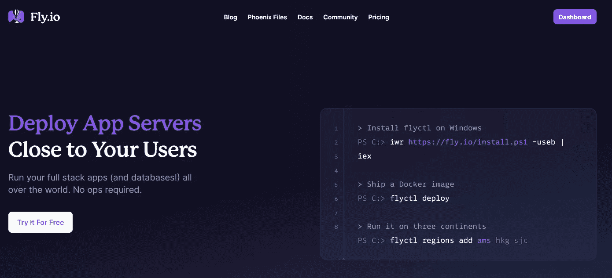
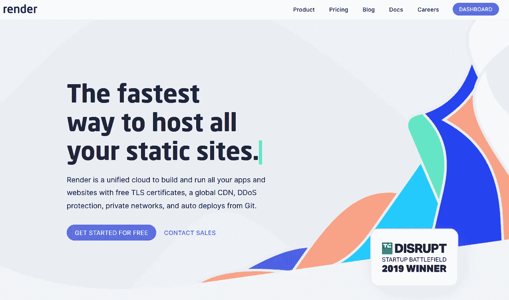
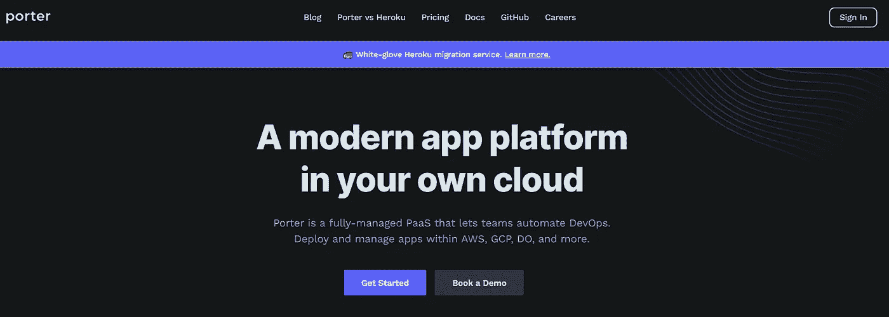

# Heroku 的 3 种 PaaS 替代品

> 原文：<https://medium.com/codex/3-paas-alternatives-to-heroku-db8fc750cc6f?source=collection_archive---------23----------------------->

洛伦佐·埃雷拉在 [Unsplash](https://unsplash.com?utm_source=medium&utm_medium=referral) 上的照片

## 一些供应商尝试为规避风险

Heroku 最近因为他们对看起来相当严重的安全事件的反应而受到批评，这是有原因的，因为[他们对整个事件的沟通](https://www.theregister.com/2022/05/04/heroku_security_communication_dubbed_complete/)非常糟糕*。*

*就我个人而言，这是一个相当大的失望，因为我已经乘坐 Heroku 火车有一段时间了。作为一名有着为极小的初创公司工作经历的软件开发人员(此外还有相当数量的自由职业者)，Heroku 的平台即服务解决方案——为所有酷孩子提供的平台即服务——已经成为了救星。*

*当你在时间和资源上捉襟见肘时，卸下诸如服务器维护、安全、数据库管理和所有其他伴随着经营一家软件公司的任务是非常有价值的；而 Heroku 的附加市场只是锦上添花。*

*相信我，没有什么比在一个单一的窗口中旋转所有您需要的内部和外部资源更令人满意的了。作为一名自由职业者，这种组织让计费客户端(并最终转移应用程序所有权)变得轻而易举。*

# *Heroku 替代方案*

*但是……所有这些现在都没有了。它已经被对一家公司的完全和完全的缺乏信任所压倒，而我在历史上对这家公司寄予了很大的信任。因此，我一直在探索一些 Heroku 替代品，它们对 PaaS 领域来说都是相对新的(或者至少对我来说是相对新的)。*

*需要澄清的是，我跳过了最知名的解决方案，如 [DigitalOcean](https://m.do.co/c/a8eb87aea1f2) 的应用程序平台和 [Google Cloud](https://cloud.google.com/) 的应用程序引擎，因为我认为大多数人已经知道它们，所以鞭打那匹特别的马可能只是浪费比特和字节。*

*也就是说，我偶然发现了一些*很棒的*解决方案，它们既独特*又有*相当“独立”的感觉——如果你问我的话，这是“开发者的工具，为开发者服务”类别中的一个伟大组合。*

# *Fly.io*

**

*https://fly.io*

*这些年来，我听说过几次 Fly.io，但直到最近几天，我才真正有机会尝试一下；我不得不说，这真是太棒了。*

*虽然不像 Heroku 那样“功能强大”(理解:没有“市场”)，但它是一个 Docker 驱动的解决方案，有一个*难以置信的*慷慨的免费层，是我见过的最令人印象深刻的技术写作承诺之一(老实说，只有 DigitalOcean 的方法让它相形见绌)。*

*作为[MUD Coders Guild](https://mudcoders.com/)的创始人，我个人拥有并管理我们所依赖的任何集成和网站，并选择 Fly.io 作为我们的新目的地。从 Heroku 到 Fly.io 的过渡就像你能想象的那样轻松，终端驱动的管理是一种很好的体验。*

*如果你持观望态度，没有一个巨大的应用程序足迹，你肯定不会错的 Fly。*

# *提供；给予*

**

*[https://render.com/](https://render.com/)*

*Render 对我来说是一个新的解决方案，但就特性和功能而言，它与 Heroku 非常相似(尽管这并不意味着它不比 Heroku 好)。作为 2019 年 TechCrunch 初创企业战场(由于 HBO 的[硅谷](https://yewtu.be/watch?v=7G5Mf6Zqe0E)，我将永远把这个事件与 Pied Piper 和 mid-Out Encryption 联系在一起)的获胜者，Render 提供了我们在 PaaS 平台中期望的所有花哨功能:*

*   *自动缩放*
*   *托管数据库*
*   *预览环境*
*   *Docker 部署*
*   *和*实际* cron 支持*

*我还没有深究这个问题，但是当机会出现时，我可能会把我的一些更复杂的自由职业项目转移过来(顺便说一句，他们的免费等级已经足够慷慨了)。*

# *搬运工*

**

*[https://www.getporter.dev/](https://www.getporter.dev/)*

*作为 TechTarget 的[开源 PaaS](https://www.techtarget.com/searchcloudcomputing/feature/6-open-source-PaaS-options-developers-should-know) 综述的一部分，我曾经检查过 [Porter](https://www.getporter.dev/) ，并且*真的*喜欢我所看到的。*

*porter 与列表中其他解决方案的不同之处在于，它是一个开源的*和*自托管选项。虽然他们确实提供了依赖于您的*自有*后端基础设施的托管云解决方案，但自托管选项非常有吸引力，因为它让您可以完全控制您的基础设施。*

*虽然我个人不喜欢“管理我所有的东西”这种游戏，但对于那些希望从托管 PaaS 向管理自己的基础架构跨越的人来说，这是一个极好的解决方案。*

# *结论*

*显然，除了这三家之外，还有很多平台即服务提供商。从大到小，从专有到开源，这是一个相当大的空间。也就是说，在我看来，这三个是更有吸引力的，我会关注他们的成长。*

*如果这些不太符合你的需求，并且正在寻找更多的选项来尝试，看看这个[令人敬畏的 PaaS 列表](https://github.com/debarshibasak/awesome-paas)。有一些很好的解决方案。*

**本帖原载于 2022 年 5 月 5 日*[*flower . codes*](https://flower.codes/2022/05/05/heroku-alternatives.html)*。**