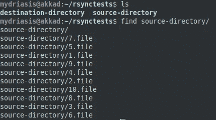
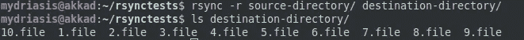
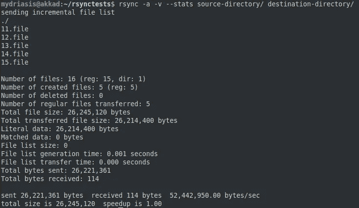
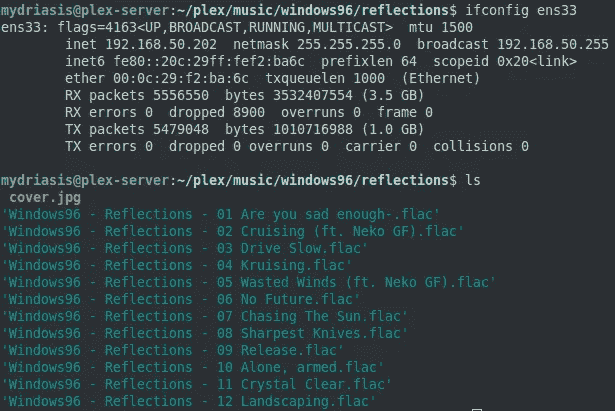
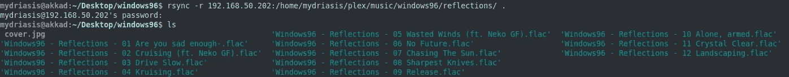
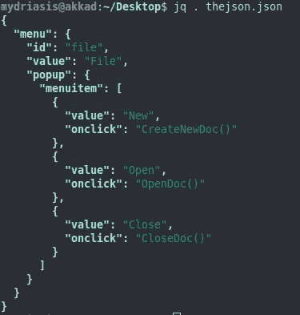
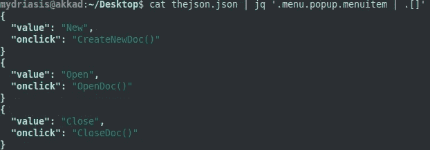
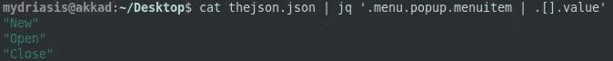
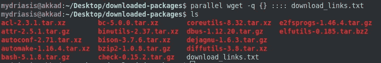

# 3 个程序将提升你的 Bash 游戏

> 原文：<https://medium.com/codex/3-programs-that-will-level-up-your-bash-game-bf14e17e2291?source=collection_archive---------1----------------------->

又见面了。很高兴你回来了，很高兴见到你！上次我们谈到了[整洁的 Python 库](https://samuel-vidovich.medium.com/3-cool-python-libraries-that-will-save-you-time-and-effort-27fcdc6762d5)。这一次，我们将讨论一些程序，您可以在 shell 中使用它们来成为 bash 发电站。或者像，一个狂欢…仓鼠…轮子。不管怎样，我希望在这结束的时候，你至少会觉得更有成效。


一个漂亮干净的标志。让我的文章看起来不错，对吧？

作为一个题外话，我试图写一些好的文章，而不仅仅是垃圾文章，以获得更多的观点来资助我的可卡因和老式电脑的习惯。我的文章从来不付费，因为我要你(是的，你！读这个！)来享受自己，学点东西。如果你觉得是垃圾，就留下评论吧！我会做得更好。记住，我不是为了赚大钱，我是免费写作的，所以我没有理由写糟糕的文章。

不管怎样，我们开始吧。所以，我不会谈论像，`sed`或`grep`。在这篇文章中，我假设这些已经在你的曲目中了。没错，伙计们。我们在这里越野。像往常一样，随着文章的进行，令人敬畏/困惑的程度会增加。我把最好的留到了最后。

# rsync

`rsync`超级酷，它正在慢慢(但肯定)成为标准，取代长寿的`scp`。不过，要移动像现在这样大的山需要一段时间；与此同时，最好先认识一下！

**什么事？**

`rsync`是一个帮助你拷贝文件的程序。它比`cp`稍微聪明一点，因为如果你在做备份之类的事情，默认情况下它可以只检测真正需要复制的东西。也比`scp`安全一点，就是[慢慢被弃用](https://lwn.net/Articles/835962/)。既能本地*又能远程*工作，超级爽。

我从哪里得到它？

哦，那要看情况。如果你用的是 Linux，可能会运行`apt install rsync`或`yum install rsync`或`pacman -S rsync`，这取决于你的发行版。如果你在 MacOS 上，你可能会运行`brew install rsync`——无论哪种情况，如果你还没有它，我会感到惊讶。如果你在 Windows 上？嗯，有点复杂，[但是外面有指南](https://alanbarber.com/post/installing-rsync-on-windows/)。一种方法推荐使用 WSL ，它是 Linux，只是……在 Windows 下。

我如何使用它？

轻松点。首先我们来看一下本地案例。假设我有两个目录，`source-directory`和`destination-directory`，其中`source-directory`包含我想复制到`destination-directory`中的随机垃圾，如下所示:



看看这些文件！

让我们把`rsync`中的内容`source-directory`转化为`destination-directory`！我们只需要说`rsync -r source-directory/ destination-directory/`:



同步他们！

就是这样！就像`cp -r`一样，但是快了很多。不要忘记你的目录名后面的`/`！

什么，没印象？rsync 的部分功能是它*同步*。也就是说，使用正确的选项，您只复制您需要的内容。因此，如果我向我的`source-directory`中添加更多的文件，并运行一个新的同步(打开冗长),我就可以演示了。让我们运行命令

`rsync -a -v --stats source-directory/ destination-directory/`:



-a 帮助我们仅同步我们需要的内容

看到了吗？我们只发送了添加的五个新文件，而不是前 10 个。这对于备份数据非常有用。在这种情况下帮助我们的选项是`-a`！使用`-a`标志将帮助我们保持目录同步，而不需要做太多的工作。

什么？？还是没印象？拜托，我真的很努力了！好吧，那它可以远程使用这个事实呢？好了，**情况**。我的 [plex 服务器](https://github.com/plexinc/pms-docker)上有一个可爱的 [Windows96](https://windows96.bandcamp.com/) 相册，我想把它同步到我的机器上。我们应该得到机器的地址——我们可以看到，对我来说，它是`192.168.50.202`。



我该怎么做？

不要使用 SCP —只使用 rsync！在这个实例中，我们需要的 rsync 命令是

`rsync -r 192.168.50.202:/path/to/the/files/on/remote/server .`:



从服务器 rsync！

就是这么简单:将远程服务器上的所有文件同步到我当前的工作目录。标志`-r`确保我们递归进入服务器上的目录。就是这样！

# japan quarterly 日本季刊

一开始我并不喜欢`jq`。一点也不。我不喜欢它的工作方式，我被它的语法弄糊涂了，我被五颜六色的高亮显示弄得心烦意乱。我错了。一个穴居人，看到第一张弓就恶心。`jq`是*牛逼*。

**什么事？**

`jq`是一个帮助你从终端操作 JSON 对象的程序。如果您使用生产代码，您可能会经常看到 JSON。擅长它绝对会让你更有效率。

我从哪里得到它？

你可以从[主页](https://stedolan.github.io/jq/)下载`jq`！它适用于 Linux、MacOS 和 Windows，都是 64 位的。如果您使用的是其他系统，或者您有一个 32 位系统，您也可以从源代码中构建它(尽管这超出了本文的范围)。你也可能只是`apt install jq`或`brew install jq`。

我如何使用它？

这个超级简单。我将从[官方 JSON 网站](https://json.org/example.html)(？奇怪吗？)，并将其粘贴到一个文件中即可。它看起来很像这样:

```
cat thejson.json
{"menu": {
  "id": "file",
  "value": "File",
  "popup": {
    "menuitem": [
      {"value": "New", "onclick": "CreateNewDoc()"},
      {"value": "Open", "onclick": "OpenDoc()"},
      {"value": "Close", "onclick": "CloseDoc()"}
    ]
  }
}}
```

很标准，对吧？让我们一起深入了解`jq`。你可以使用`cat <file> | jq .`或者直接在文件上调用`jq`。这为您赢得了一些不错的语法突出显示:



jq 语法突出显示

我们必须更深入。让我们向下挖掘，从“菜单”键中获取“值”字段。

这就足够了:

`cat thejson.json | jq '.menu.value'`


向下选择到 JSON

够简单！看到我们如何为我们关心的文档的每个级别使用一个`.`了吗？非常整洁。
现在，该文档也有一个数组。看到在`popup`键下面的`menuitem`了吗？我们如何处理这些？使用数组运算符:

```
cat thejson.json | jq '.menu.popup.menuitem | .[]'
```



那么，让我们来分析一下。像以前一样，我们使用`.` s 向下选择 JSON 对象。但是这一次，我们在 jq 命令内部使用*管道。*我们找到`menuitem`，我们知道它是一个数组，然后我们把它传递给`.[]`，这样它就为我们提供了三个独立的条目。现在，让我们做一些 jq 魔术。我们可以从中获得所有的值，就像这样:

`cat thejson.json | jq '.menu.popup.menuitem | .[].value'`



从数组中的元素中选择特定的键

很酷，对吧？这是那么容易挖掘的权利。现在，你可以用`jq`做很多非常酷的事情，甚至超出了我们在这里看到的牛逼([这里有一个关于`select`的牛逼帖子](https://stackoverflow.com/questions/18592173/select-objects-based-on-value-of-variable-in-object-using-jq)，它超级强大)，但是为了简洁起见，我们就到此为止。`jq`的值只是…太多了，无法处理。

# GNU 并行

哦伙计。这款*是目前为止最酷的*。这可能是我用过的最酷的程序之一。不是超常规使用的东西？我想是的。但是当你需要它的时候，你会知道的，并且知道如何在紧要关头使用它是超级酷的。

**什么事？**

GNU Parallel 是一个让你从*终端进行真正的并行化的程序。是啊，我没开玩笑，这太棒了。*

我从哪里得到它？

你可以`apt install parallel`或`brew install parallel`，如果你幸运的话，也许你可以`pacman -S parallel`。或者，你可以从 GNU 网站上下载。

我如何使用它？

所以我将介绍*最基本的用例。*这个程序有绝对 [*惊人的手册*](https://www.gnu.org/software/parallel/man.html) *，*以及[杀手教程](https://www.gnu.org/software/parallel/parallel_tutorial.html)，如果你想做什么高级用法，绝对要看看。

但是我们开始了。

情况:您发现自己有一个包含一长串 URL 的文件，每个 URL 都指向您想要下载的内容。你会怎么做？

“啊，简单，”你说，“我只写一个 for 循环。“站住，你违反了法律。不，我们不需要那样做。事实上，我们不想这样——那样会让我们排队等待顺序下载。如果我们想在下周之前下载我们的文件，我们应该一次下载尽可能多的文件，对吗？GNU Parallel 让这个*变得简单*。请看:



说够了。

我们的命令最终变成了

`parallel wget -q {} :::: download_links.txt` —我们来分解一下。

`{}`是我们将要使用的东西，它充当`download_links.txt`中每一行的占位符。`::::`告诉 GNU Parallel 我们应该从文件中读取。仅此而已！

你真的不能打败它。它超级快，因为这就是它的用途——让事情变得更快。这只是 GNU 并行的一个用途。有更多的用途，你可能无法指望所有的四只手。真的——去探索 GNU 并行吧！

# 结论

我们在这里，你和我，在另一篇不可思议的文章的结尾。到目前为止，我们已经一起讨论了[表演技巧](https://samuel-vidovich.medium.com/4-python-performance-techniques-to-remember-1b04898de03d)、[库](https://samuel-vidovich.medium.com/4-python-performance-techniques-to-remember-1b04898de03d)和[雨](/analytics-vidhya/hastily-constructed-precipitation-analysis-32e132dc1933)。好吧。我已经跟你谈过了，但是你很喜欢，对吗？没错。我希望你这次发现了一些有趣的东西。我个人几乎每天都使用`jq`,所以希望这是一个可以放在你口袋里的好东西。

我很高兴你能来聊天。这对我很重要，你知道吗？Bash 和 shell 脚本在我心中有着特殊的地位。这么说很奇怪吗？等等，你要去哪里？为什么每次都这样？我还没说完。我让它变得很奇怪还是什么？嘿。嘿！

# **引文**

GNU Parallel: O .葛覃(2011):GNU Parallel——命令行工具；登录:USENIX 杂志，2011 年 2 月:42–47。