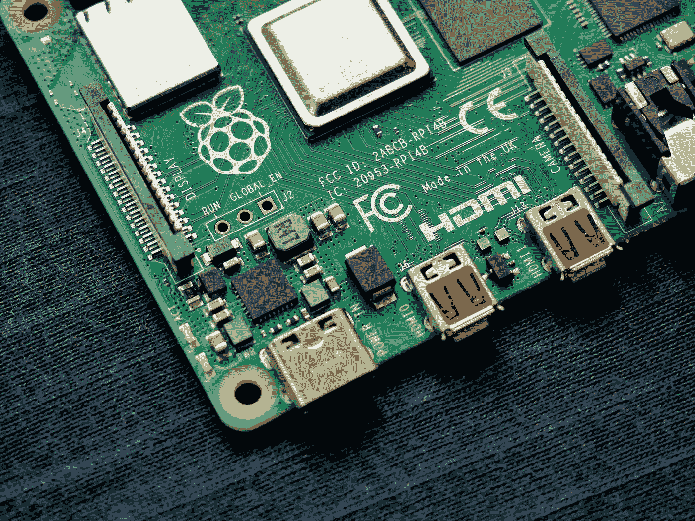

# 你应该鄙视你的树莓派的三个理由

> 原文：<https://medium.com/codex/3-reasons-you-should-scorn-your-raspberry-pi-92bfab59537?source=collection_archive---------1----------------------->

Vishnu Mohanan 在 [Unsplash](https://unsplash.com?utm_source=medium&utm_medium=referral) 上的照片

除非你在过去的 10 年里一直呆在山洞里，否则你应该知道什么是树莓派。

我可以重复你已经读过无数遍的“优点”。

它是开源的，非常便宜，背后有一个很棒的社区，等等，等等。