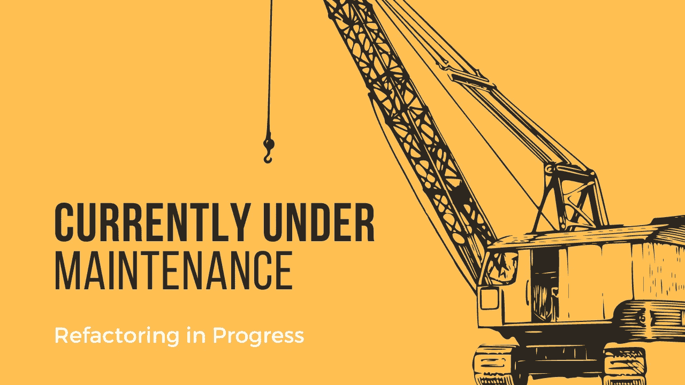

# 告诉你尽快重构代码的 3 个信号

> 原文：<https://medium.com/codex/3-signs-that-tell-you-to-refactor-your-code-asap-96fa9a64aaf?source=collection_archive---------11----------------------->

## 做和让是一条细线

由[作者](http://www.arnoldcode.com)通过 Canva.com 制作的插图

重构是一个你可能经常听到的词，但是它是什么意思呢？这意味着*在保留语义的同时改变代码。*

阅读这份声明引发了两个关键问题:

1.  *代码变更的目的是什么？*
2.  *你如何确保* …