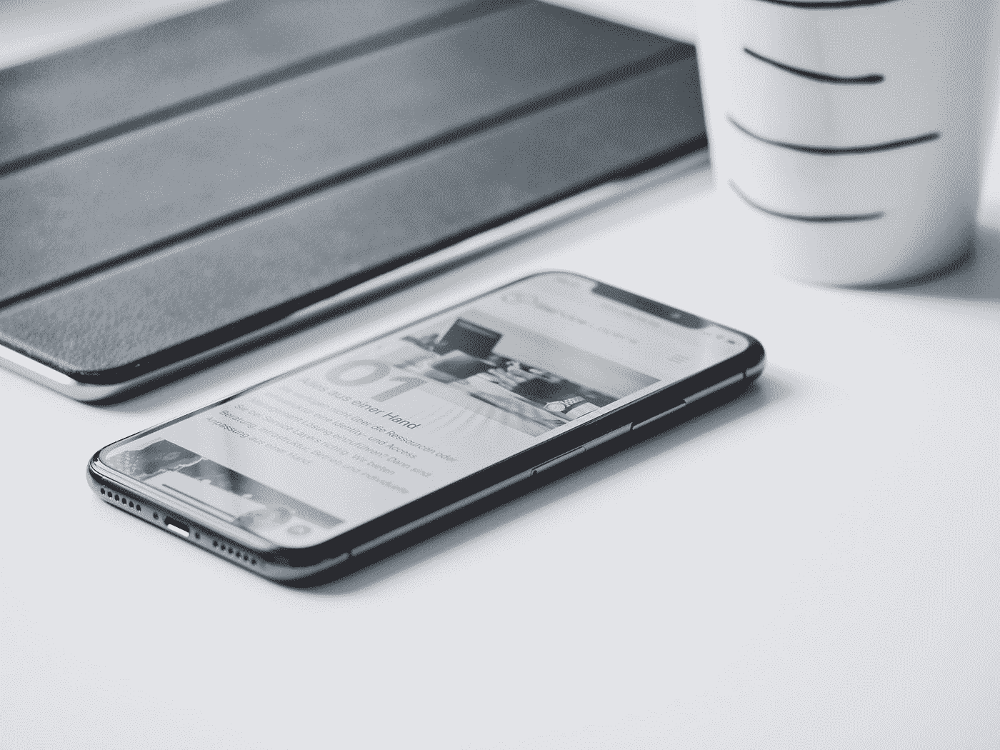

# 3 个可能改变世界的智能手机功能

> 原文：<https://medium.com/codex/3-smartphone-features-that-could-change-the-world-508e794719aa?source=collection_archive---------9----------------------->

照片由[斯文](https://unsplash.com/@shauste?utm_source=medium&utm_medium=referral)在 [Unsplash](https://unsplash.com?utm_source=medium&utm_medium=referral)

在过去的十年里，智能手机取得了长足的进步。起初是 MP3 播放器和手机的混合体，现在却神奇地变得如此丰富。现在，我们用智能手机完成几乎所有可以想象的任务，但这还不是终点。让我们来谈谈智能手机的一些功能，这些功能可能会极大地改变人类文明的进程。

# 更多健康指标