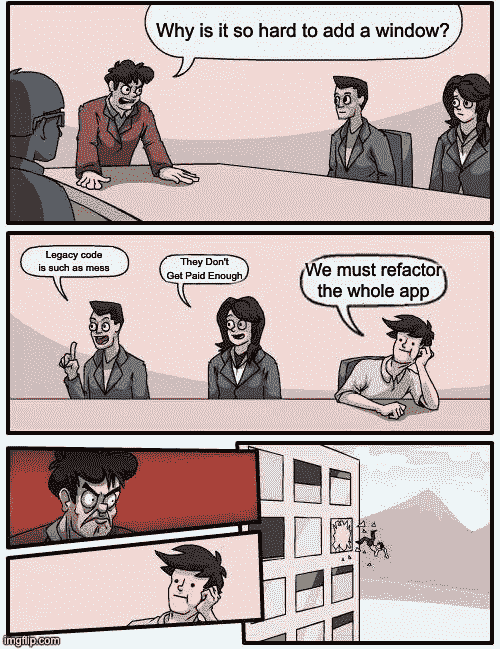

# 避免技术债务的 3 个步骤。每次都管用！

> 原文：<https://medium.com/codex/3-steps-to-avoid-technical-debts-5dcc0c91a3b3?source=collection_archive---------33----------------------->



所有初级开发人员在进入每个软件产品的编码阶段之前都必须理解这个问题。在我指导初级开发人员的经验中，你最喜欢在没有适当计划的情况下就投入代码。要想早点成为职业选手，请后退一步。

但是等等，技术债到底是什么？

简而言之，技术债务

> “技术债务(也称为技术债务或代码债务)描述了当开发团队采取行动来加速一项功能或一个项目的交付时会产生什么结果，这些功能或项目随后需要进行重构。换句话说，这是优先考虑快速交付而不是完美代码的结果。”更多阅读[https://www.productplan.com/glossary/technical-debt/](https://www.productplan.com/glossary/technical-debt/)

在这篇文章中，每当我开始从事任何软件产品时，我想向你展示我的思维过程。

# #1 了解业务增长的方法。

重要的是你必须了解你的行业。大多数时候，当你从你的项目领导或经理那里得到需求/任务时，他们会向你解释他们想要你将要工作的“特性”的最终结果是什么。这是您考虑该功能的更大图景的机会。想想现在，想想未来。

在这一点上，您可以从了解特性如何影响整体业务开始。你最好疯狂地提出问题/想法。比如说；如果我添加这个和那个，如果这个功能可以做 x 和 y，并且与团队一起验证你的想法，如果这些想法在未来可以工作/很好。主动与您的团队成员沟通。如果你不告诉他们你在做什么，他们可能根本不知道你在做什么。

# #2 规模规划。

一旦你知道并理解了理想的特性和未来的特性，这显然超出了范围。但至少，这些想法给了你一些在早期阶段应该在代码中包含什么的感觉。此时，您可以为可伸缩性制定计划。最简单的方法是在代码中为那些未来的任务腾出空间。eg；想象一下，如果你必须让前端与不同的 web3 钱包交互，而不是按照要求只与一个钱包交互，你可以在早期阶段准备与多个钱包连接，以最大限度地减少债务的产生。

*一个实现理想的例子*

```
✅ const yourWallet = new WalletConnection(walletSource)❌ const yourMetaMaskWallet = new MetaMask()❌ const yourBSCWallet = new BSCWallet()
```

# #3 遵循模式

设计模式是软件开发中最流行的模式之一。大多数软件问题已经被某个地方的某个人发现并解决了。因此，随着软件变得越来越复杂，您可以更容易地找到帮助。为您的问题解决方案选择正确的技术实践。

## ✨奖金:这里是我在每个前端项目中的顶级技术实践。

🐳独立系统=容器模式

📡反应上下文=提供者模式

💉React hooks/HOC =依赖注入。

👂Redux/Saga =观察者模式

👆选择器模式

# 有用的链接

学习设计模式的最好地方是 https://refactoring.guru/design-patterns