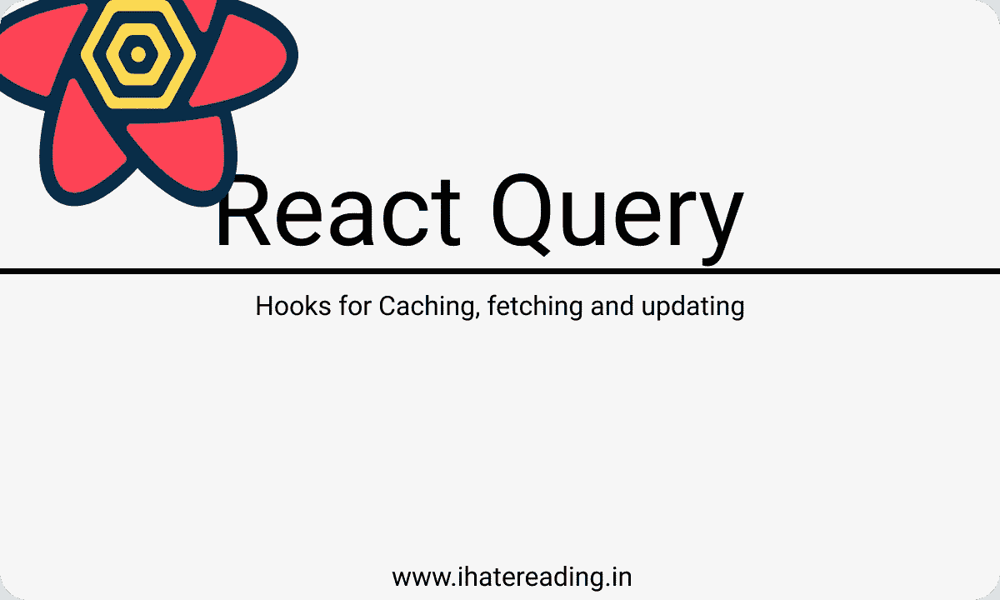

# 快速开始 React 查询的 3 个步骤

> 原文：<https://medium.com/codex/3-steps-to-quickly-start-with-react-query-a3012c62b18b?source=collection_archive---------3----------------------->

## 在下一个 JS 项目中开始使用 React 查询

[**本网**](http://www.ihatereading.in)

## 在后台

故事从我连续看到关于 react query 及其缓存数据并在需要时重新获取数据的能力的新帖子开始。这让我大吃一惊，因为我们必须在前端编写缓存逻辑，或者我们必须在…