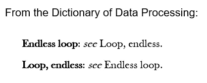

# 你一直想知道的关于 C#中循环的 3 件事…

> 原文：<https://medium.com/codex/3-things-about-loops-in-c-you-always-wanted-to-know-53f4666c45d8?source=collection_archive---------4----------------------->

## …但是我们不敢问


Bruno Abatti 在 Upleash 上的照片

循环是编程中的一个基本话题，每种编程语言都包含某种循环或重复语句。C#提供了几种类型的循环，`for`循环，`while`循环和`foreach`循环。由于循环被重复使用(*双关语为*)，所以循环消耗了大量的执行时间，细节也很重要。

这里，我们收集了一些关于循环内部工作的问题。

# 1.foreach 循环到底是如何工作的？

foreach 语句通常在内部扩展为迭代器上的 while 循环。例如，列表上的迭代(例如整数的迭代)

```
foreach (int a in list) { 
   // do stuff 
}
```

扩展到

```
using (var e = list.GetEnumerator()) {
   while (e.MoveNext()) {
       int a = e.Current;
       // do stuff
   }
}
```

除了数组，`foreach`循环扩展成了`for`循环。当`data`是一个整数数组时，下面几行

```
foreach (int a in data)
{
    // do stuff 
}
```

完全等同于

```
var d = data;
for (int i = 0, a; i < d.Length; i++)
{
    a = d[i];
    // do stuff
}
```

# 2.for 循环和 while 循环有什么区别吗？

理论上，应该没有区别

```
for (long i = 0; i < N; i++)
{
  // do stuff 
}
```

和

```
int i = 0;
while (i < N)
{
  // do stuff
  i++;
}
```

事实上没有。两者产生相同的操作码。

# 3.C#中有没有一种简单的方法来并行执行循环？

当循环体包含不依赖于先前循环迭代的语句时，循环可以并行化。换句话说，循环迭代的执行顺序并不重要。一个`foreach`循环总是满足这个要求。然后可以并行执行循环体。如果在 C#中有一种简单的方法来做到这一点，而不需要启动任务或线程，那就太好了。

C#的任务并行库具有并行运行 for 和 foreach 循环的方法。它是这样工作的。循环`for (int i=0; i < N; i++) {...}`的标准与并行化

```
Parallel.For(0, N, (i, state) =>
{
    // do stuff
});
```

关于`state`变量的解释和`Paralle.For`选项的指定，参见[文档](https://docs.microsoft.com/en-us/dotnet/api/system.threading.tasks.parallel.for?view=net-5.0)。顺便说一下，最有用的选项是设置`[MaxDegreeOfParallelism](https://docs.microsoft.com/en-us/dotnet/api/system.threading.tasks.paralleloptions.maxdegreeofparallelism?view=net-5.0#System_Threading_Tasks_ParallelOptions_MaxDegreeOfParallelism)`。

foreach 循环`foreach(var a in list) {...}`通过以下方式实现:

```
Parallel.ForEach(list, a =>
{
  // do stuff
});
```

再次参考[文档](https://docs.microsoft.com/en-us/dotnet/api/system.threading.tasks.parallel.foreach)了解选项。

通常，并行版本的循环比顺序(标准)循环慢。原因是启动并行任务会产生一些开销，这可能会超过并行计算带来的好处。

F 最后，一个关于循环的笑话:

