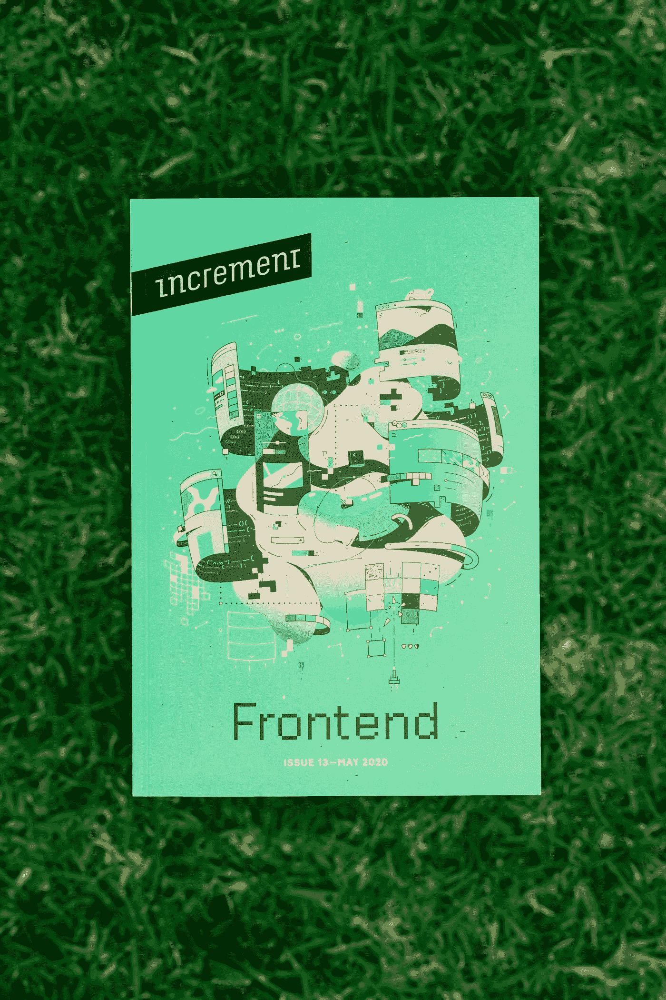

# 3 种趋势前端语言

> 原文：<https://medium.com/codex/3-trending-frontend-languages-fee8cc0b5625?source=collection_archive---------12----------------------->

您是否想知道 3 种趋势前端语言中哪一种最适合您的下一个项目？下面的文章将解释 ReactJS、VueJS 和 Elm。应该先学哪个？每一种都有许多优点和缺点。继续阅读，了解更多信息！别忘了给他们打分！我们还将讨论如何在您的下一个项目中使用它们！然后，决定你最喜欢哪一个。

保罗·花冈在 [Unsplash](https://unsplash.com?utm_source=medium&utm_medium=referral) 上的照片