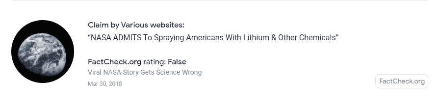

# 未知的 Google API 服务

> 原文：<https://medium.com/codex/3-unknown-google-api-services-4042db955247?source=collection_archive---------6----------------------->

## 和 python 脚本来尝试它们

照片由[帕韦尔](https://unsplash.com/@pawel_czerwinski)在 [Unsplash](https://unsplash.com/) 上拍摄

如果你作为一个开发者使用 Google solutions，你会发现自己经常使用他们的 API 服务，他们遵循 REST 协议，文档和参考资料实际上非常清楚。有这么多，我相信这是因为谷歌在开发他们的产品时有一个以开发者为中心的心态，然而，其中一些比其他人知道的少一点，我会试着给你一个快速的介绍和例子来使用它们。

你只需要一个谷歌账户和一个谷歌云平台账户:谷歌认证协议要求你[创建一个谷歌云*项目*](https://developers.google.com/workspace/guides/create-project) 。通过这样做，您可以用不同的方式授权 API 请求:

*   使用*服务帐户* *键*，用于在 Google Cloud IAM 页面上创建的非人类用户执行的操作
*   通过构建一个 *Oauth2 流*，它将创建最终用户凭证，并让我们执行操作，就像是用户自己在执行操作一样
*   一个 API 密匙，一个简单的加密字符串，标识一个 Google Cloud 项目，用于配额、计费和监控目的

对于下面显示的三个服务，我们将只使用后者，因为我们将请求的数据是公开可用的。

# 页面速度洞察 API

 [## PageSpeed Insights API | Google 开发者

### PageSpeed Insights (PSI)报告移动和桌面设备上页面的性能，并提供…

developers.google.com](https://developers.google.com/speed/docs/insights/v5/about) 

名字本身就说明了一切，这是最简单的 API 之一，它使用 Lighthouse，这是一个开源工具，通过提供一些关于网站性能的有用见解，帮助 web 开发人员分析他们的网站。

响应将包括有关分析的调试信息，如使用的用户代理和 Lighthouse 版本，以及根据请求的类别得出的结果，对于每一项，您将找到一个总的*分数*以及更详细的指标:

*   对于**性能**:速度指数、交互分数、第一内容绘制、渲染阻塞资源数、重定向数、dom 大小…
*   对于**可访问性** : aria 属性，颜色对比，按钮名称，重复 id，语言规范，标题标签顺序，焦点陷阱…
*   对于**最佳实践** : https 存在、doctype、图像纵横比、图像响应性、控制台错误、弃用…
*   对于**渐进式网络应用**:清单、图标、每页的 url、http 重定向…
*   对于**SEO**:metas，robots-txt，canonicals，crawlability…

# 事实检查工具 API

 [## 事实检查工具 API | Google 开发者

### 谷歌事实检查工具 API 为 https://g.co/factchecktools 的事实检查工具提供了一个接口

developers.google.com](https://developers.google.com/fact-check/tools/api/?hl=en_GB) 

这个 API 围绕着**索赔**工作，你可以通过创建一个*索赔审查，指定你正在审查的索赔，谁首先提出的，以及在哪里；之后，您可以给出您对索赔的*评级*，说明来源和分数。
例如，假设你听说美国国家航空航天局(NASA)参与了化学追踪，你可以创建一个评论，说明你在哪里发现这些说法，并给出你的评论(例如，假的、真的、不准确的…)，在你的网站上有一篇文章来加强你的陈述。*

在谷歌的[事实核查浏览器](https://toolbox.google.com/factcheck/explorer)上找到的[factcheck.org](https://www.factcheck.org/)对 NASA 相关声明的评级

对于单个用户，最简单的用例就是查询这些*声明*，这可以使用[在线浏览器](https://toolbox.google.com/factcheck/explorer)或通过 API 来完成。
为了测试这一点，一个 API 密钥授权就足够了，因为结果是公开可用的，然而，为了创建*索赔审查*，我们需要创建一个 *OAuth 客户端 ID* 凭证来验证创建索赔的用户。

# 知识图搜索 API

 [## 谷歌知识图搜索 API |谷歌开发者

### 知识图搜索 API 允许您在 Google 知识图中查找实体

developers.google.com](https://developers.google.com/knowledge-graph?hl=en) 

这项服务让你可以查询谷歌的知识图谱，这是搜索结果的“智能”附加功能，可以更好地了解你正在搜索的是一个定义良好的东西的*实例*，而不仅仅是一些关键词。这个实例可以是例如一个人、一个品牌、一个机构或一个地方。在[schema.org 网站](https://schema.org/docs/full.html)中定义了可在请求中指定的实体类型的完整列表。

在 *itemListElement* 中返回的每个结果将有一个 *resultScore* 来指示结果精度，一个上面链接的可能模式的 *type* ，一个实体的 *name、*和 *detailedDescription* 。

川普离开，由[雷](https://unsplash.com/@raymondo600)上 [Unsplash](https://unsplash.com/)

如果没有指定额外的参数，如*类型*和*前缀*，这些查询的结果可能是不可预测的。
例如，“阿玛尼”的第二个结果是亚美尼亚语，而“特朗普”的第四个结果是抹香鲸。

谷歌有更多的 API，开发者可以用来与它的服务进行交互，包括专有的和获得的，你可以在这里找到完整的列表。