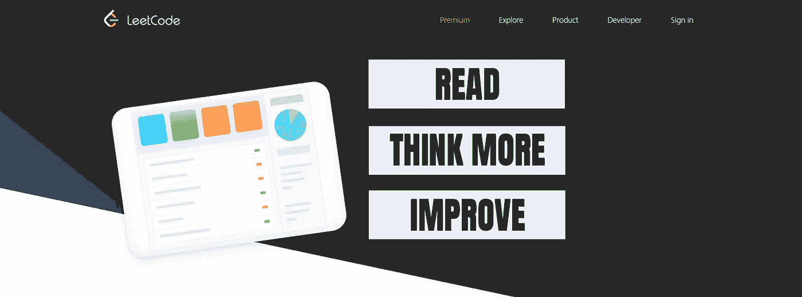
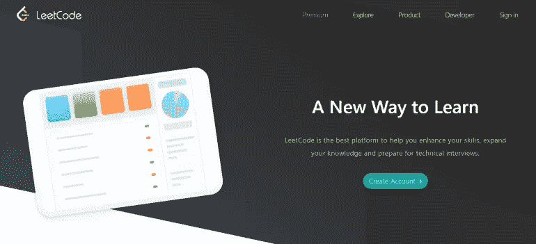
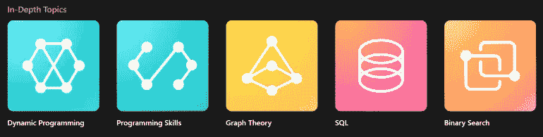
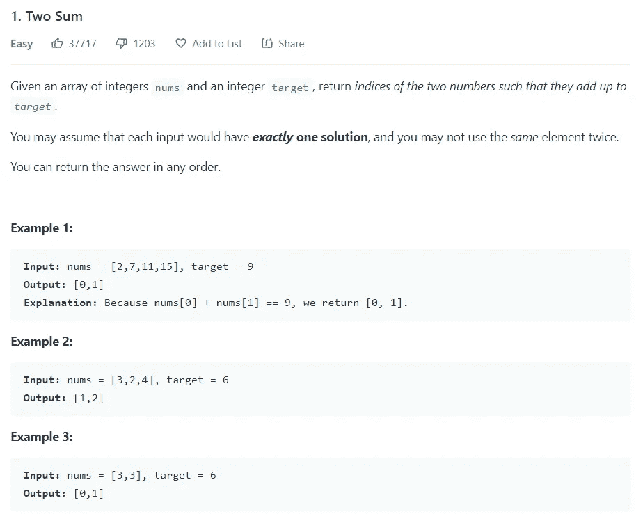
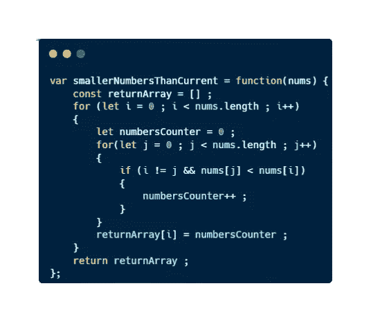
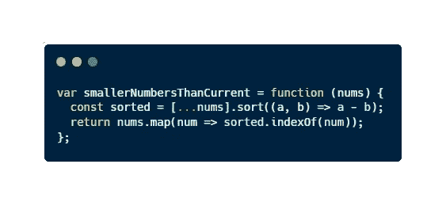

# 我从解决 LeetCode 挑战中学到的 3 个有用的经验

> 原文：<https://medium.com/codex/3-useful-lessons-ive-learned-from-solving-leetcode-challenges-a8468210365d?source=collection_archive---------7----------------------->

作为我成为更好的开发人员的过程的一部分，我已经在不同的网站上解决了编码问题。起初，我认为这将是一个非常无聊的练习，我会讨厌它。然而，**我很享受在这些平台上度过的时光**，我可以说**我的代码因为这次**而得到了改进。

昨天，我思考了一下我解决问题的过程是如何演变的，在其中的一页中，我从我的人生道路中总结了 3 条经验。

今天，我将与大家分享我在这些平台之一上解决数十个挑战时学到的 3 条经验。我确信如果你记住这些课程，你会学得更快、更多。

你准备好提高你的学习了吗？

# 我的代码挑战网站的故事

今年夏天，我通过了一些面试，得到了我的第一份工作，成为一名后端开发人员。我在 9 月 1 日开始这份工作，但我知道我在 7 月 28 日得到这份工作。为此，我开始参加一个编码挑战:[**# 100 daysofcode**](/python-in-plain-english/with-this-challenge-i-am-becoming-a-better-developer-9b8a5f5fcfd)**。**

如果您想了解更多关于我如何计划提高我作为一名开发人员的形象以及我如何为这份工作做好准备的信息，我推荐您查看这篇文章:

 [## 想成为更好的开发者？这是我实现它的计划

### 我会告诉你我的两步计划，在 2022 年成为一名更好的开发者。跟着它，我能够得到我的电流…

medium.com](/codex/want-to-become-a-better-developer-this-is-my-plan-to-achieve-it-1ec318f5200d) 

在这个挑战的第一天，我创建了一个**资源列表**。在这个列表中，我列出了我想学习的语言，我需要掌握的概念，我想开发的项目，以及两个解决编码挑战的网站。

我知道，如果我准备好解决编码问题，我会成为一名更好的开发人员。这个练习**教会你很多关于数据结构**和不同的**方法来优化你的代码**。我选择的其中一个网站是 [**LeetCode**](https://leetcode.com/) 。

## [LeetCode](https://leetcode.com/)

[LeetCode 仪表盘](https://leetcode.com/)

你可能已经听说过 [**Leetcode**](https://leetcode.com/) 。我不确定，但这可能是关于编码挑战的**最著名的一页**。这是因为在 LeetCode 中，你将**找到真实的、经过验证的技术面试问题**。

此外，该平台还为我们提供了一些**学习计划**以了解更多关于数据结构或算法等主题的知识。

关于 [LeetCode](https://leetcode.com/) 的一些话题

使用这个平台，我可以解决许多不同的编程挑战，并尝试更多。想一想，我可以提取我在这个平台上学习的关于解决挑战的 3 条不同的建议，我希望当我解决我的第一个练习时有人说过我。

我确信如果我以前知道这些建议，我会学到更多。你想发现这些提示吗？

# 我学到的用 Leetcode 解决挑战的技巧

仅仅试图解决这些挑战并不能教会我太多，除了发现我对数据结构和有效的代码没有太多的了解。

然而，经过一点思考，我可以提炼出 **3 个非常有趣的提示**:

## 1.你应该一直阅读所有的声明

在一些练习中，你会发现语句中有很多文本。出于这个原因，我已经停止慢慢阅读所有的声明。当我打开一个新的练习时，我试图从语句中找出最重要的单词，并快速阅读例子。我后来发现这种做法是错误的。

> 如果你不读声明，你会丢失信息。

的确，在很多练习中，你会在语句中发现一个**小故事**或一些**不相关的细节**。尽管如此，在练习的这一部分，您将**找到关于用例以及需求的所有信息**。

所以不要犯我的错误**仔细阅读所有语句**(虽然如果发现不相关的故事也可以练习快速阅读)。因为如果你不这样做，你就会编码，提交失败，返回到语句，重新编码你的解决方案…一个**过程地狱**你可以避免只慢慢阅读语句。

LeetCode 中的语句示例

## 2.最好多思考一点，而不是把你的第一个想法编码出来

当我开始解决这些问题时，我提交了我想到的第一个解决方案。随着时间的推移，我发现这种做法不会教我任何东西。

如果这个想法很快出现在我的脑海里，这意味着这个问题对我来说不是一个挑战。还有，我是如何提交我的第一个想法的，很多情况下只是一对循环和如果，没有优化，没有好的实践等等。只有一堆解决问题的代码。

> 能够解决问题并不能让你成为一名优秀的程序员。

**但是解决问题还不够**。每个人都能解决问题，但不是每个人都能给出一个**可读**、**可维护**、**高效**的解决方案。如果我们想成为更好的程序员，这些是我们必须注意的方面。

[图像](https://www.pexels.com/es-es/foto/hombre-en-polo-negro-sentado-frente-a-la-mesa-de-madera-marron-6325938/)来自[像素](https://www.pexels.com/es-es/foto/hombre-en-polo-negro-sentado-frente-a-la-mesa-de-madera-marron-6325938/)

现在当我试图解决一个问题时，我总是有第一个想法。但是**我不马上编码**。我想我知道一些用我所知道的好的实践和数据结构来优化我的初始解决方案的方法。如果我什么也想不出来，我就开始编写解决方案**，试图始终保持代码的可读性和可伸缩性**。

试试这个练习，看看它如何帮助你更好地编码。

## 3.你可以改进你的解决方案

如果你是使用这种平台的新手，在大多数情况下，**你可能不会编写出最佳解决方案**。为此，你总是可以改进你的解决方案。

一般来说，我知道 O(n)解决方案不是好的解决方案，在很多情况下，平台不会接受它们。因此，当我编写了一个我认为是最好的解决方案，而不仅仅是我按照建议 2 想到的第一个，我会提交它。当我提交后，我开始在谷歌上搜索更多的最佳解决方案。

我提交给 LeetCode 的解决方案之一

我尝试搜索大约 10 分钟，以便找到有效的解决方案。我明白了，并在接下来的练习中记下了申请要点。反过来，我试着**想想为什么我没有想出这个解决方案**。

比上述代码更有效的解决方案

这是一个非常好的实践，它让我学到了很多东西，因为我不仅从我的解决方案中学到了东西，还从一个真正的最优解决方案中学到了东西。

# 最后的想法

乍一看，解决编码问题听起来很无聊。事实上，你必须考虑使用**数据结构**和**算法**。但是我们不能忘记，这些概念是发展的重要组成部分。

如果我们想**成为更好的开发者**，我们必须**掌握**这些方面。在诸如 LeetCode 这样的网站上解决挑战可能是一种非常有趣的学习方式。

此外，如果我们稍微思考一下我们如何解决问题以及我们向页面提交什么样的解决方案，我们可以学到比复杂概念更多的东西。为此，在这篇文章中，我与你分享了我在 LeetCode 中解决问题时学到的三个不同的教训。

我希望它们能像对我一样对你有用。

*您使用这些类型的页面吗？有什么解决问题的建议吗？*

想了解更多可以解决编码问题的网站吗？检查这个；)

 [## 我最喜欢的 3 个解决编码挑战的网站

### 🖥️和为什么如果你想在 2022 年成为一个更好的开发者，你必须尝试一下。

medium.com](/codex/my-3-favorites-websites-to-solve-coding-challenges-1bd3b47c6fd0) 

# 结论👋

谢谢大家！非常感谢您阅读这篇文章。如果你想了解更多关于技术和发展的知识，别忘了**跟我来**。我很想知道你对此的看法，所以不要花花公子**写在评论里**，我会读给你听。

如果这篇文章帮助你记住了，你可以**为它鼓掌**并与你的同志们分享。

# 关于作者🤓

嗨！很高兴见到你！我是赫苏斯·拉加雷斯。目前，我是一名后端软件工程师，正在加的斯大学完成我的计算机科学学位。

我的两大爱好是**技术**和**交流**，所以我会抓住一切机会谈论或撰写关于技术的文章。我喜欢把复杂的概念转换成每个人都能理解的简单概念。

# 想要连接吗？📲

📸[**Instagram**](https://instagram.com/jesuslagares_)**|**💼[**LinkedIn**](https://www.linkedin.com/in/jesus-lagares/)**|**📹****|**🐦 [**推特**](https://twitter.com/jesuslagares_)**

**📩**jesuslagaresgalan@gmail.com****

**谢谢！❣️**