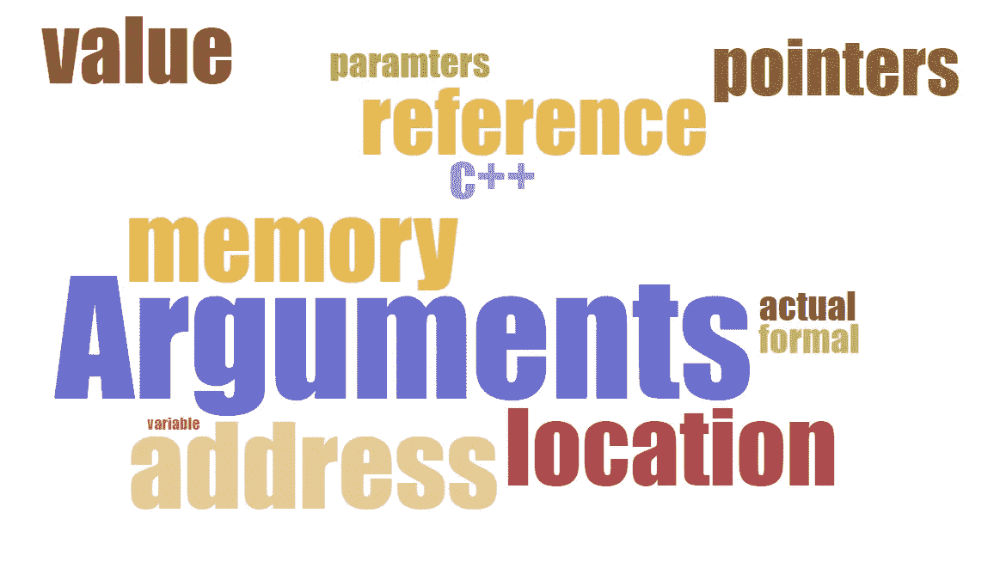
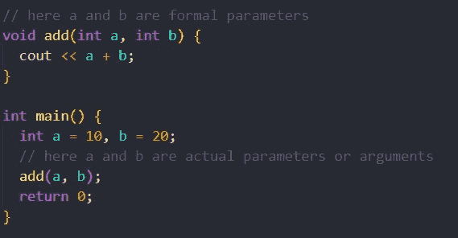
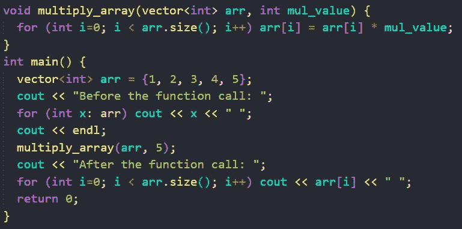
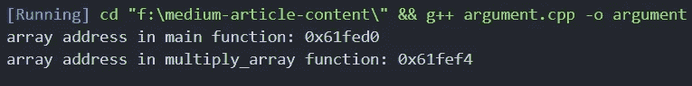
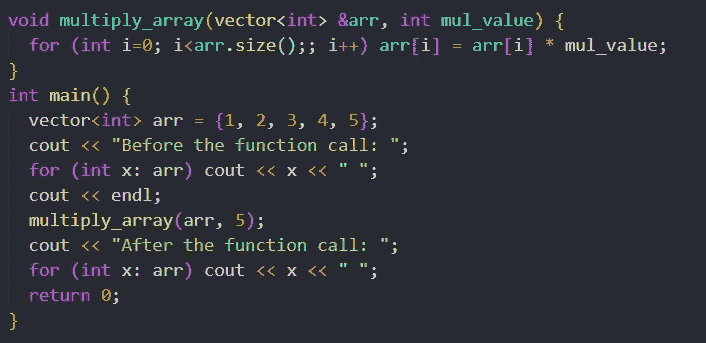
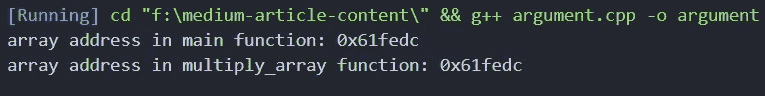
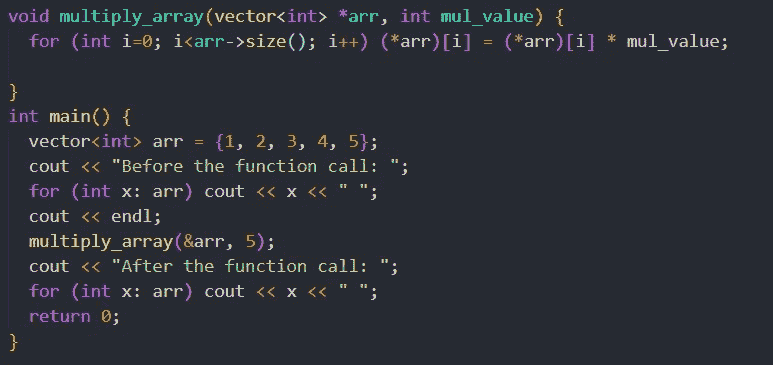
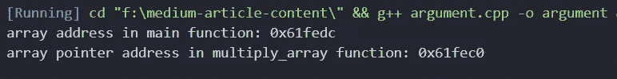

# C++中传递参数的 3 种方式

> 原文：<https://medium.com/codex/3-ways-of-passing-arguments-in-c-f22b9853a5dc?source=collection_archive---------4----------------------->

## C++基础

## 了解你的论点



作者图片

只有三种方法可以将参数传递给函数:

*   **按值传递**
*   **参考通过**
*   **通过地址**

本文将详细讨论这三种方法。

在继续之前，让我们看看**实际参数**和**形式参数。**

*   **实际参数**(也称为自变量)是传递给函数的值。
*   **形参**是在函数定义中定义的变量。



实际参数与形式参数

# 按值传送

在**按值传递中，**实际参数的值被复制到形式参数中。对函数定义中的形参所做的更改不会反映在实参的变量中。在 C++中，默认情况下参数是通过值传递的。



带代码的传值示例

此代码的输出是:

```
Before the function call: 1 2 3 4 5
After the function call: 1 2 3 4 5
```

当控制权从主函数转移到 multiply_array 函数时，**为**形参**创建新的内存位置**，并将**实参**的值复制到其中。在**主**和**乘数组**函数中打印数组地址时，我们得到不同的值。这样就确认了实参变量的副本被传入了形参。

```
void multiply_array(vector<int> arr, int mul_value) {
    cout << "array address in multiply_array function: " << &arr <<
    endl;
}
int main() {
    vector<int> arr = {1, 2, 3, 4, 5};
    cout << "array address in main function: " << &arr << endl;
    multiply_array(arr, 5);
    return 0;
}
```



当数据按值传递时，函数中数组的地址

按值传递使用更多的内存，因为对于同一个变量，有两个内存位置。

# 通过引用传递

在**引用传递中，**实际参数的**引用**被复制到形参中。所以在函数中引用被用来访问参数的实际值。因此，函数内部的任何变化都将反映在实际参数的变量中。通过引用传递变量 **&** 符号用于捕捉形式参数。看下面的例子有一个更清晰的画面。



用代码传递引用示例

此代码的输出是:

```
Before the function call: 1 2 3 4 5
After the function call: 5 10 15 20 25
```

当控制权从主函数转移到 multiply_array 函数时，没有为形参创建新的存储单元**。更确切地说，形式参数用于**引用**实际参数的存储位置。在两个函数中打印数组的地址时，我们得到了相同的结果，这证实了前面的陈述。**

```
void multiply_array(vector<int> &arr, int mul_value) {
    cout << "array address in multiply_array function: " << &arr <<
    endl;
}
int main() {
    vector<int> arr = {1, 2, 3, 4, 5};
    cout << "array address in main function: " << &arr << endl;
    multiply_array(arr, 5);
    return 0;
}
```



当数据通过引用传递时，两个函数中的数组地址

引用传递节省内存，因为变量的引用被复制。

# 按地址传递

在**传递地址**也称为**传递指针中，**复制形式参数中实际参数的**地址**。在函数中，地址用于访问实际参数。因为使用了变量的地址，所以对函数内部的形参所做的更改会影响到实际的形参。通过地址 **&** 传递变量，传递实参时使用符号 ***** 捕捉形参时使用符号。



带代码的传递地址示例

此代码的输出是:

```
Before the function call: 1 2 3 4 5
After the function call: 5 10 15 20 25
```

当控制从主函数转移到 multiply_array 函数时，**新的内存位置**被创建，用于存储形式参数指针的值。在打印 multiply_array 函数中的指针地址和 main 函数中的数组地址时，我们得到了不同的值，从而证实了前面的陈述。

```
void multiply_array(vector<int> *arr, int mul_value) {
    cout << "array address in multiply_array function: " << &arr <<
    endl;
}
int main() {
    vector<int> arr = {1, 2, 3, 4, 5};
    cout << "array address in main function: " << &arr << endl;
    multiply_array(&arr, 5);
    return 0;
}
```



主函数和指针 multiply_array 函数中数组的地址

总之，可以说按引用传递和按地址传递比按值传递更有效。感谢您阅读这篇文章。希望这对你有帮助。在 [LinkedIn](https://www.linkedin.com/in/ashish-yoel-585a6116a/) 上与我联系。

## 阅读更多

[](https://blog.bytellect.com/software-development/cplusplus/which-is-faster-in-cplusplus-call-by-value-call-by-reference-or-call-by-pointer/) [## C++中按值调用、按引用调用和按指针调用哪个更快？

### 当引用或指针作为参数传递给函数时，指针大小的东西必须是…

blog.bytellect.com](https://blog.bytellect.com/software-development/cplusplus/which-is-faster-in-cplusplus-call-by-value-call-by-reference-or-call-by-pointer/) [](https://www.differencebetween.com/difference-between-actual-and-vs-formal-parameters/) [## 实际参数和形式参数之间的差异|比较相似术语之间的差异

### 使用函数是编程中的一个重要概念。函数是一些语句，它们可以执行某种…

www.differencebetween.com](https://www.differencebetween.com/difference-between-actual-and-vs-formal-parameters/) [](https://www.geeksforgeeks.org/pointers-c-examples/) [## C/C++中的指针及示例- GeeksforGeeks

### 指针是地址的符号表示。它们使程序能够模拟引用调用以及…

www.geeksforgeeks.org](https://www.geeksforgeeks.org/pointers-c-examples/)