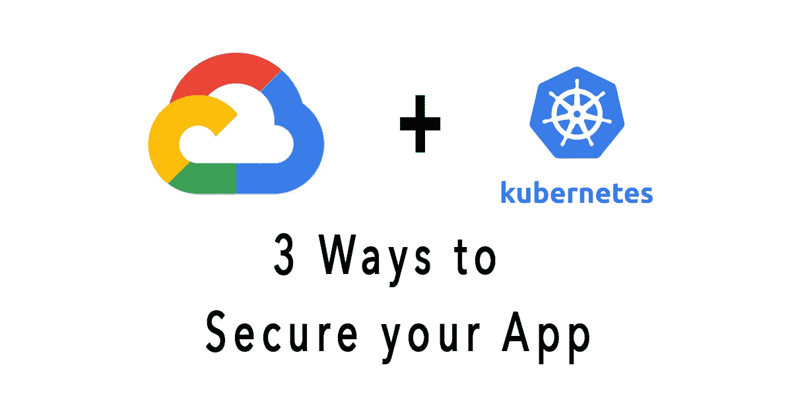

# 在 Kubernetes 引擎上保护您的应用程序的 3 种方法

> 原文：<https://medium.com/codex/3-ways-to-secure-your-app-on-kubernetes-engine-274ea549eeee?source=collection_archive---------4----------------------->

## [法典](http://medium.com/codex)

在配置安全性时，应该向应用程序授予仍然允许它们正确运行的最小特权集。当应用程序拥有比它们需要的更多的特权时，它们受到危害时就更加危险。在 Kubernetes 集群中，这些权限可以分为以下几个主要级别:

*   **主机访问:**描述了…