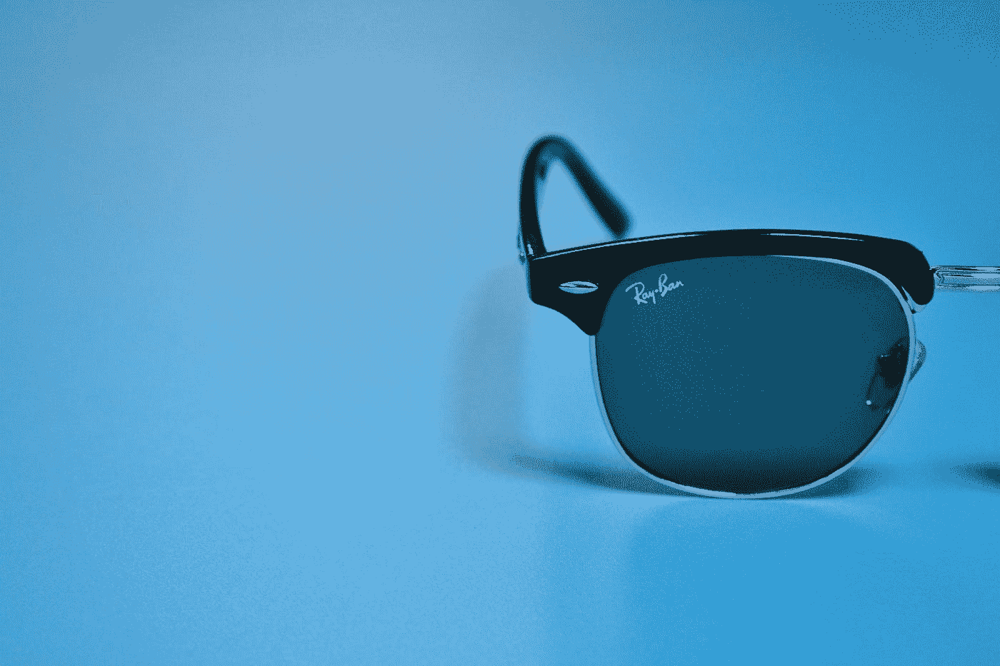

# 戴着蓝色滤光眼镜工作 30 天

> 原文：<https://medium.com/codex/30-days-of-work-with-blue-filter-glasses-5b4b70d9c2ea?source=collection_archive---------4----------------------->

## 健康|生活窍门|编程

## 有没有道理？

迈克尔 C 在 [Unsplash](https://unsplash.com?utm_source=medium&utm_medium=referral) 上的照片

我是一名[软件](/codex/2-job-interview-questions-that-90-of-developers-fail-3cef9bbfe46d) [工程师](/codex/4-red-flags-of-terrible-it-company-710b36a81e7e)。我每天花 ***8 小时*** 在屏幕前做我的[主要工作](/codex/20-years-old-senior-developer-job-interview-joke-or-new-reality-5150c55971c8)。然后我再花***2-3 个小时*** 做我喜欢的项目。然后我让自己休息一下，看看 YouTube 或网飞。