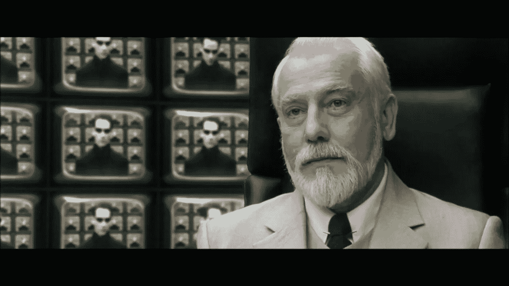

# 我作为软件架构师第一年学到的 35 件事

> 原文：<https://medium.com/codex/35-things-i-learned-in-my-first-year-as-an-architect-6dff145d6589?source=collection_archive---------0----------------------->

黑客帝国重装上阵——建筑师场景

# 介绍

我曾在许多小型创业公司(不到 30 名工程师)担任软件架构师，为了满足角色的需要，我不得不快速提升。所以我认为讲述这段旅程是一个很好的主意，希望能帮助和我处境相似的人。

所以这里有 35 件事，我希望在我开始之前有人教过我！

**注意:**这篇文章有点长——如果你只看标题，应该只需要几分钟。深潜大约需要 10 分钟。

**TL；博士**

建筑师的角色可能有巨大的影响力。为了最大化影响，关注你对 R&D 团队真正的附加价值，而不是推动当前流行的流行语。

# 一般注释/备注

*   软件架构师的角色没有明确的定义。你可以去挖掘信息，但事实是:**你最有可能在学习、设计、编码和评审时塑造角色。**
*   架构师/首席开发人员负责软件开发周期的主要部分。以下注释可以帮助您更好地掌握该角色、其在公司/团队中的位置以及该角色如何影响他人。

# 人

斯科特·布莱克在 [Unsplash](https://unsplash.com?utm_source=medium&utm_medium=referral) 上拍摄的照片

*   你的大部分时间将用于招聘、入职、指导和辅导。**正确选择团队成员和适当的指导将有助于你通过他人塑造你的愿景。**
    ***举例:*** 明智地选择你的员工。如果他们和你一样对一个概念充满热情，他们会帮助你在团队成员和整个组织中推广这个概念。指导时，确保你的设计决策是一致的。矛盾会减缓进度，降低团队的动力。
*   构建你的代码库，这样团队就可以从中成长。您选择的架构将影响您当前的员工、他们的技能组合和工作实践，以及未来的招聘需求。
*   *单一回购 vs 多重回购*。如果你错过了过去几年围绕单一回购的讨论，将一家公司的整个代码库放入一个单一的公司范围的存储库已经变得很常见。有一些缺点，但从团队的角度来看，有一个巨大的内在优势:每个人都可以立即学习和贡献，没有障碍。
    当存储库根据专长或知识领域划分时，共享代码和信息变得困难，每个员工的贡献和能力都被“孤立”起来，其他团队无法访问。
*   分离您的代码库的一部分，供外部团队——比如说，离岸团队——将来使用。为了实现这一点，**实现核心组件和操作模块之间的分离。**
    ***示例:*** 独立的运营领域，如分析、报告、管理功能和第三方的 web 应用。

# 设计

由 [Med Badr Chemmaoui](https://unsplash.com/@medbadrc?utm_source=medium&utm_medium=referral) 在 [Unsplash](https://unsplash.com?utm_source=medium&utm_medium=referral) 上拍摄的照片

*   建筑材料——不管是什么——都需要同样的方法。如果你正在建造一个宜家办公桌，建造一条高速公路，翻新你的厨房，或者重新设计一个完整的代码库，你仍然需要把复杂的问题分解成小的、分散的任务。
*   一个好的设计可以通过许多参数来衡量，但成功的关键是从一个记录良好的过程开始，这个过程鼓励团队成员参与、贡献和突破界限——从第一天开始。
    ***示例:*** 创建一个简单的设计文档，封装整个流程。涵盖的主要主题有:
    -总体概念
    -高层流程
    -业务需求
    -质量度量
    -绩效指标
    -范围外的问题

# 技术

[都铎·巴休](https://unsplash.com/@baciutudor?utm_source=medium&utm_medium=referral)在 [Unsplash](https://unsplash.com?utm_source=medium&utm_medium=referral) 上的照片

*   实现一致性的最佳方式是自动化关键流程。一旦过程自动化并开始显示“成功”和“失败”，项目管理就会大大简化。
*   所有的最佳实践都应该完全自动化，否则，它们可能经不起时间的考验。
*   创建一个价值/成本计算器，用它与公司管理层分享你的分析——这将帮助他们理解决策过程。例如，它可以用来选择供应商，比如提供开源解决方案的供应商和提供托管解决方案的供应商。
*   编程语言、库和框架只是达到目的的一种手段。如果你想让人们跟随你，忽略“每月流行”的宣传，你必须有自己强烈的编程信念。这些信念将成为你在波涛汹涌的大海中航行的指南针。
    ***例如:*** 总是试图在完全理解手头问题的基础上解决问题——而不是在讨论问题时引用特定的库名。请记住，人们在谈到自己喜欢的图书馆时，往往会情绪激动(甚至咄咄逼人)。
*   技术决策应该始终与业务决策同步。
    ***举例:*** 推出一款新产品要与公司支持该产品的能力充分协调。
*   不要把你的技术工程师限制在纯粹的研发工作上。与其他团体合作将使每个人受益。
    ***示例:*** 与人才获取人员密切合作的工程师通常对团队表现出更高的忠诚度，这种合作通常会带来更高质量的员工。他们还可以帮助提高客户成功团队的绩效。
*   最后，在你的信念上保持一致，并且**不要在紧急的新功能上妥协**，那可能会降低产品质量。

# 质量

*   可以为会议记录、设计概念和调试过程创建一个模板。架构师的首要任务是调整团队的质量理念。哲学应该反映出你在软件设计、架构和开发中根深蒂固的信念。任何事情都不应该碰运气。
    ***举例:*** 决定什么该考什么不该考。如何测试，以及如何测量。手动与自动化技术。
*   质量管理是一个持续的过程，包括方法和效率的改进。质量设计应该反映产品生命周期的特征。
    ***示例:*** A/B 测试、预发布测试、生产过程中的质量控制测试、左移/右移方法。
*   **一个好的质量设计将包含自动测试、手动测试和代码质量监控的不断发展的组合。总是寻找附加值。
    ***例子:*** 手动测试应该适应于包括 UX 反馈。应该鼓励 QA 团队提供各种学科的反馈。**

# 影响

*   你将花费大量时间说服你的同事、经理和团队成员你的议程、理念和决策，因此:
*   学会做一个“人缘好的人”,能够建立一个伙伴联盟来支持你的事业。
*   你的推销技巧应该和连续创业者一样好。
*   你的设计概念演示必须是一流的，以便有效地向各种各样的观众展示新概念。
*   使用类比让你的陈述更有说服力。一定要小心选择类比，确保你没有因为举一些人/组织/职业的反面例子而冒犯到任何人。我强烈建议使用建筑类比——比如道路和建筑。相似之处无处不在。
*   人们倾向于批评新的过程，但是如果有一个记录良好的过程，其中每个人都理解对他们的期望，这就变得容易管理了。
    ***举例:*** 假设你要向团队介绍一个结对编码流程。仅仅给团队成员分配任务会导致失败。相反，提供一个记录良好的过程描述，这将减少他们之间的摩擦，并给每个人一个发言和影响决策的机会。
*   **委派责任，以身作则。**展示事情是如何完成的，以及你如何使用你拥有的整套工具，并引导他们取得更好的结果。
*   对委派的任务提供指导，直到不再需要为止。刚开始可能会有点不舒服，但是在指导和独立之间找到合适的平衡，你的同事会让你成为一个比你梦想的更好的领导者。

# 工作流程

*   创建模板将使您的生活变得更加轻松。
    ***示例*** *:* 设计审查此处(链接至上方项目符号)
*   模板可以托管在存储库上，公开相同的 CI/CD 管道、代码指南、安全性、审计和林挺。
*   可以为会议笔记、设计概念和调试过程创建模板。
*   模板可用于探索新功能。
*   模板在准备工作面试时会很有用。
    ***举例:*
    -** 没有对错答案的问题池，只是衡量理解的深度。
    -预先准备的技术问题，从团队的日常任务中收集。

# 文化

*   没有合适的视频通话，永远不要在 Slack/WhatsApp/即时通讯上争论。
*   保持谦逊的态度，控制你的自我——许多人际挑战在等着你。
*   与所有利益相关者的公开交流对你的团队和公司的发展至关重要。
*   对变化持开放态度，对批评持开放态度，对学习持开放态度。