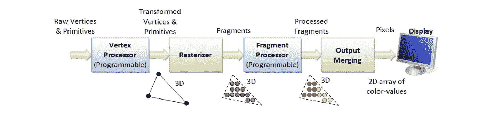
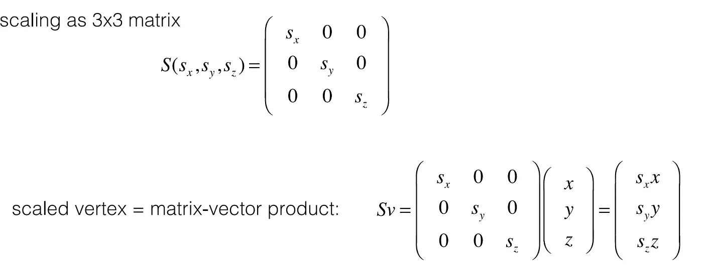
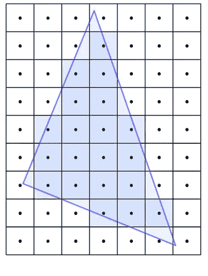
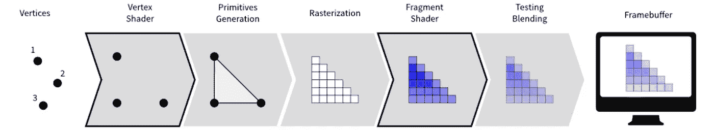

# Android 中使用 OpenGL 的 3D 图形

> 原文：<https://medium.com/codex/3d-graphics-with-opengl-in-android-5e5d8a4f7d2b?source=collection_archive---------2----------------------->

## [抄本](http://medium.com/codex)

计算机图形是我们生活的核心部分，在电影、游戏、计算机辅助设计、虚拟模拟器、可视化，甚至成像产品和相机中。当我们玩 3D 游戏、体验虚拟现实或与复杂的数据可视化交互时，组成这样一个场景的几何图形必须在设备上每秒钟重画几十次。除了由点、线和多边形组成的几何图形之外，我们通常还在 3D 场景中使用纹理、照明和虚拟相机来控制形状和对象的外观，并改变我们在场景中的视角。

**OpenGL** 是渲染 2D 和 3D 矢量图形的应用编程接口。API 通常用于与*图形处理单元*交互，以实现*硬件加速渲染*。OpenGL 的对象由图元组成(如三角形、四边形、多边形、点和线)。图元通过一个或多个顶点来定义。 **Android 通过其框架 API 和本地开发工具包(NDK)支持 OpenGL** 。本文主要讨论 Android 框架的 API 接口。

Android 框架中有两个基础类，可以让你用 OpenGL ES API 创建和操作图形:`[GLSurfaceView](https://developer.android.com/reference/android/opengl/GLSurfaceView)`和`[GLSurfaceView.Renderer](https://developer.android.com/reference/android/opengl/GLSurfaceView.Renderer)`。我们将使用 OpenGL 来创建 3D 形状和动画。在我们将对象绘制到屏幕上之前，我们需要通过 OpenGL 管道发送它，为此我们需要使用称为 ***着色器的小子程序。*** *着色器告诉图形处理单元(GPU)如何绘制我们的数据*。有两种类型的**着色器顶点着色器和片段着色器，**着色器是在 GPU 上为每个顶点(顶点着色器)或每个片段(片段着色器)并行执行的小程序

1.**一个*顶点着色器:*** 它生成每个顶点的最终位置，并且每个顶点运行一次。一旦知道了最终的位置，OpenGL 将获取可见的顶点集，并将它们组合成点、线和三角形。

2.**一个*片段着色器:*** 它生成点、线或三角形的每个*片段*的最终颜色，并对每个片段运行一次。片段是一个单一颜色的小矩形区域，类似于计算机屏幕上的一个像素。

# OpenGL 中的图形管道

OpenGL 中的图形管道

顶点处理器:就像瘸子在纸上画画一样，点和线连接在一起形成共同的几何图形。顶点只是表示几何对象的一个角的点，具有与该点相关联的各种属性。最重要的属性是位置，代表这个顶点在空间中的位置。

顶点处理包括将模型从模型空间转换到世界空间，并将视图转换到相机空间，然后将其投影到设备的屏幕上。在将对象渲染到归一化的设备坐标时，可以通过缩放、旋转和变换以及投影(正交投影或透视投影)的矩阵运算来应用各种变换

**光栅化**

这确定了被图元(例如三角形)覆盖的像素，并为每个被覆盖的像素内插顶点着色器的输出变量(即变化的变量和深度)。

[图片来自维基百科](https://upload.wikimedia.org/wikipedia/commons/d/d6/Pixels_covered_by_a_triangle.png)

**片段处理**

**片段着色器**是**着色器**阶段，它将光栅化生成的**片段**处理成一组颜色和单个深度值。**片段着色器**是图元光栅化后的 **OpenGL** 流水线阶段。对于由图元覆盖的像素的每个样本，生成一个“**片段**”。光照、阴影、插值和纹理映射都在这里完成。

[图片来自 vispy](https://vispy.org/getting_started/modern-gl.html)

**输出合并**

一旦生成了最终的颜色，OpenGL 会将它们写入一个被称为*帧缓冲区*的内存块，然后 Android 会在屏幕上显示这个帧缓冲区。

**让我们跳转到某个编码**

**设置环境**

为了向后兼容，我们将使用 OpenGL ES 2.0 支持，它与 API 10 兼容:Android 2.3.3(姜饼)和更高版本。

创建 GLSurfaceView 的实例

GLSurfaceView 负责 OpenGL 初始化的一些细节，例如在后台线程上配置显示和渲染，处理标准的 Android 活动生命周期，例如 *onCreated* 和 *onDestroyed* 。这种渲染是在显示器的一个特殊区域完成的，称为*表面*；这有时也被称为*视口*。

在处理 android 的活动生命周期事件时，我们增加了暂停和恢复的方法，以符合 Android 的活动生命周期。这样我们的 surface view 就可以适当地暂停和恢复后台渲染线程以及释放和更新 OpenGL 上下文，如果我们不这样做，我们的应用程序可能会崩溃并被 Android 杀死

**创建渲染器**

渲染器负责调用 OpenGL 来渲染帧。GLSurfaceView 将在单独的线程上调用 renderer 方法。默认情况下，GLSurfaceView 将连续呈现，通常以显示器的刷新率呈现，但我们也可以通过使用 GLSurfaceView 调用 GLSurfaceView.setRenderMode()来配置表面视图，使其仅在请求时呈现。RENDERMODE_WHEN_DIRTY 作为参数。由于 Android 的 GLSurfaceView 是在后台线程中做渲染的，所以一定要小心，只在渲染线程内调用 OpenGL，Android UI 只在 Android 的主线程内调用。我们可以在 GLSurfaceView 实例上调用 queueEvent()，在后台渲染线程上发布一个 Runnable。

**创建出对象**

OpenGL 希望你在一个数组中发送所有的顶点。一个**顶点数组**对象(VAO)是一个 **OpenGL** 对象，它存储了提供**顶点**数据所需的所有状态(下面有一个小的例外)。它存储了**顶点**数据的格式以及**缓冲**对象(见下文)提供的**顶点**数据**数组**。我们将创建一个**场景**，它有**地板**、**球、墙、水花和水滴。我们将为场景中的物体定义顶点，如下所示。**

> 我们使用浮点数的顺序列表来定义顶点数据，这样我们就可以用小数点来存储位置。这个数组就是我们的*顶点属性数组*。Java 中的 Float 有 32 位精度，而 byte 有 8 位精度。每个浮点数中有 4 个字节。FloatBuffer 将用于在本机内存中存储数据。我们可以访问 Java 中的一组特殊的类，这些类将分配一块本地内存并将我们的数据复制到该内存中。本地环境可以访问这个本地内存，并且它不会被垃圾收集器管理。我们通过调用`*StoreVertexData(..)*` *方法*中的 glBufferData()和`*StroreVertexData*` *中的`glBindBuffer`将数据上传到指定缓冲区 ID* 的 buffer 对象中

我们实现渲染器接口定义的方法:

***onSurfaceCreated(GL11 glUnused，EGLConfig config)***GLSurfaceView 在创建表面时调用这个。这发生在我们的应用程序第一次运行时，也可能在设备唤醒或用户切换回我们的活动时被调用..

**onSurfaceChanged(GL11 Glu nu used，int width，int height** ) GLSurfaceView 在创建表面后以及尺寸改变时调用此函数。当从纵向切换到横向时会发生尺寸变化，反之亦然。

**onDrawFrame(GL10 glUnused)**GLSurfaceView 在绘制框架的时候调用这个。我们*必须*画点什么，哪怕只是为了清空屏幕。这个方法返回后，渲染缓冲区将被交换并显示在屏幕上，所以如果我们不画任何东西，我们可能会得到不好的闪烁效果。

**结论**

这是 github repo 的链接，你现在可以放心地根据需要将它应用到你的 android 项目中。

 [## banjodayo 39/3 androidgraphicwith OpenGL

### 这是一个用 android 和 OpenGL 制作的 3D 场景。OpenGL 是一个应用程序，用于渲染 2D 和三维矢量…

github.com](https://github.com/banjodayo39/3DAndroidGraphicWithOpenGL.git)