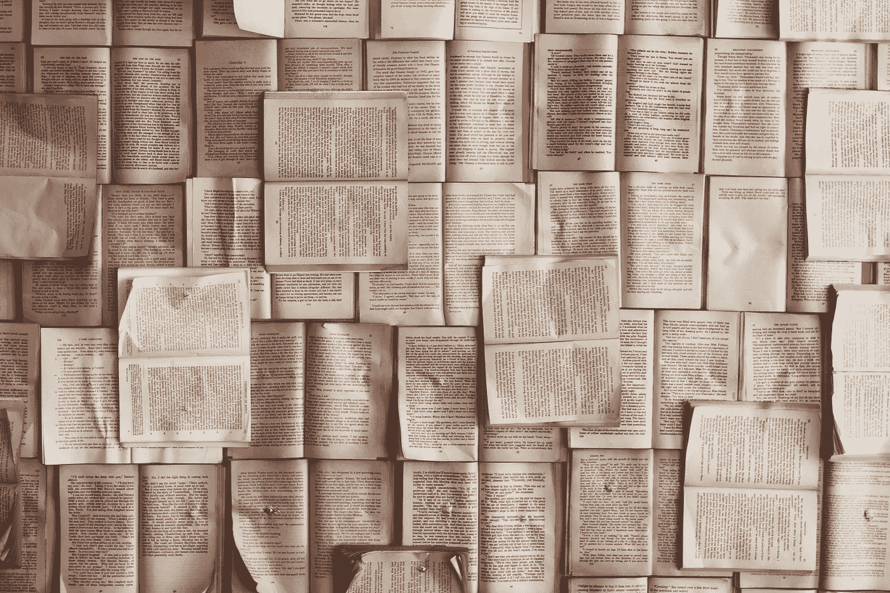

# 作为一名博士生，我花了 3 年时间研究机器学习——到目前为止我学到了什么

> 原文：<https://medium.com/codex/3yrs-into-machine-learning-as-a-phd-student-what-i-learned-so-far-e5a1a1bf69e1?source=collection_archive---------6----------------------->

## 机器学习体验

## 从博士生的角度看机器学习

帕特里克·托马索在 [Unsplash](https://unsplash.com/s/photos/study-machine-learning?utm_source=unsplash&utm_medium=referral&utm_content=creditCopyText) 上的照片

# 介绍

自从我开始攻读自主水下航行器(AUV)的博士学位以来，已经过去了将近 3 年半的时间，我在那里使用机器学习，深度学习…