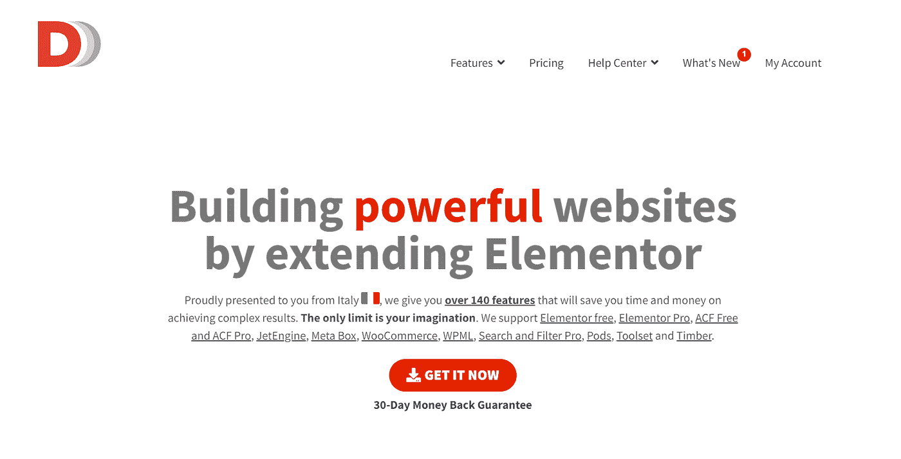
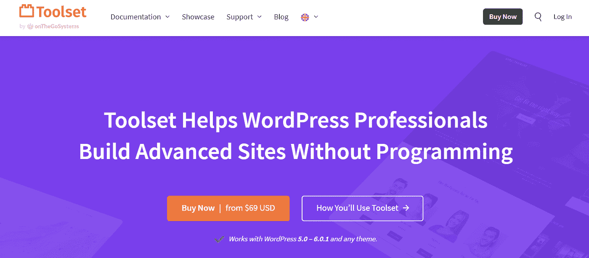
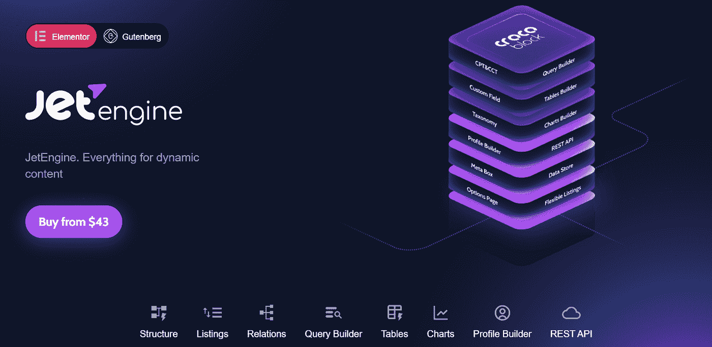
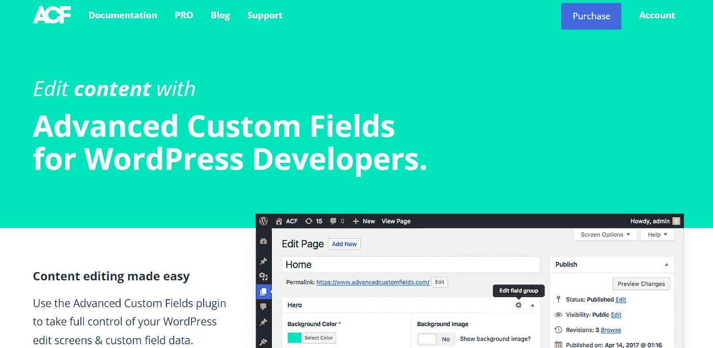

# 4 个最好的动态内容工具

> 原文：<https://medium.com/codex/4-best-wordpress-dynamic-content-tools-6d0512aa7ca8?source=collection_archive---------6----------------------->

斯蒂芬·菲利普斯-Hostreviews.co.uk 在 [Unsplash](https://unsplash.com?utm_source=medium&utm_medium=referral) 上的照片

什么是动态内容？你如何在你的[网站上使用它？在这里，我将回答这两个问题。然后，我将解释动态内容与静态内容的不同，提供一些例子，并向您介绍一些流行的 WordPress 插件，您可以使用它们来使您的网站动态化。](https://medium.com/codex/tagged/wordpress)

# 解释的动态内容

动态内容是根据位置、时间和用户而变化的交互式 web 内容。当一个人浏览一个动态网站时，WordPress 将从数据库[中提取正确的信息](/codex/5-best-practices-to-optimize-your-wordpress-database-6c0201b0cba7)显示给用户，这取决于各种因素，比如他们的偏好、他们正在浏览的页面以及他们过去的浏览历史。这创造了比静态内容更具互动性的体验，静态内容对所有观众来说始终是一样的。

**动态内容的一个众所周知的例子是 YouTube。如果你登录了，YouTube 知道你的偏好和过去的观看历史，并会向你展示它认为你会喜欢的推荐视频。然后你在看视频的时候，它会根据你在看的内容推荐相关视频。**

另一个例子是一个健身房网站，你可能想在那里看到各种健身房。每个健身房都有不同的信息，例如，健身房名称、地址和可用的设施。所以，当你点击每个健身房的时候，你会看到不同的相关内容，这些内容是你在其他页面上找不到的。

在过去，构建一个动态网站需要进行大量的定制开发。你现在可以从各种插件中选择创建动态网站，而无需学习编程或雇佣网络开发人员。这里有四个插件，可以让你轻松地在你的 WordPress 网站上创建[动态内容。](https://crocoblock.com/blog/dynamic-wordpress-content-explained/)

# [元素的动态内容或](https://www.dynamic.ooo/)

这个工具是专门为那些希望创建功能强大的网站的设计者和开发者设计的。顾名思义，Elementor 的动态内容允许您用来自不同来源的数据填充 Elementor。

如果你是一个开发人员，想为 Elementor 获得更多的特性，这就是你要的工具。我不能在本文中涵盖它的所有特性，但是这个插件最强大的方面是它定制的小部件和扩展。

【Elementor 主要特性的动态内容:

*   60 个部件
*   24 个扩展
*   几十个模板
*   四个特定于页面的设置
*   轻松添加 PHP、动态标签、光标跟踪器和高级遮罩
*   大量的 SVG 图像效果
*   元素或表单功能扩展

许多小部件本质上是 JavaScript 库改造成的 Elementor Pro 小部件。所以，你可能会想，当我可以使用 JavaScript 库的时候，为什么这个插件要花钱呢？我问自己同样的问题，并试图做到这一点。

将 JavaScript 库整合到 WordPress 中可能有点困难，但是将 Elementor Pro 加入其中会使事情变得更具挑战性。一个更好的选择是购买 Elementor 插件的动态内容，这将使您能够访问顶级 JS 库，如 web GL、光标跟踪、平滑页面过渡等等。

**定价:**

*   一个站点每年 49 欧元
*   每年 169 欧元，最多 1000 个站点

# [工具集](https://toolset.com/)

Toolset 是另一个流行的插件，用于定制文章类型和字段。它宣称自己是“构建高级 WordPress 站点的最快方式”,无需编写 PHP 代码或创建子主题。你可以使用 Block Editor 在 WordPress 中完成所有的设计。

**工具集的主要特性:**

在其大量的功能中，您将发现创建以下内容的能力:

*   新的自定义帖子类型
*   模板、归档和内容列表
*   网站搜索
*   记录链接
*   目录和电子商务页面
*   分类学
*   多语言网站

不幸的是，在自定义字段列表中，您将找不到 Datetime、Textarea 或 Switcher，它们出现在高级自定义字段(ACF)和 JetEngine 中。

**定价:**

*   一个站点每年 69 美元
*   三个站点每年 149 美元
*   无限制站点每年 299 美元

# [喷气引擎](https://crocoblock.com/plugins/jetengine/)

Crocoblock 为 Elementor 提供了许多特定的插件，但我将专门关注其中一个产品 JetEngine。JetEngine 被明确设计为在显示条件数据时增加 Elementor 或 Gutenberg 编辑器的功能。它类似于高级自定义字段，只是它是为 Elementor Pro 专门构建的，并且集成得非常好。

**JetEngine 的主要特点:**

*   设置一个[自定义帖子类型](https://crocoblock.com/blog/wordpress-custom-post-type-examples-and-plugins/)以一种易于理解的方式组织你的内容。
*   添加分类法来帮助您对自定义文章类型进行分类。
*   添加自定义字段，帮助您在网站前端添加、编辑和显示数据。
*   在 Elementor 网站的后端，创建一个选项页面允许您存储和更改可以应用于文章类型、自定义字段或分类的所有附加选项。

**定价:**

每年 43 美元。

# [高级定制字段(ACF)](https://www.advancedcustomfields.com/)

高级自定义字段使您能够创建在整个网站上动态显示内容所需的数据结构。它允许您根据需要在任何地方添加字段，并在任何地方显示它们。它充满了强大的功能和 30 多个字段类型，但简单直观。

不幸的是，ACF 仅限于设置内容的结构。将动态内容放在网站的前端需要了解 PHP 或者使用兼容的插件。

和大多数顶级 WordPress 插件一样，有免费和付费版本。免费版本适用于大多数情况。你可以使用大多数的字段类型，这将比没有插件的时候节省你更多的时间和麻烦。

**ACF 的主要特点:**

*   向帖子和页面添加自定义字段和元框。
*   创建帖子之间的关系。
*   创建数据并将其保存到数据库的选项表中。这意味着数据不依赖于任何特定的文章或页面，这是创建您希望稍后在页眉和页脚中显示的内容的理想选择。

**专业版的附加功能:**

*   如果您想要在帖子中多次包含同一个字段，重复字段会很有帮助。
*   ACF 块使您能够显示自定义字段，而不是块样式中的标准元框。如果您正在为客户构建网站，并且需要尽可能容易地理解自定义字段数据，这将非常有用。
*   图库字段允许您将多个图像上传到单个字段。

**定价:**

主要功能免费，专业版收费:

*   一个站点每年 49 美元
*   10 个站点每年 149 美元
*   无限制站点每年 249 美元

# 结论

如果你维护一个内容不断变化的网站，一个动态的网站会很适合你。创建动态网站比以往任何时候都更容易，这要归功于各种插件，这些插件使您能够定制内容、在任何需要的地方动态显示内容，或者两者兼而有之——所有这些都无需编码！

你通常建静态网站还是动态网站？你已经在使用提到的插件中的动态特性了吗？给我留言，让我知道！