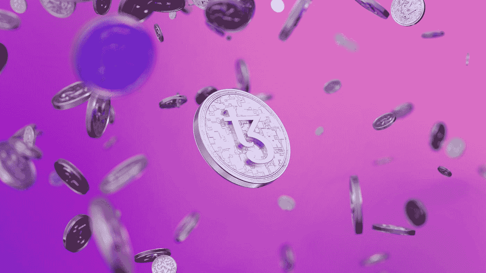

# 4 个聪明的方法来利用 NFTs 赚取被动收入

> 原文：<https://medium.com/codex/4-clever-ways-to-use-nfts-to-earn-passive-income-8f15f99cf441?source=collection_archive---------16----------------------->

## 用这些独特的方法赚取被动收入！

由[泰佐斯](https://unsplash.com/@tezos?utm_source=medium&utm_medium=referral)在 [Unsplash](https://unsplash.com?utm_source=medium&utm_medium=referral) 上拍摄的照片

NFT 是新一代的收藏品，一种新的底层技术允许创作者设定自己的条款。一旦你把你的一个非功能性物品卖给一个收藏者，你将无限期地从那次销售中获得被动收入。有几种方法可以通过非功能性交易获得被动收入。这些…