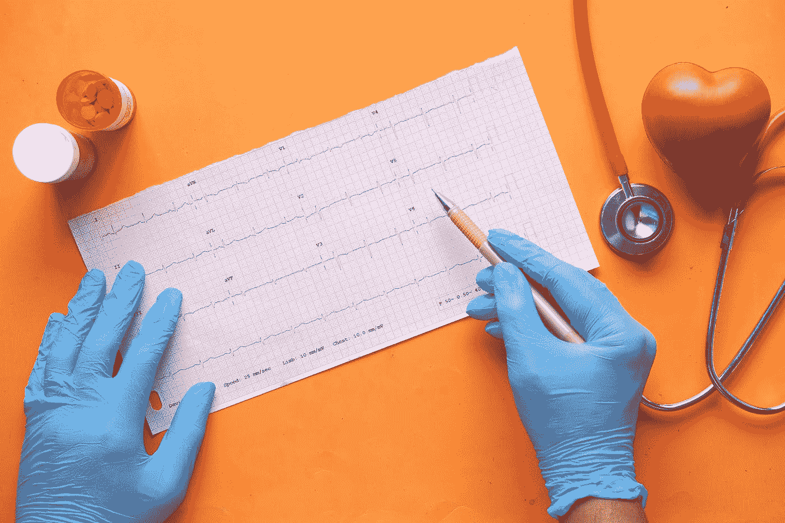
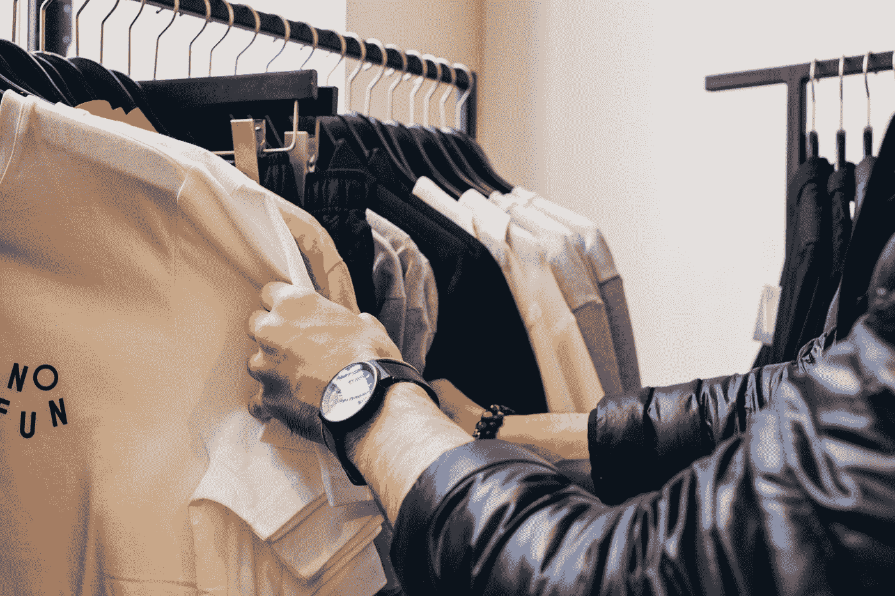

# 您下一个数据科学项目的 4 个数据集

> 原文：<https://medium.com/codex/4-datasets-for-your-next-data-science-project-f842610a51db?source=collection_archive---------7----------------------->

## 基于分类的数据科学项目的前 4 个数据集

照片由[屋大维丹](https://unsplash.com/@octadan?utm_source=medium&utm_medium=referral)在 [Unsplash](https://unsplash.com?utm_source=medium&utm_medium=referral)

作为一名新手，很难选择要做哪些项目，哪些项目是简单的，会有助于增加你的简历？这篇文章将在这方面帮助你。

在本文中，我将向您展示 4 个可以使用分类算法(监督学习)的数据集。我正在查看主要集中在分类算法上的数据集，看看在哪里可以使用这种方法。

我使用了 Kaggle 并过滤了数据集(分类)。列出的每个数据集都有一个链接。如果你需要一些指导或灵感，你也可以看看如何接近他们。

 [## 使用沃尔玛数据的零售分析—第 1 部分

### 沃尔玛 45 家门店的机器学习模型分析与构建

medium.com](/codex/retail-analysis-with-walmart-data-part-1-5fe1c81e9617)  [## 使用沃尔玛数据的零售分析—第二部分

### 为沃尔玛的 45 家商店建立机器学习模型

medium.com](/codex/retail-analysis-with-walmart-data-part-2-21934aeb0d77) 

**准备开始一些最激动人心的 Python 项目吧！**

## 1.信用卡欺诈检测

该数据集包括欧洲持卡人在 2013 年 9 月进行的信用卡交易。该数据集包含两天内发生的 284，807 笔交易中的 492 笔欺诈。特征“类别”是答案变量，值为 1 表示欺诈，否则为 0。

[杰弗逊·桑托斯](https://unsplash.com/@jefflssantos?utm_source=medium&utm_medium=referral)在 [Unsplash](https://unsplash.com?utm_source=medium&utm_medium=referral) 上拍摄的照片

***数据集:*** [***链接***](https://www.kaggle.com/datasets/mlg-ulb/creditcardfraud)

## 2.鸢尾属物种

这是一个小而出名的新手数据集。它包括三种鸢尾，每种有 50 个样本，以及每种花的基本信息。根据 SepalLengthCm、SepalWidthCm、PetalLengthCm、PetalWidthCm 和物种分类。

凯文·卡斯特尔在 [Unsplash](https://unsplash.com?utm_source=medium&utm_medium=referral) 上的照片

***数据集:*** [***链接***](https://www.kaggle.com/datasets/uciml/iris)

## 3.心脏病发作分析和预测数据集

该数据集包含有关患者年龄、性别、胸痛类型、胆汁淤积、空腹血糖、静息心电图结果、达到的最大心率和目标变量(0 =心脏病发作几率较小，1 =心脏病发作几率较大)的信息。

照片由 [Towfiqu barbhuiya](https://unsplash.com/@towfiqu999999?utm_source=medium&utm_medium=referral) 在 [Unsplash](https://unsplash.com?utm_source=medium&utm_medium=referral) 上拍摄

使用分类方法，你可以预测心脏病发作的可能性。

***数据集:*** [***链接***](https://www.kaggle.com/datasets/rashikrahmanpritom/heart-attack-analysis-prediction-dataset)

## 4.客户个性分析

这个数据集完全是基于消费者的出生年份、教育程度、婚姻状况、收入以及之前在水果、鱼、肉、酒、糖果、黄金等方面的支出来预测消费者是否会购买某样东西。

有 2240 行和 29 个特征。

由 [charlesdeluvio](https://unsplash.com/@charlesdeluvio?utm_source=medium&utm_medium=referral) 在 [Unsplash](https://unsplash.com?utm_source=medium&utm_medium=referral) 上拍摄的照片

您可以利用这一点来确定哪个客户群最有可能购买该产品。

***数据集:*** [***链接***](https://www.kaggle.com/datasets/imakash3011/customer-personality-analysis)

这篇文章无疑将提高您对如何以及何时应用分类算法的理解。

我真心希望你喜欢阅读这篇文章。有什么推荐或者批评请关注我，留下评论；这将有助于我成长，以便我可以通过提高我的写作能力和专业知识来为您服务。

## 你会支持 awesome❤️