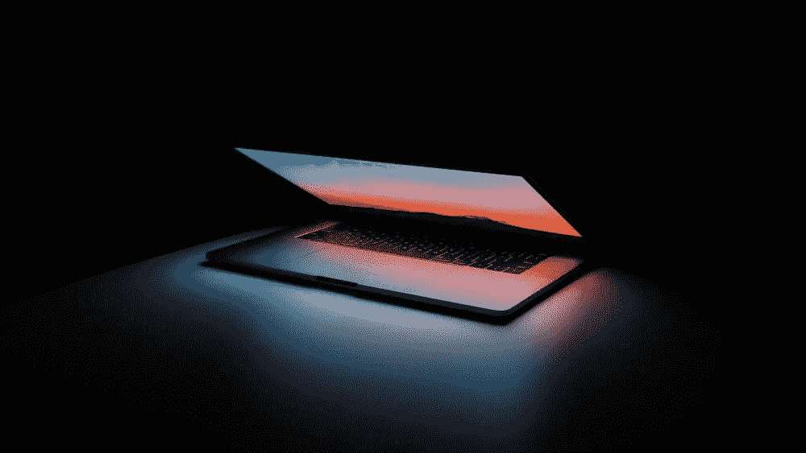
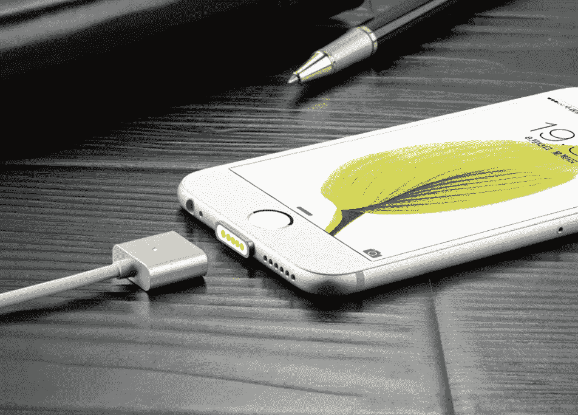
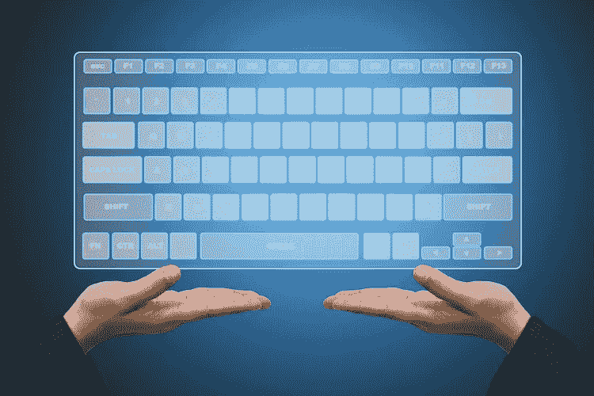
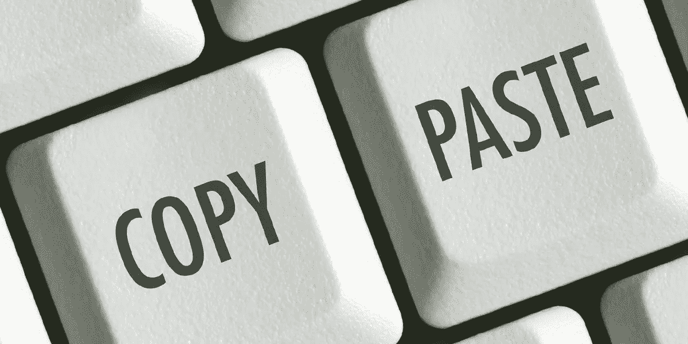
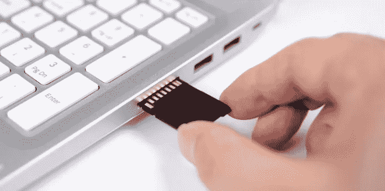

# Code4 特性我很惊讶它还没有进入技术世界

> 原文：<https://medium.com/codex/4-features-im-surprised-haven-t-made-it-to-the-tech-world-yet-3d0d790d1ed3?source=collection_archive---------9----------------------->

## 有人需要提出这些…

图片:[https://www.bing.com](https://www.bing.com)

你真的不能责怪技术世界没有努力通过每个月的最新产品让我们的生活变得更容易。今天，我们购买的手机无需任何调整就能立即拍出高质量的照片。智能手表确保应用和服务永远不会离我们太远，笔记本电脑有时会提供类似于机器的性能，否则就必须放在你的桌子上。在过去的几十年里，技术世界的可用性和效率一直在快速发展。

尽管如此，时至今日，我有时会发现自己在执行简单而普通的任务时感到沮丧，因为缺乏真正应该尽快进入技术世界的新想法。其他时候，我只是在想，为什么我们还没有看到那些看起来如此显而易见，并且完全适合我们现代环境的技术。让我带你看看其中的四个。

## 时髦的手机充电器

你不需要看得太远就能明白我从何而来。然而，有时最简单的解决方案离现在还很遥远。我说的是磁性手机充电器。理论上，这似乎是一个简单的过程:将一块薄磁铁插入手机的 USB-C 端口，第二块磁铁放在充电器上，工作就完成了！您的充电器可以令人满意地安装到位，让您的手机充电比以往任何时候都更简单。我在 Mac 上安装了这个系统，它改变了我对旧的宏基笔记本电脑的拥有体验。

苹果对这种充电器的概念:【https://www.bing.com/images

在手机上找到这个功能会让生活变得更加简单。有时候，在手机上安装充电器比你想象的要复杂得多。虽然无线充电器是朝着正确方向迈出的一步，但它们仍然需要你将手机放在电池的正确位置。简而言之，手机的磁性充电将改变你的用户体验，坦率地说，我很惊讶我们还没有人提出类似的系统并采取措施。

## 手指屏幕

这是一个典型的例子，我想知道这样的技术突破怎么还没有进入科技界。你会注意到我们目前是如何痴迷于在任何地方安装屏幕，使它们尽可能薄或透明，增加它们的功能，然而…这是我们没有得到的东西:我们笔记本电脑的键盘或由屏幕制成的台式机。有了透明屏幕，你不用在实际的按键上打字，而是在一个大屏幕上按下，感觉仍然像一个实际的键盘。

图片:[https://www.bing.com](https://www.bing.com)

我知道这可能看起来有点强迫性，并带有“屏幕越多越好”的主题，但这不是我的出发点。首先，想想它的好处:让一个屏幕充当你的键盘，从而使它模块化，允许你改变你能想到的任何语言设置。如果有人来了，宁愿使用意大利的布局，而不是英国的，这个选项可能是可行的。可以定制屏幕来满足您的需求:也许您只想显示数字和整体控件。或者你想把字母设置得更大或更小。你也可以把它变成一个草图板，取代外部触控板，甚至是一个用于涂鸦和手写的触摸屏。为了仍然给它真实的键盘感觉，将使用触觉反馈，这也是可配置的。根据你希望虚拟键感觉起来有多硬或多轻，这种键盘将是高度可配置的。当然，它看起来也会很酷。无论大部分面板是完全透明的，还是键盘中的一些组件暴露在外，类似玻璃的设计目前都非常流行，我认为它会完美地融入现代科技时代。

## **快捷方式之后的快捷方式**

下一个功能不需要太多的计算技术，只需在电脑设置中设置一个可定制的选项即可。也就是说，它将解决一个我们或多或少经常经历的问题，这个问题让我们中的一些人抓狂。你知道电脑上的复制粘贴或剪切粘贴功能吗？我不知道你，但我经常发现自己需要同时复制和粘贴不止一个页面或链接或任何类型的数字项目。

照片:【https://www.bing.com 

这就是我对这个问题的非常简单的解决方案:配置你的一些键来容纳大量的复制和粘贴功能。例如，如果你拿一排数字来说，从 1 到 9 的每一个数字，当同时按下 Control C 或 Command V 键时，每一个都可以存储不同的复制项。当然，这意味着你必须更有组织性，但这将允许你提交多个复制的项目，甚至存储非常长的链接和重要的页面几个小时甚至几天，而不会被替换。

## 正在扫描数据…

最后，我正在完成一个有用的功能，我不会感到惊讶，它可能很快就会出现在我们的电脑上，甚至从长远来看会出现在我们的手机上。实际上，我已经在去年 8 月的一篇专门文章中写了这个概念，但是因为这个想法对我来说非常重要，而且因为它目前已经被阅读了 62 次，所以我不会冒险再提到它了。

你不再需要做的事情:[https://www.bing.com](https://www.bing.com)

这项技术主要是将文件、系统和数据存储在一个我们都很熟悉的小设备上:USB 闪存盘。它们是非常简单但令人印象深刻的套件。首先，它们可以容纳数百件贵重物品，但尺寸不超过五六厘米，可以轻松放入你的口袋，这一事实令人印象深刻……但今天这还不够吗？因为现在，我们也有能力将所有这些可用空间塞进 SD 卡，这些 sd 卡甚至比最薄的 MacBook Airs 还要薄，可以更方便地运送到任何地方。当然，并不是说你应该把 SD 卡放在裤子或外套口袋里。你必须小心不要损坏它们，因为它们仍然是套件中易碎的部分。但是，如果我们能把 SD 卡的小巧和 USB 钥匙的(相对)坚固结合起来，会怎么样呢？当我们这样做的时候，我们怎样才能让它们更快地被使用呢？我可能有答案了。首先说格式。这种解决方案可以与 SD 卡的尺寸相同，但形状类似于酒店卡，即你用来打开酒店门的卡(当他们喜欢时)。在卡上，没有易碎的金属片，如果被划伤或潮湿，它可能会阻止卡工作，因为你不需要将系统插入你的计算机。取而代之的是，你的键盘上会内置一个不显眼的扫描仪或者一个附件，它可以读取卡上的内容。在几秒钟内，扫描仪读取卡，您的文件可以访问，而不必将设备插入您的计算机。除了替代 USB 钥匙和 SD 卡，这款扫描仪还可以用作信用卡读卡器或识别其他外部设备的系统。

这就是我认为现在应该已经进入技术世界或者至少在不久的将来会出现的四个特征。如果你有其他想法，如果你同意我的某些观点或不同意其他观点，请在下面随意评论，感谢您的阅读。

照片:【https://www.bing.com 