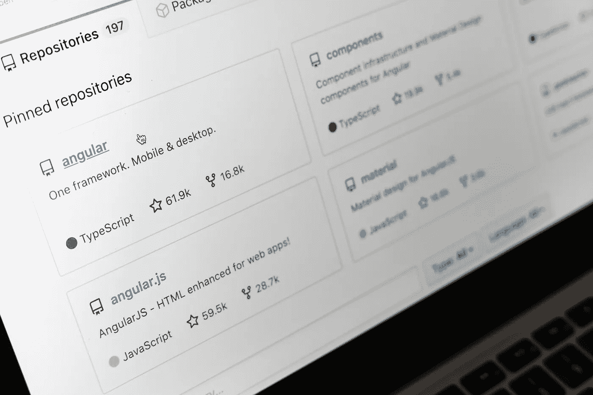
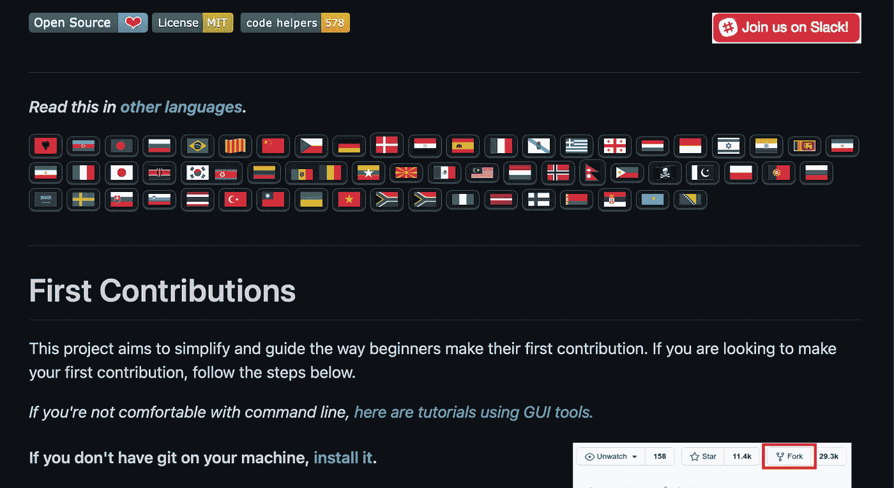
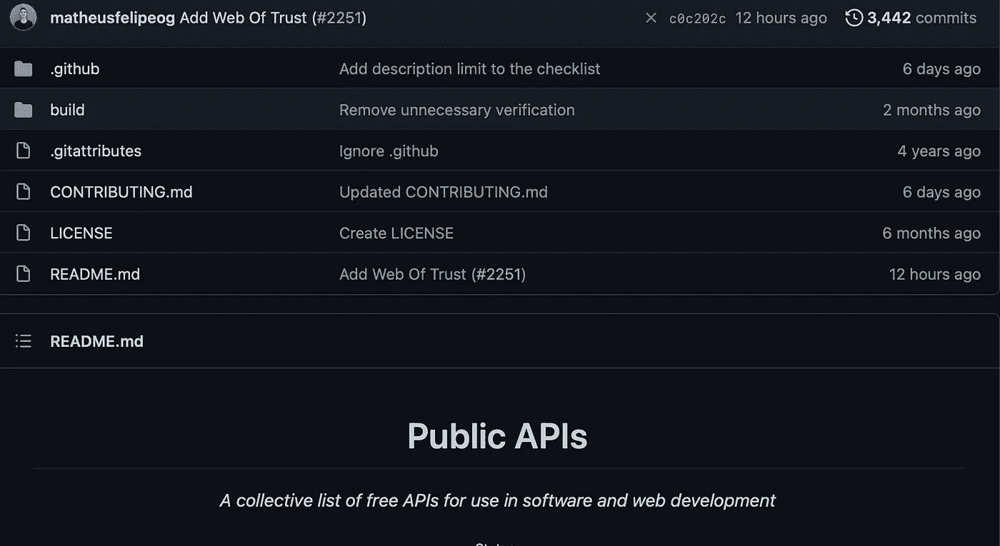
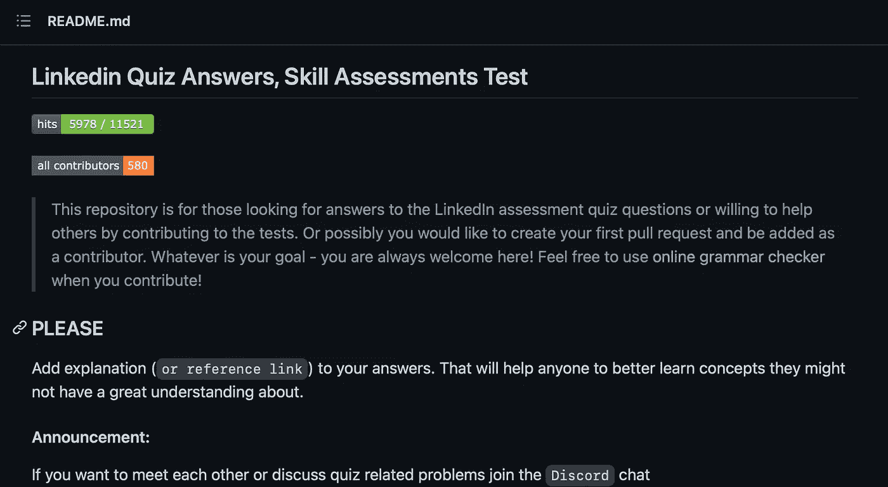
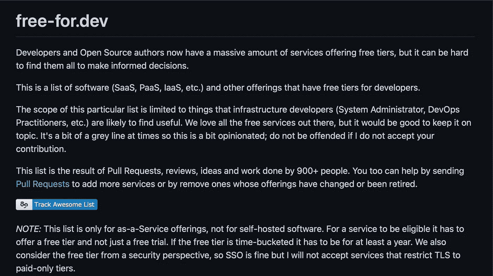

# 4 个 GitHub Repos，对每个初学程序员都有帮助。

> 原文：<https://medium.com/codex/4-github-repos-that-will-help-every-beginner-programmer-bc5c1417da05?source=collection_archive---------2----------------------->

马库斯·温克勒在 [Unsplash](https://unsplash.com/s/photos/github?utm_source=unsplash&utm_medium=referral&utm_content=creditCopyText) 上的照片

Github 是为开发者和程序员在网上寻找优秀资源的最佳网站之一。我记得我第一次去 GitHub 网站的时候我很害怕，因为它看起来很复杂。像存储库、版本控制和拉式请求这样的词吓倒了我。一旦我学会了如何使用 git 并理解了如何使用 GitHub，它就成了我最喜欢的网站之一。它在很多方面帮助了我，我都不记得了。我整理了一些帮助过我无数次的回购清单，我相信它们也会帮助你！

1.  [**一等功**](https://github.com/firstcontributions/first-contributions)

这个 repo 指导初学者在 GitHub 上贡献开源和其他项目的过程。它会一步一步带你去做你的第一份贡献。它以多种语言提供，将教授分叉、克隆、推和拉请求，以及一点关于 git 的知识。你也可以把你的名字添加到贡献者列表中，并获得那种你有所贡献的良好感觉。

回购链接:[https://github.com/firstcontributions/first-contributions](https://github.com/firstcontributions/first-contributions)

**2。** [**公共 API**](https://github.com/public-apis/public-apis#environment)

这份报告包含了大量的公共 API 列表。您可以根据类别搜索 API，它还会告诉您 API 是否需要认证，或者它是否可以处理 HTTP 请求。这个列表激励我开始一些兼职项目。在你的投资组合中有一个 API 项目对招聘人员来说会很好。

回购链接:[https://github.com/public-apis/public-apis#environment](https://github.com/public-apis/public-apis#environment)

**3。**[**LinkedIn-技能-评估-测验**](https://github.com/Ebazhanov/linkedin-skill-assessments-quizzes)

虽然你应该试着自己通过技能评估测验，但它们有时会很棘手，或者你只是停留在一个问题上。这个回购将会是你的救星，因为它包含了很多你需要的答案。您可以搜索正在进行的测验，然后按 ctrl+f 找到您的问题。还有其他的回购也有答案，但这是我发现的最大的和维护得最好的。

回购链接:[https://github . com/Ebazhanov/LinkedIn-技能-评估-测验](https://github.com/Ebazhanov/linkedin-skill-assessments-quizzes)

**4。** [**免费开发**](https://github.com/ripienaar/free-for-dev)

找到真正的免费产品可能很难。它们声称是免费的，但当你下载该文件或导出该项目时，你会看到一个弹出窗口，告诉你升级到专业版。您对免费服务的搜索将变得更短，因为这个 repo 有一个庞大的免费服务列表，开发者和开源作者可以在他们的项目中使用

回购链接:[https://github.com/ripienaar/free-for-dev](https://github.com/ripienaar/free-for-dev)

名单到此结束。如果你有其他很棒的回复，你可以在评论中分享，也可以和我分享你的反馈。如果您觉得这篇文章很有用，可以考虑关注，这样您就可以听到更多关于开发者的东西。