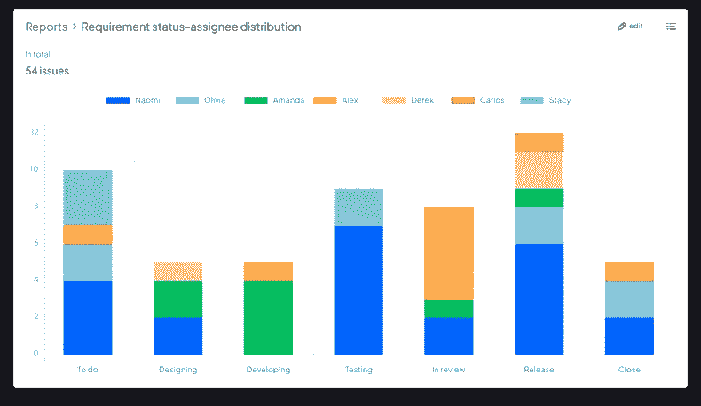

# 写一份优秀的每周项目报告的 4 个关键

> 原文：<https://medium.com/codex/4-keys-to-writing-an-excellent-weekly-project-report-7918eb1337d2?source=collection_archive---------11----------------------->

周报告是项目沟通中的例行报告，在报告中对项目流程进行梳理，同步项目更新和有效性，并对遇到的所有问题进行讨论，以便获得相关利益方的反馈。

本文将介绍每周报告的三个主要部分，3S 沟通原则和撰写每周报告的四个关键。

# 每周报告包含 3 个主要部分

## 1.本周的任务

对一周任务的描述包括三个部分:

*   交付成果方面的成就
*   任务完成到什么程度，如果没有完成，未能按计划完成的原因是什么
*   项目的总体状态和完成百分比

## 2.遇到的问题

定期检查问题和解决方案对于项目的成功完成至关重要。每周项目报告应主要包括以下内容:

*   未解决的问题:本周出现的新问题以及相应的解决方案、状态和管理策略，以及对以前问题的更新
*   待定风险:本周出现的新风险，以及风险管理计划
*   协调请求:解决悬而未决的问题需要哪些支持

## 3.下周的计划

下周的所有重点和优先事项都应该明确。可以参考以下步骤:

*   列出下周的所有关键任务
*   阐明产出和目标
*   评估任务负载，相应地分配时间，并明确时间安排

# 有效沟通的 3S 原则

周报的目的是交流。3S 原则(简单、具体、柔和)也适用于每周报告:

*   简单:关注“核心信息”以避免冗余
*   具体:确保信息的有效传递
*   软性:达成共同目标

# 写周报告的 4 个关键

根据 3S 沟通原则，写每周报告的 4 个关键可以总结如下:

## 1.关注结果而不是过程

当写每周项目报告时，一定要记住一个原则:以结果为导向。换句话说，你需要展示你所取得的成就，而不是你做了什么。

## 2.核心内容第一

利益相关者不会总是仔细阅读整个报告，所以一定要把核心部分放在报告的开头。这有助于确保利益相关者获得最重要的信息。

## 3.使用数据图表

除了文字，更多地使用数据图表。数据比文字更有说服力，图表比文字更直观。使用进度表、甘特图和燃尽图等。尽可能多。

## 4.两个“软”实践

为了达到共同的目标(如项目目标)，应详细描述本周任务中任何有争议的内容。对于需要利益相关者支持的内容，您需要向相关各方和项目展示其好处。

写一份优秀的每周项目报告并不容易。除了上面提到的正确方法和技巧，还需要更多的练习。

*原载于 2022 年 11 月 17 日*[*【https://blog.ones.com】*](https://blog.ones.com/4-keys-to-writing-an-excellent-weekly-project-report)*。*