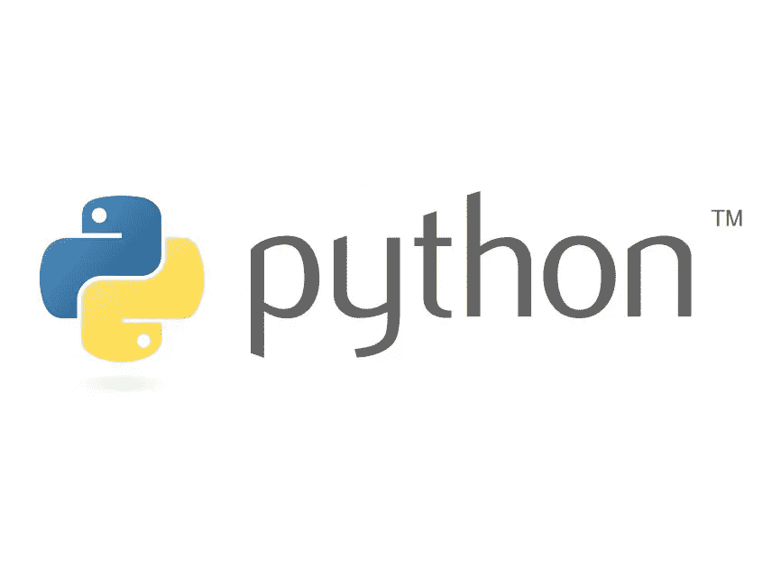

# 4 个最令人讨厌的 python 特性

> 原文：<https://medium.com/codex/4-of-the-most-annoying-python-features-a058fb20fe7c?source=collection_archive---------19----------------------->

我们大多数人都同意，Python 是一种很棒的编程语言。它包含了丰富的奇幻因素，结构如此简单。然而，依我拙见，python 有太多令人讨厌的特性。所以我编制了一个列表，包括 4 个“最讨厌的 python 特性”。

# **1。缩进**

在 C#、C++、JavaScript 和许多其他语言中——花括号(`{ }`)用于缩进条件、迭代、函数和任何其他需要限定范围的东西。然而，python 令人恼火地采用了使用多个空格的概念。它不如具有明确的开始和结束字符明显。这可能会导致代码中出现错误，因为很难看到应该在哪里放置缩进。

# **2。无尽版本**

回想我开始使用 python 的时候——迈出第一步并下载它是最大的任务之一，因为那里有这么多不同的版本。自从 Python 2.0 旗舰版发布以来，总共有 163 个不同的版本！与只有 14 个的 C#相比，这是一个巨大的数字！我最后安装了当时最新的版本 3.3.2。下一个任务是找到一个支持我的 Python 版本的课程，每次我试图遵循一个教程，它都是一个旧版本，从来没有工作过。

# **3。表演速度**

蟒蛇的表演速度绝对令人发指。这太麻烦了，当使用输入和打印语句时，控制台要花很长时间来处理请求，代码越长越复杂，受到的影响就越大。不仅仅是打印命令，其他功能都是 python 慢。这就是为什么只有基本的 2D 游戏是用 Python 制作的(那些复杂的 3D 游戏性能很低)。

# **4。命令命名**

老实说，python 中一些命令的名字实在是太荒谬了。为什么在像`__name__`、`__init__`、`__import__`这样的方法中会有这些无用的下划线。他们可以很容易地添加类似于`func.` ( `func.name`、`func.init`、`func.import`)或方法的东西。让它变得更容易理解。尽管这并没有真正影响 Python 的工作方式，但它仍然是一个非常不必要的特性。

# **结论**

正如我在上面的文章中所说的，Python 有 4 个最明显的令人讨厌的特性。这些是缩进、无限制的版本、缓慢的性能和不必要的长命令命名。

谢谢你阅读这篇文章，请考虑关注我的更多文章。