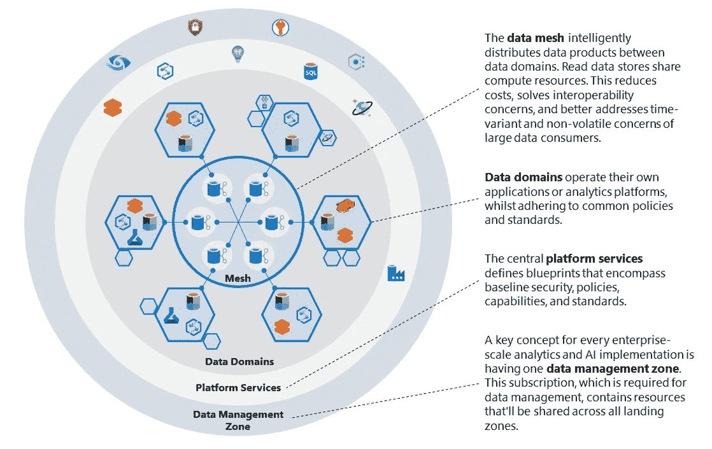
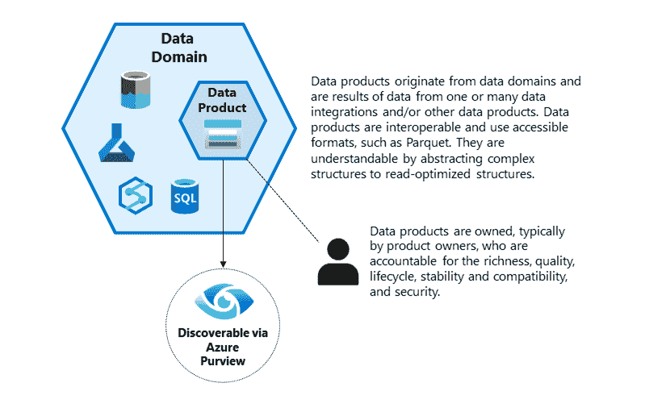
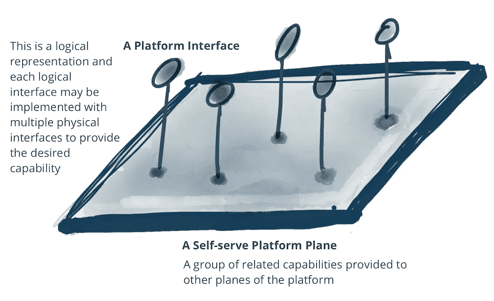
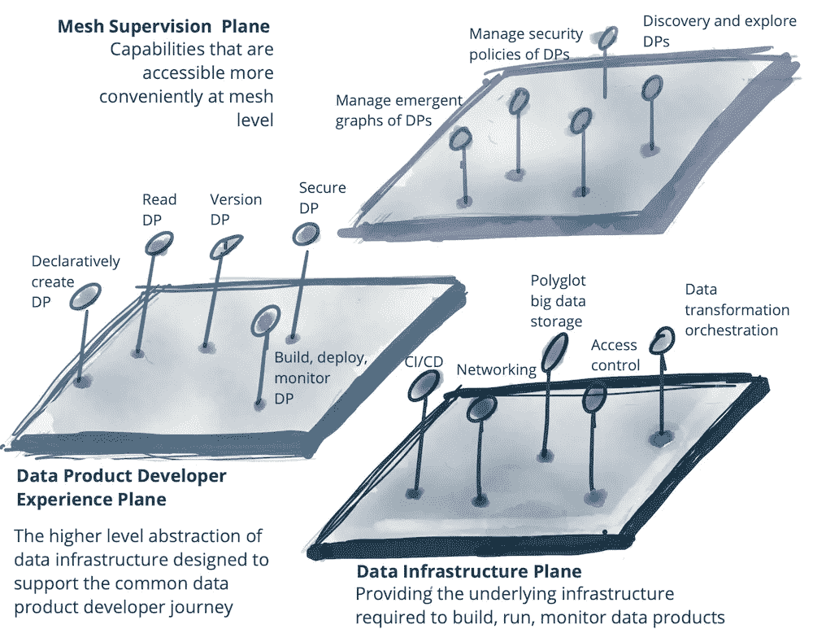
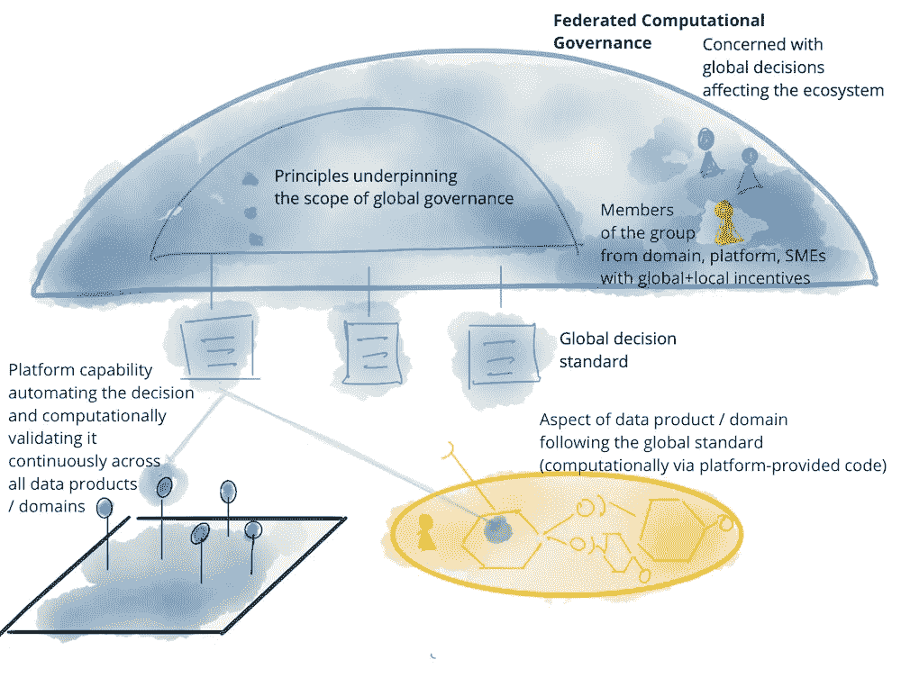

# 轻松解开数据网格的 4 个原则

> 原文：<https://medium.com/codex/4-principles-to-easily-unravel-data-mesh-6533bb752a3e?source=collection_archive---------19----------------------->

## 简化数据网格的复杂性并提出一个 KPI 来衡量它

哈里·皮克在 [Unsplash](http://unsplash.com) 上的照片

数据网格是一个旨在改善组织管理和使用数据的方式的概念。它基于四个原则，分别侧重于增强域所有者的能力、将数据视为产品、提供自助式数据平台和实现联合治理。

## [1]以域名所有者为目标的数据

指的是确保域所有者能够访问和控制与其域相关的数据的实践。

这可能涉及各种活动，例如为数据建立明确的所有权和治理结构，为域所有者提供管理数据所需的工具和培训，以及让域所有者参与决策过程。

数据网格架构，图片来自[微软](https://learn.microsoft.com/en-us/azure/cloud-adoption-framework/scenarios/cloud-scale-analytics/architectures/reference-architecture-data-mesh)

## [2]数据即产品+ OEE KPI =数据即服务

数据被视为有价值的资产，由组织中的团队管理、维护和共享。这意味着数据不仅仅是一种原始资源，而是一种积极开发、改进和利用来推动商业价值的东西。

数据产品，图片由[微软](https://learn.microsoft.com/en-us/azure/cloud-adoption-framework/scenarios/cloud-scale-analytics/architectures/reference-architecture-data-mesh)

衡量数据作为产品的价值的一种方法是使用 OEE(总体设备效率)KPI 来评估生产运营的总体绩效。通过这种方式，it 可以被清晰地定义为服务**(数据即服务)**。

OEE 被定义为可用性、性能和质量相乘的结果，因此主要衡量数据解决方案的运营效率。这允许识别影响我们流程的可能浪费，例如:执行速度、失败、中断和异常。

## **可用性(一)**

是用完成操作的时间除以应该完成操作的计划时间得到的值。

如果我们的流水线通常需要 5 分钟来完成所有的任务，我们决定执行的计划时间是 6 分钟。但结果是出现了问题，管道不得不重新启动，总共花了 10 分钟，时间偏差为 66.6%。

## **性能(P)**

它是在生产时间内完成的所有事情的结果，除以在理想生产时间应该生产的数量。

假设我们的 ETL 组件每分钟能够管理 1 TB 的数据量，但是最后在执行过程中，我们发现总共用了 90 秒来移动这个 TB。我们会说实际表现比我们的标准差了 50%。

## **质量(Q)**

是从第一次正确生产的件数中获得的值。

在数据世界中，与要移动的总数据量相比，在目的地已被正确装载并满足所有质量限制的数据集。例如，移动了 2TB，只有 1.8 TB 通过了质量标准。我们会说我们的质量价值是 90%。

> OEE = A x P x Q = 0.66 x 0.50 x 0.90 = 0.297

最后，整体 OEE 为 29.7%。这使我们能够识别运营效率低下的情况，并采取措施加以改善。

## [3]自助服务数据平台

是一种系统类型，使用户无需专业技能或 IT 或数据工程团队的支持即可访问和分析数据。

这在数据网格的环境中特别有用，因为数据网格的目标是让领域专家和其他非技术用户能够管理和利用他们领域中的数据。

自助服务数据平台通常提供用户友好的界面，允许用户轻松访问和浏览数据，以及用于转换和丰富数据以支持特定用例的工具。

*提供自助界面的平台飞机，图片由*T4 扎马克·德赫加尼[马丁福勒](https://martinfowler.com/articles/data-mesh-principles.html)拍摄

*自助数据平台的多个平面，由[zamak Dehghani](https://twitter.com/zhamakd)在 [MartinFowler](https://martinfowler.com/articles/data-mesh-principles.html) 上成像*

## [4]联合治理

一种以分散方式管理和控制数据的方法。在数据网格体系结构中，数据分布在多个系统和筒仓中，而不是集中在一个位置。

这种分散的方法允许更大的灵活性和敏捷性，但是它也需要不同的治理方法。

联合治理涉及使用一组通用标准和协议，以确保数据在数据网格中的所有系统之间是一致的、准确的和安全的

*联邦计算治理模式，图片由* [扎马克](https://twitter.com/zhamakd)上[马丁福勒](https://martinfowler.com/articles/data-mesh-principles.html)

数据网格是一种相对较新的数据管理方法，在各种规模的组织中日益流行。但是，它特别适合跨国组织，这些组织经常面临与跨不同地区和业务部门的数据孤岛、治理和互操作性相关的挑战。

💡在奥莱利的[官方数据手册](https://www.oreilly.com/library/view/data-mesh/9781492092384/ch01.html) [中了解更多章节](https://www.oreilly.com/library/view/data-mesh/9781492092384/ch01.html)