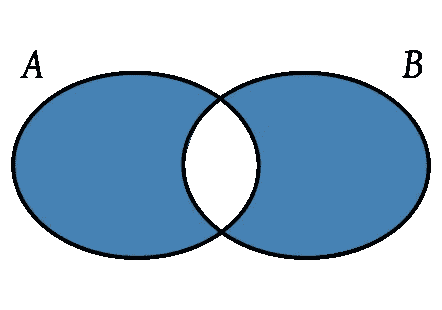

# 要记住的 4 种 Python 性能技术

> 原文：<https://medium.com/codex/4-python-performance-techniques-to-remember-1b04898de03d?source=collection_archive---------0----------------------->

嘿！一个点击诱饵的故事，让你在忽略当前任务时阅读。不妨(希望)学点东西，对吧？至少它不是付费的。

好吧，给你。让我们考虑一些 Python。如果你正在做一些以表现为导向的事情，也许这些会帮到你。


Python:根据目前的统计数据，你可能正在使用的最流行的语言

# 1.LRU 缓存

情况:你有一个做重复计算的函数，或者它做查找，它很有可能连续多次做相同的计算或查找。对于您的代码或您正在查找的服务，或者两者，这会很快占用大量资源。

我们可以用“最近最少使用”的 LRU 缓存来解决这个问题。这将缓存您的函数调用的结果，以便如果您再次以相同的方式调用它，它将从缓存中获取结果，而不是运行整个过程。

使用它很容易。让我们看看如何:

```
from functools import lru_cache*# The same function twice, but one of them is cached!*def uncached_lookup(*big_tuple*: tuple, *number_to_find*: int):
    return *number_to_find* in *big_tuple*@lru_cache(*maxsize*=256)
def cached_lookup(*big_tuple*: tuple, *number_to_find*: int):
    return *number_to_find* in *big_tuple*
```

那是……就这样。您只需添加一个小装饰器并选择一个大小，Python 会处理剩下的事情。有一个警告——函数的参数类型需要是可哈希的。所以你不能把字典作为一个参数，但是你可以使用一个元组。结果相当惊人——我做了一个时间测试，你可以在这里找到要点:

```
mydriasis@akkad:~/Desktop$ python lru_sample.py 
59000 uncached lookups took 0.8154561520ms
59000 cached lookups took 0.2635743618ms
```

哇！节省大量时间。

# 2.杜平简易清单

情境:你有一个清单。它有副本。你*不在乎秩序。*你不必做一个新的列表，然后像这样迭代它

```
deduped_list = list()for item in big_list:
    if item not in deduped_list:
        deduped_list.append(item)
```

说真的，请不要这样做。太可怕了。这也是 StackOverflow 关于这个问题的最高投票答案。这是*非常不理想的*，而且浪费了几行代码。相反，只需将其更改为一组并返回:

```
deduped_list = list(set(big_list))
```

那是……就这样。我知道，这些真的是令人兴奋的技术。但是*男孩的区别。*我做了一个时间测试，你可以在这里找到要点:

```
mydriasis@akkad:~/Desktop/samples$ python list_dedupe.py 
Deduping 1000000-element list to 100 by creating a new list took 0.4950282574ms
Deduping 1000000-element list to 100 using set conversion took 0.0072016716ms
```

差远了。它甚至不在同一个球场。我求你了，用定投法。

# 3.用集合检查成员资格

场景:你有一个大的列表或者元组或者什么的，你有一些元素。你想知道你得到的元素是否在大列表或元组中。

相反，从一组事物开始，并在这组事物中寻找成员。这为您提供了免费的重复数据消除，并且集合操作速度惊人地快。您仍然可以使用“in”关键字。我做了一个时间测试，你可以在这里找到要点:

```
mydriasis@akkad:~/Desktop/samples$ python set_lookups.py 
10000 lookups on list took 84.0385153294ms
10000 lookups on set took 0.0007445812ms
```

好吧，*也许*我的设置有点偏差。但是，如果你正在做大量的成员查找，使用集合。你不会后悔的。我发誓。

# 4.数据集与集合异或

场景:你有两个数据集。也许两份名单？二元组？你想要一个或另一个中的所有东西，但不是两个都要。你不在乎顺序。这个有点棘手。您可以很容易地编写一个嵌套循环来遍历它们:

```
xored_list = list()for item in big_list_1:
    if item not in big_list_2:
        xored_list.append(item)for item in big_list_2:
    if item not in big_list_1:
        xored_list.append(item)
```

*更正:我的一个朋友指出随文章发布的代码是错误的。我已经把它修好了(我想)。让我知道它是否合法。*

这样做是可行的，但是随着列表变大，这将变得非常慢，非常快。相反，我们可以使用 set API 的内置函数，名为*对称差*。为了更好地理解，下面是两组的文氏图表示:



对称差异:一切都不相同

看哪！这正是我们所需要的。代码非常简单:

```
xored_list = list(set(big_list_1).symmetric_difference(big_list_2))
```

就是这样。真的，就是这样。尽管需要转换成新的数据类型，但它甚至更快。作为主题，我做了一个时间测试，你可以在这里找到一个要点:

```
mydriasis@akkad:~/Desktop/article-code/perf$ python dataset_xor.py 
List xor with 1000 items by iteration took 0.0177657604ms
List xor with 1000 items by set symmetric difference took 0.0002312660ms
```

神圣的地狱！那是…呀！是的，不要只是重复列表。那是粗鲁的。也许有另一种方法在性能上与 set symmetric difference 相似，但我一时想不出来。还有，这些数字让我的文章更好看。

# 结论

这些是你可以做的事情。也许下次你写 Python 的时候会记得它们，你需要做…这些具体的事情。等等，你要去哪里？你没印象吗？嘿，别走。拜托，周六下午我和你一样无聊。这篇文章没那么糟糕，是吗？哦，你已经知道列表集重复数据删除的事情？那对称差呢，很酷，对吧？

资源

设置对称差异图形: [kismalac，CC0，via Wikimedia Commons](https://commons.wikimedia.org/wiki/File:SetSymmetricDifference.svg)