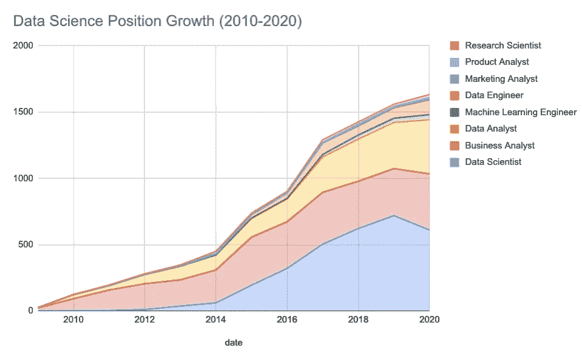
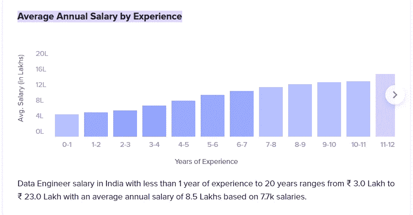
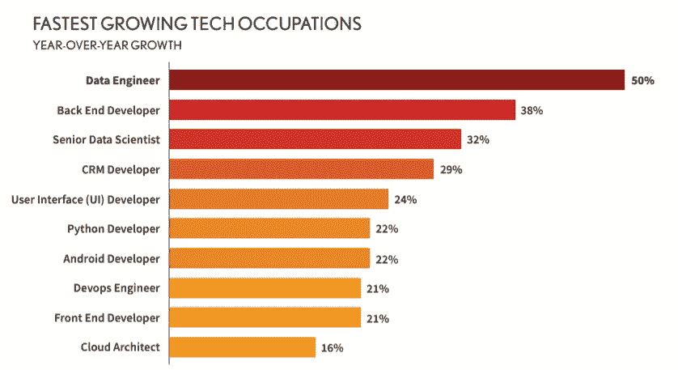

# 在 2022 年，数据工程是一项伟大的事业吗？

> 原文：<https://medium.com/codex/4-reasons-why-data-engineering-is-a-great-career-move-in-2022-3ef07b1e14f3?source=collection_archive---------0----------------------->

## 数据工程 101

## 数据工程是本世纪最性感的新工作

图片来自 Pixabay

2012 年 10 月，HBR 预测数据科学将是 21 世纪最性感的工作。

在本世纪的第一个 10 年，它确实看起来完全匹配。

这份被高度引用的报告完美地预测了对作为资源的数据科学家的需求的巨大增长。这也催生了大量新的创业公司(coursera / Udemy 等。)专门对企业员工进行相关技能的培训。

不相信我？阅读下面的文章…

 [## 数据科学家:21 世纪最性感的工作

### 2006 年 6 月，当乔纳森·戈德曼(Jonathan Goldman)来到商务社交网站 LinkedIn 工作时，这个地方仍然让人感觉…

hbr.org](https://hbr.org/2012/10/data-scientist-the-sexiest-job-of-the-21st-century) 

然而，在 Pandaemic 时代的 2019 年之后，事情完全变了。在 2019 年同比增长 80%后，数据科学在招聘中的作用在 2020 年实际上仅增长了 10%。你问为什么？

答案是数据工程的发展。

相比之下，数据工程正以每年 40%的速度增长，这一研究发表在下面的[interviewquery.com](https://www.interviewquery.com/blog-data-science-interview-report/#:~:text=Data%20engineering%20specific%20interviews%20increased%20by%2040%25%20in%20the%20past%20year.)…

图片来自 interviewquery.com

在当前的印度就业市场上，对 Azure 数据工程师的需求尤其巨大。根据[的这份骰子](http://marketing.dice.com/pdf/2020/Dice_2020_Tech_Job_Report.pdf)报告，数据工程在 2020 年同比增长 50%。

然而你可能仍然会问，**这是未来的证据吗？**

哦，是的，绝对是。

1.  **理想情况下，数据应该自动回答这个问题。**只要探索数据来回答业务中的问题，数据工程需求就会以这样或那样的形式存在。

如果数据工程的基础和基本逻辑是清楚的，你就可以在数据空间中开发任何新的闪亮的工具了。

由于获取数据的不同来源越来越复杂，越来越多的企业试图收集尽可能多的数据。**这再次增加了数据管道的复杂性，推动了对数据工程师的需求。**

好吧，那么角色是有需求的，但是钱能匹配需求吗？

**2。那么，一个数据工程师的工资是多少呢？**

根据 Glassdoor、Ambitionbox 和 Payscale，印度数据工程师的平均年薪为 80-90 万卢比。

从这个角度来看，薪水取决于你的工作经验和你工作的公司。

然而，薪水从 3-4 拉克不等，对于有 10 年以上工作经验的人来说高达 30 拉克。

**不相信我？看下面的图表，了解与经验的相关性。**

点击这里查看详细报告…

 [## 印度数据工程师工资

### 印度 66000 多名员工的数据工程师平均年薪为₹85 万卢比。通过…检查数据工程师的工资

www.ambitionbox.com](https://www.ambitionbox.com/profile/data-engineer-salary#:~:text=Average%20Annual%20Salary%20by%20Experience) 

平均工资与软件工程师相当，有时甚至更高。

然而，看看 **linkedIn，你一定会注意到对云数据工程师的需求很高。随着需求的增加，你可以期待更高的回报和更容易的面试。**

那么，永恒的问题是，什么更好？

**3。数据工程还是数据科学……？**

对数据科学家的需求正在放缓，因为企业已经认识到，没有高质量的数据，任何数据科学家或 DS 算法都无法提供预期的结果。

FAANG 公司和其他大型技术公司正在收获数据科学和 ML 的真正好处，因为他们已经投入巨资建立主干数据基础设施。但在大多数其他公司，数据成熟度仍未达标，**因此围绕 DS 的讨论终于放缓，这对数据工程师来说是个好消息。**

与面试相比，破解 DS 面试也要困难得多。

DS 的学习曲线也要长得多，因为除了编程和数据工具之外，它还涉及复杂的数学、算法和统计知识。

但是你有一个好消息，对于 DE 来说，你所需要关注的是对数据和相关工具的理解以及少量的编程。

那么，数据工程的需求有多大，为什么？

**4。需求高:**

COVID 19 之后的锁定和限制加快了许多企业从内部迁移到云的速度。

这导致了将数据和操作迁移到云的巨大开支。尽管大数据和云自 2015 年以来一直是一个热门词汇，但它们实际上在 2020-21 年成为现实，在那里发生了大规模的转变。

因此，目前存在对云数据工程师和大数据工程师的巨大需求，以帮助企业从内部迁移到云，并构建可扩展的数据基础架构。

这种需求至少会在未来 2-3 年内保持不变，这意味着有很多轻松搞定面试的机会。

**好得难以置信？**

根据 DICE 的 2020 年技术工作报告，数据工程无疑是增长最快的技术工作，自 2020 年以来需求一直在增长。

Dice 2020 年技术工作报告

**那么，成为数据工程师能创造大量财富吗？**

很长一段时间以来，人们一直相信“数据是新的石油”，然而当石油被发现时，一批新的人也变得非常富有，他们拥有开采石油的技能。

> 当人们去挖金子时，最富有的人是卖铲子的人。

因此，如果数据是新的货币/黄金/石油，那么知道如何存储、处理数据并从中获取情报的人也会变得非常成功。

数据工程师就是这些人，拥有正确的技能和工具，2022 年将是数据工程师的黄金年。

既然我们已经报道了**为什么？**让我们讨论一下**如何？**

一旦你理解了需求，自然会问[我如何成为一名数据工程师？](/codex/how-to-become-a-data-engineer-905686dee7ce)

我已经提供了详细的路线图。这包括要涵盖的主题的综合列表，甚至是深入学习的详细子部分。路线图也有一个学习计划(一个概念模板),你可以跟随并标记你的进步。

 [## 如何成为一名数据工程师

### 2022 年你如何学习并成为一名数据工程师的完整路线图

medium.com](/codex/how-to-become-a-data-engineer-905686dee7ce) 

我将分享更多关于数据行业的故事、文章和经验。你可以关注我更多这样的帖子。

***感谢*** *的阅读！如果你想和我联系，请随时通过 withsaikat@gmail.com 联系我或者我的* [*LinkedIn 个人资料*](https://www.linkedin.com/in/saikatdt/) *。*