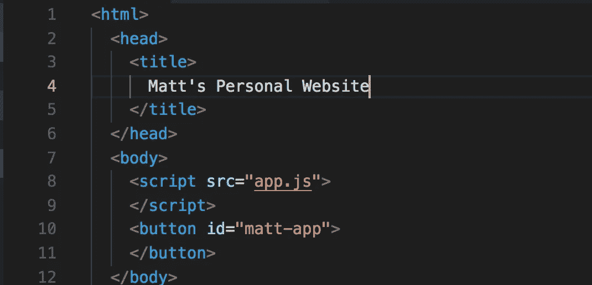

# 作为一名前端开发人员，我选择不从头开始建立自己的网站的 4 个原因

> 原文：<https://medium.com/codex/4-reasons-why-i-chose-not-to-build-my-own-website-from-scratch-as-a-front-end-developer-e75b32de6fa1?source=collection_archive---------4----------------------->

## 尽管我很想

(这不是实际的代码)

## 背景

对于前端的软件开发人员来说，向全世界展示项目总是很有帮助的。一开始，我想用 [React](https://reactjs.org/) 和 [AWS](https://aws.amazon.com/) 从头开始建立自己的网站。我想这样做有几个原因: