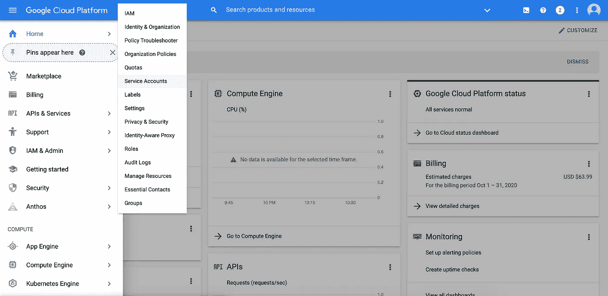
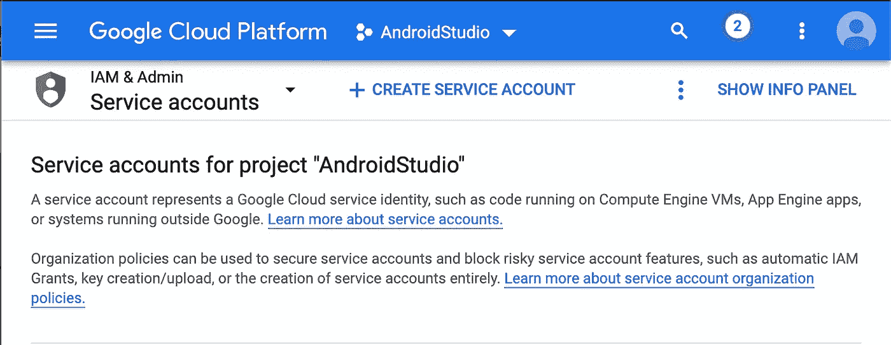
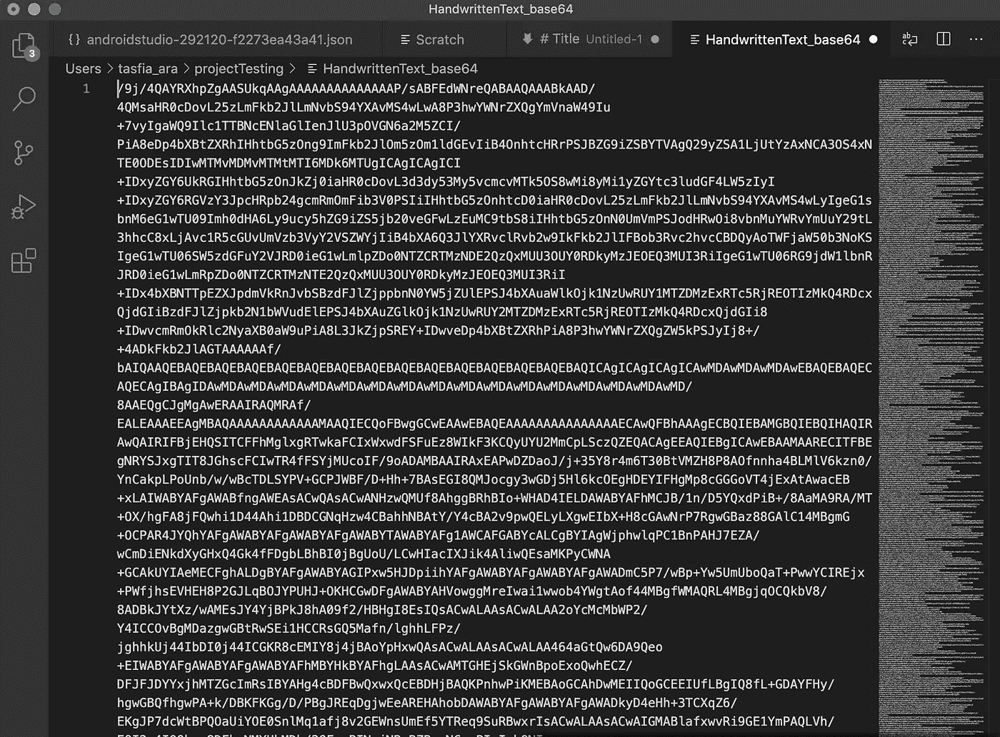
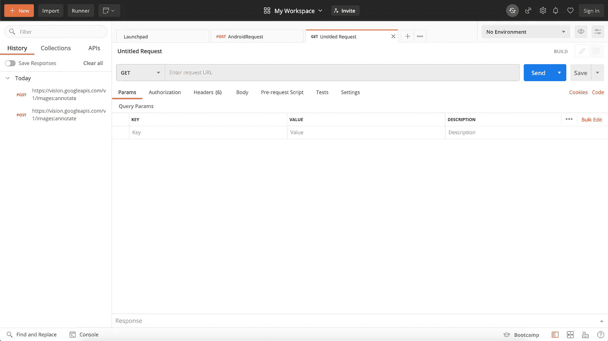
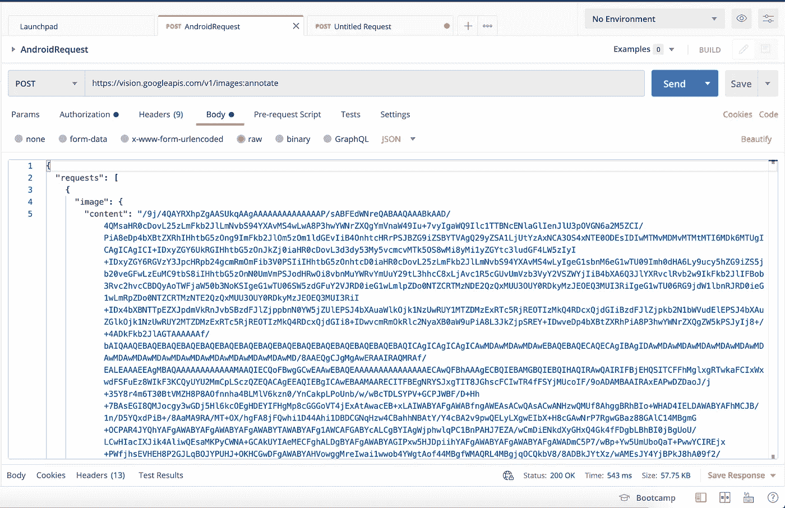
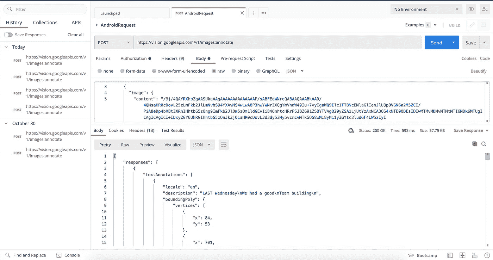

# 检测图像中笔迹的 4 个步骤

> 原文：<https://medium.com/codex/4-steps-to-detect-handwriting-in-images-cc6f031b42d8?source=collection_archive---------0----------------------->


如果你曾经想把手写的文本图像翻译成文字，那么你来对地方了。在本文中，我将讨论如何向 Cloud Vision API 发送 POST 请求。所以让我们开始吧！

**您可能需要预先安装的应用程序:**

1.  [Visual Studio 代码](https://code.visualstudio.com/download)或[崇高文本](https://www.sublimetext.com/3)(只是一个好的文本编辑器)
2.  [Postman](https://www.postman.com/downloads/) (向 Google Vision API 发送 POST 请求)

# **步骤 1:在 GCP 上创建一个项目并启用 API**

首先，用一个用户账号登录 [Google 云平台](https://cloud.google.com/)，在上面建立一个项目。该项目将让您访问谷歌提供的所有 API 和服务。请确保为您的帐户启用计费，以避免在开发项目时遇到问题。不要担心，我们会给你 300 美元的信用点数，所以一开始不会向你收费。

一旦您设置了帐户、获得了计费权限并创建了项目，请导航至平台上的“API 和服务”选项卡(您可以在顶部的搜索栏中进行搜索)。点击“+启用 API 和服务”并搜索 Cloud Vision API。单击它并启用 API。

那么什么是云视觉 API 呢？这个 API 将读取你的图像文件，识别手写内容并返回输入的文本。

现在进入下一步！

# **第二步:设置您的服务帐户**

等等…那么服务账号和我刚设置的账号有什么区别呢？您设置的账户是一个**用户账户**。从名字就能猜到，它代表了与 Google Cloud 交互的开发者或用户。**服务账户**代表非人类用户。当您的应用程序需要在没有人或“用户”指导的情况下自己访问资源时，可以使用它。

现在我们知道了*为什么*我们需要一个服务帐户，让我们来设置一个。

转到导航菜单上的“IAM 和管理”选项卡。悬停在它上面，从菜单中选择“服务帐户”，然后单击“+创建服务帐户”。



选择一个帐户名称，最好与您的项目同名，然后单击“创建”。然后使服务帐户成为项目的“所有者”,这样它就可以完成项目中的操作。单击继续。然后输入您与 GCP 关联的电子邮件地址，授予您访问和更改服务帐户的权限。单击“完成”,等待服务帐户设置完成。

# 第三步:获取公钥

设置服务帐户后，单击“操作”选项卡下的三个按钮。从下拉菜单中单击“创建密钥”。这会将一个 JSON 文件下载到您的计算机上。这个文件夹包含您所有的凭证，这就是为什么它是超级重要的，你不要失去你的电脑中的文件。

在您的主目录中创建一个名为“secrets”的文件夹，并将下载的 JSON 文件移动到 secrets 文件夹中。

**使用终端**

使用以下命令将当前目录更改为主目录:

```
cd ~
```

在您的个人目录中创建一个名为“秘密”的文件夹

```
mkdir secrets
```

从当前目录(下载)移动到目的地(主页>机密)

```
mv ~/Downloads/[file name] ~/secrets
```

好了，你的文件现在被移动到一个新的目的地，这样你就不必搜索它了:)

现在要打开这个文件，你需要一个好的文本编辑器，最好是 [Visual Studio Code](https://code.visualstudio.com/download) 或 [Sublime](https://www.sublimetext.com/3) Text(如果你还没有安装，下载并安装它。一个好的文本编辑器真的会改变你的生活。使用您选择的编辑器打开下载的文件。

现在我们需要创建一个**系统变量:一个可以被你计算机上的任何应用程序访问的变量。**系统变量将包含您的凭证。为什么？因为 gcloud 将使用系统变量来生成一个承载令牌，我们将在发送到 Vision API 的请求中使用它。

打开终端(我知道…我们今天会经常使用终端)并键入以下命令:

```
export GOOGLE_APPLICATION_CREDENTIALS = [your JSON file path]
```

`export`是用于在终端中创建系统变量的关键字。现在，计算机上的任何应用程序都可以访问您的文件路径。

设置好系统变量后，gcloud 可以使用它来访问您的凭据，以生成不记名令牌。**无记名令牌是标识用户的凭证。**现在你要做的第一件事就是查看 gcloud 是否在你的终端上运行。要进行检查，请运行以下命令:

```
gcloud -v
```

如果它返回一个响应，那么 gcloud 就安装在你的电脑上了，你就可以开始使用了。如果没有，则使用[此链接](https://cloud.google.com/sdk/docs/install)下载并再次运行上述命令。一旦 gcloud 开始运行，请在您的终端中键入以下内容:

```
gcloud auth application-default print-access-token
```

你得到的回应就是你的不记名令牌。复制密钥并将其粘贴到您的文本编辑器中。我们需要保存这个密钥，因为我们将在发送到 Cloud Vision API 的请求中使用它。现在我们已经设置好了一切，是时候测试了！

# 步骤 4:使用 Postman 向 API 发送 POST 请求

现在是有趣的部分——转换！

首先，您需要一个样本图像。如果你已经有一张手写文本的图像，只需使用[在线转换器](https://onlinejpgtools.com/convert-jpg-to-base64)将其转换为 base64 格式。如果您没有图像，请找到一个，并使用相同的转换器将其转换为 base64。在文本编辑器中将 base64 格式保存到一个新文件中。

例如，这是我的图像


这是我的字符串表示



如果你还没有，[下载并安装邮递员](https://www.postman.com/downloads/)。登录后，您应该会看到如下页面:



从灰色下拉菜单中，选择 POST。复制以下请求 URL 并将其粘贴到灰色栏中。

```
https://vision.googleapis.com/v1/images:annotate
```

然后，在右下方的“auth”选项卡中，单击“Type”下拉菜单并选择“Bearer Token”。还记得我们从证件上找到的不记名令牌吗？复制并粘贴到灰色栏中。设置授权后，转到“Body”选项卡，从下拉菜单中选择“raw”。从旁边的下拉菜单中，选择 JSON。然后，复制下面的 JSON 请求。

```
{
  "requests": [
    {
      "image": {
        "content": "[*base64-encoded-image*]"
      },
      "features": [
        {
          "type": "DOCUMENT_TEXT_DETECTION"
        }
      ]
    }
  ]
}
```

还记得你保存的 base64 字符串吗？复制粘贴到“内容”里。你的身体应该看起来像这样:



保存请求并点击“发送”,将请求发送到 Cloud Vision API。你的回答应该是这样的:



回应

现在，如果我们将图片与响应进行比较，我们会看到我们的请求被发送到 API 并被 API 读取。

现在，您向 Cloud Vision API 发送了第一个请求，将手写文本翻译成书面文本！补充说明:不记名令牌会随着每个会话而改变，所以如果您在关闭 Postman 后发送相同的请求，请确保重新生成令牌。如果您将这个特性硬编码到应用程序中，以自动向 API 发送请求，那么这是一个需要记住的重要注意事项。我将在下一篇文章中讨论这一部分。

在那之前，再见，祝你项目好运！