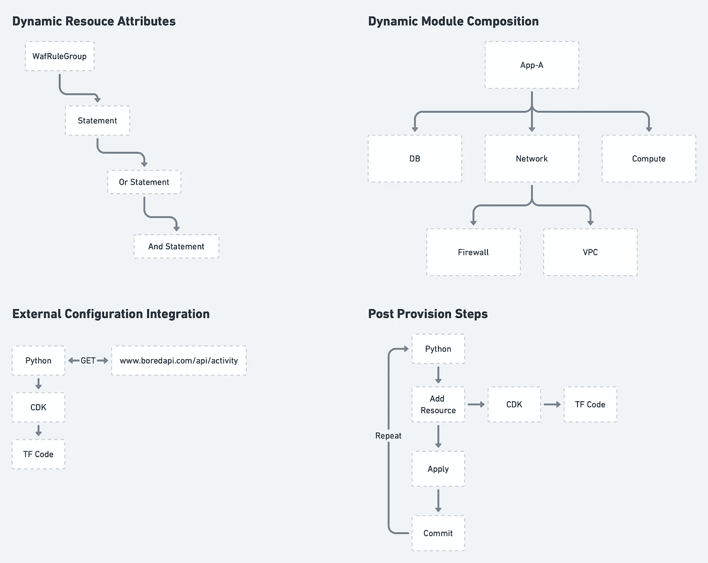
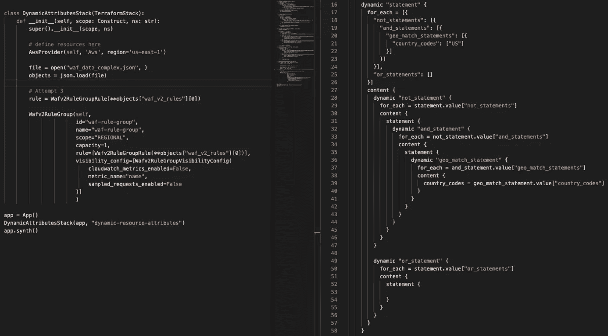
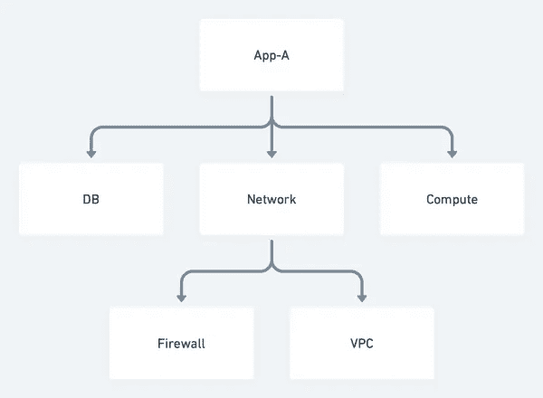
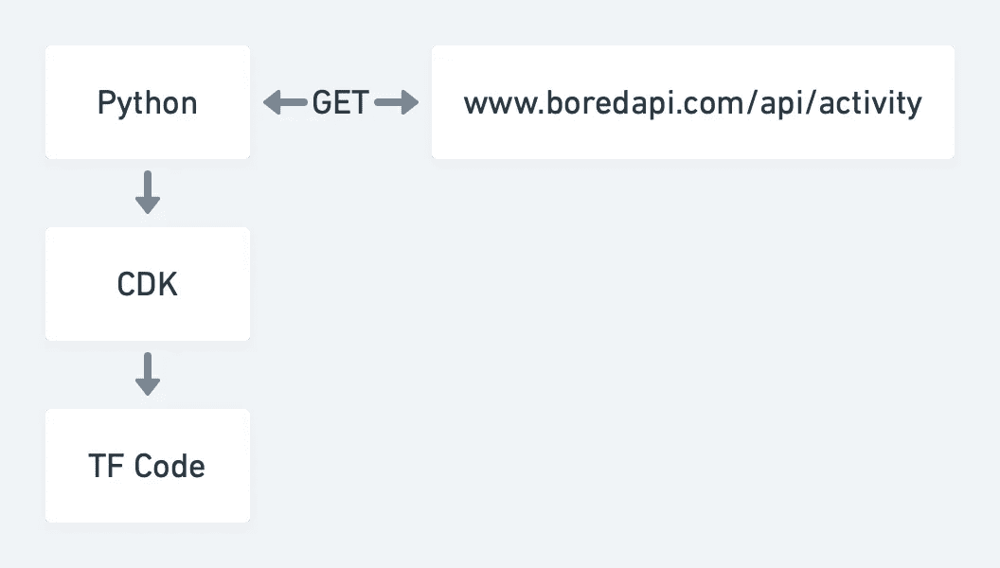
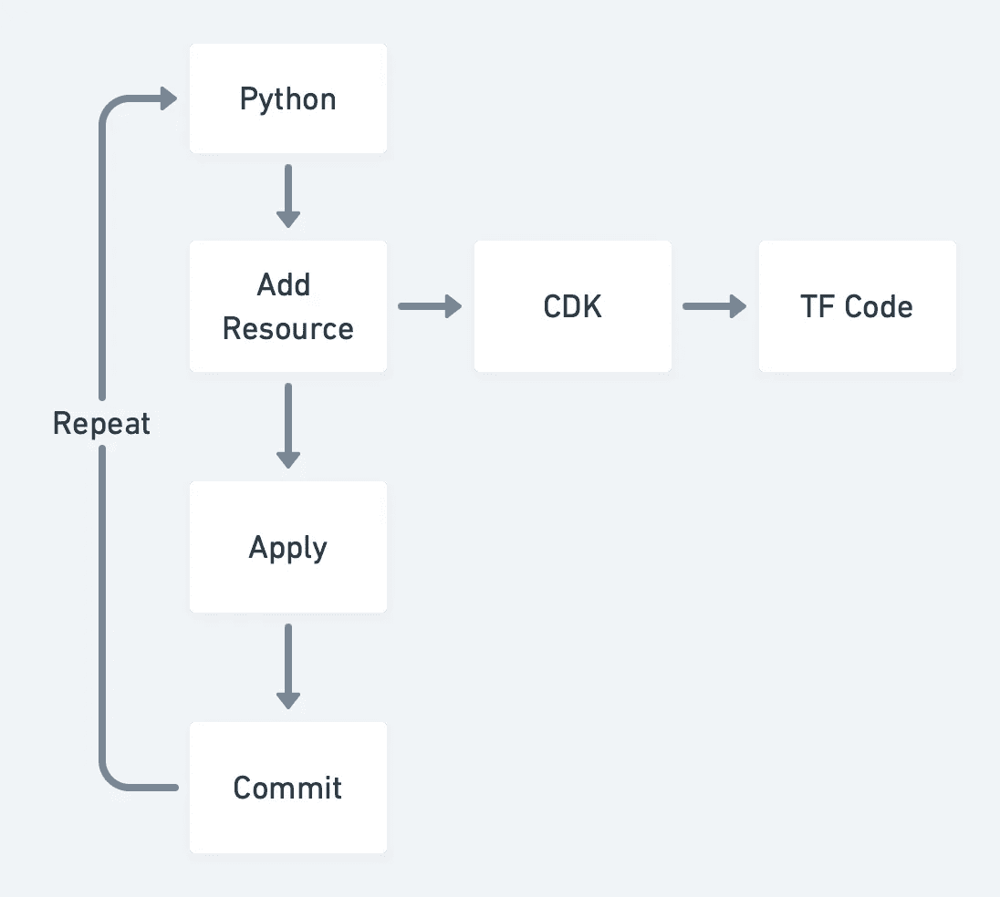

# CDK 地形的 4 个使用案例

> 原文：<https://medium.com/codex/4-use-cases-for-the-terraform-cdk-5864630d147e?source=collection_archive---------3----------------------->

作为一个已经写了相当一部分 TF 的人，我有点偏向于 IaC 的声明性方法。声明性方法将维护负担转移到提供者维护者身上，并使不知道如何编码的从业者能够更快地开始。

也就是说，我认为大多数通情达理的人都会同意，并不是所有的事情都应该或者可以用静态的、声明性的方式来定义。Terraform 的动态资源块和 for_each 支持可以很快让你想要更多。让我们深入 CDK，看看它能在哪些方面有所帮助。

# 什么是 CDK 地形？

2019 年 AWS 发布了他们的云开发工具包(CDK)，基于[构造](https://docs.aws.amazon.com/cdk/latest/guide/constructs.html)库构建。构造库允许开发人员定义基于 Javascript 或 Typescript 的类，这些类可用于以任何实现 JSii 接口的语言生成类。

通过为 Terraform 提供者、资源和数据源自动创建构造，Terraform CDK (TF CDK)建立在相同的构造和 JSii 库之上。这使得从业者可以利用 Python、Typescript、Go 等语言来开发 Terraform 资源的本地语言表示。

然后，TF CDK 负责获取用这些其他语言之一编写的代码，并将其合成为 JSON 格式的 TF 配置。然后这被交给 Terraform 二进制来计划和应用。

您可以将 TF CDK 视为提供者及其资源的语言库，以及将任何语言转换为 TF 配置的预处理步骤。

# 用例

## 动态资源属性

代码示例展示了如何将嵌套的动态块与 AWS 的 WAF v2 规则组语句一起使用，这些语句可以递归嵌套

在某些时候，您会希望将资源的属性建立在一组动态数据的基础上。在最简单的情况下，`for_each`和`dynamic{}`块允许您捕获数据和资源之间的关系。

但是，有些资源，如 AWS WAFv2 规则组，具有更复杂的数据结构，因为它们支持递归语句。这种关系的一个例子显示在上面的右侧。用 Terraform 的`dynamic`块支持这种类型的关系会导致复杂的代码。在无限递归深度的情况下，它可能无法捕获整个数据结构。

与左边的[动态资源属性示例](https://github.com/peytoncasper/tf-cdk-examples/tree/master/dynamic-resource-attributes)相比，它允许我们利用 Python 的原生 JSON 解析，并将这些嵌套语句直接转换成适当的 CDK 类。

## 动态模块组合

显示 App A 模块如何利用子模块作为构建模块的分层图

Terraform 不提供动态获取提供者和模块版本的能力，因为这些信息必须在初始化之前知道。一般来说，这不是问题。尽管如此，这通常意味着您的模块最终会有一个层次结构，其中您最外层的模块代表一个“版本”或其所有子模块的特定配置。

这个发布概念是理想的，因为它为我们提供了模块配置的时间点快照，这些模块配置相互之间交互良好。然而，如果您正在运行 PaaS 服务，并且有 100 个客户使用不同的发布版本，该怎么办呢？将客户正在运行的模块版本集合外部化可能是有益的。这允许我们支持像特性标志这样的功能，而不必手动修改任何 TF 代码。

CDK 为我们提供了这种能力，因为它充当了 TF 代码生成层的角色；我们可以很容易地从任何外部系统获取发布信息，比如数据库、REST API、Consul，甚至是磁盘上的文件。

[动态模块组合示例](https://github.com/peytoncasper/tf-cdk-examples/tree/master/dynamic-module-composition)展示了从磁盘上的 JSON 文件中读取一组模块版本的示例。然后，它将这些信息传递到 CDK 库中，以生成最终的 TF 代码。

## 外部配置集成

该图显示了一个 Python 进程向 BoredApi 发出 GET 请求，并使用该响应作为 CDK 的输入。

Terraform 可以访问数百家提供商，这些提供商拥有不同程度的数据来源，我们可以从中获取信息。但是，如果我们想将我们的一些 TF 配置基于来自 Kafka、REST API 或者甚至是没有提供者的服务的数据呢？

不幸的是，在我们运行`terraform apply`之前，如果没有一个外部进程提取数据并将其转换成 TF 变量，这是不可能的。这是 TF CDK 充当外部流程的另一个例子，为我们提供了两种可能性。

1.  自动响应收到的事件，生成新的 TF 代码，然后执行它。
2.  从外部来源提取数据，并使用它来动态生成我们的 TF 代码。

[外部配置集成示例](https://github.com/peytoncasper/tf-cdk-examples/tree/master/external-configuration-integration)利用场景二，向 [BoredApi](https://www.boredapi.com) 发出`GET`请求，然后使用该响应来定义 AWS 计算实例的名称。

## 调配后步骤

显示 Python 流程的流程图，将资源添加到 CDK 堆栈，生成 TF 代码，应用它，添加提交阶段并重复

我在使用 Terraform 时只遇到过一次这种问题，它特别与 Terraform Palo Alto provider 的工作方式有关。不幸的是，Palo Alto provider 无法在应用结束时执行提交。因此，在 Statefile 中更新的所有更改都是暂存的。这意味着，在 terraform 应用程序结束时，您需要有一些流程可以针对 Palo Alto API 执行提交。这也意味着，如果由于某种原因，提交步骤失败了，我们的 TF 状态和 Palo Alto 提供者基本上就不同步了。

[Post Provision 步骤示例](https://github.com/peytoncasper/tf-cdk-examples/tree/master/post-provision-steps)利用了 TF CDK 按需生成 TF 代码的能力，以及通过在添加每个资源后注入 commit 步骤来控制 Terraform 生命周期的能力。

# 骗局

我将省略优点部分，因为 4 个用例已经代表了其中的大部分。大多数不利因素与项目的成熟度有关，但是我确实想指出它们，因为它们对于理解您的团队是否能够支持当前状态的 CDK 非常重要。

1.  CDK 使用`cdktf get`命令获取模块、提供者和它们的 JSii 类。喝一杯咖啡需要足够长的时间，而且不幸的是，在跑步前似乎没有进行区分；相反，它每次都会重新下载所有内容。你可能不会运行它太多，但`terraform init`是一个非常快速的操作，在功能上是等价的。
2.  对于 CDK 的 Python 实现，导入语法高亮显示和智能感知是不存在的。我怀疑这是因为 CDK 将 JSii 类下载到了一个非标准的导入文件夹中，但是它与下一个问题混合在一起。
3.  没有关于类名或其实现的文档意味着在 AWS 的情况下，您将使用 find 命令搜索一个 40MB 的 Python 文件，而没有语法高亮显示来搜索它们的实现。
4.  类名是自动生成的，并且会产生一些有趣的名称。在我们上面的递归 WAF 规则语句中，这是一个例子。`Wafv2RuleGroupRuleStatementOrStatementStatementGeoMatchStatementForwardedIpConfig`
5.  与所有新项目一样，错误消息会变得非常冗长，CDK 也不例外。在下面的例子中，我在创建`TerraformHclModule`时传入了错误类型的对象

向 CDK 类传递错误参数的堆栈跟踪示例

# 结论

TF CDK 是一个很好的工具，可以添加到你的腰带上，但是我要提醒你不要大规模的使用它。虽然使用一种你已经知道的语言会感觉很舒服，但是声明性代码在可维护性方面有很多看不见的好处。因为我们只是简单地声明我们希望存在什么类型的资源，只要底层实现提供相同的输入和输出，它就可以很容易地升级。虽然自动生成的 JSii 类也是如此，但是您还需要处理另外两个随时可能发生变化的抽象层。

利用 CDK 的最大优势，它是一个位于 Terraform 之上的薄层，允许您动态获取信息，然后使用它来生成底层 TF 代码。更具体地说，我认为有一个最佳点，其中 95%的 TF 是声明性 HCL，剩下的 5%是加载数据和利用现有 TF 模块的 CDK 代码的某种变体。这允许团队维护一组共享的模块，同时仍然允许每个团队维护一个轻量级的定制层。

我喜欢探索 TF CDK，我很兴奋地看到它如何随着项目的继续迭代而变化。希望你从这篇文章中学到了一些东西，但是，我也很好奇你有什么经验，或者你对如何利用 CDK 有什么其他想法。在[推特](https://twitter.com/peytoncasper)上联系我；我很乐意继续这个话题。

 [## GitHub-peytoncasper/TF-CDK-示例

### Terraform CDK 是一个相对较新的项目，它很好地扩展了 Terraform…

github.com](https://github.com/peytoncasper/tf-cdk-examples)