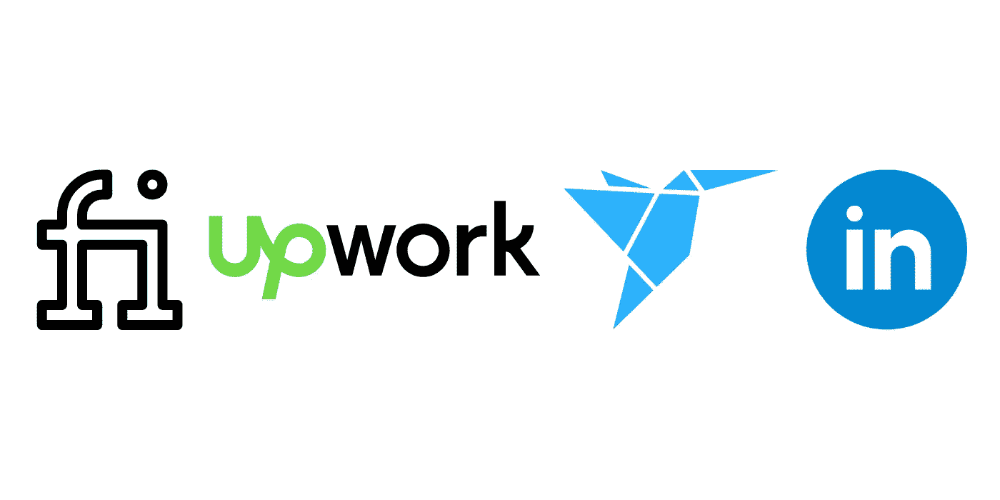
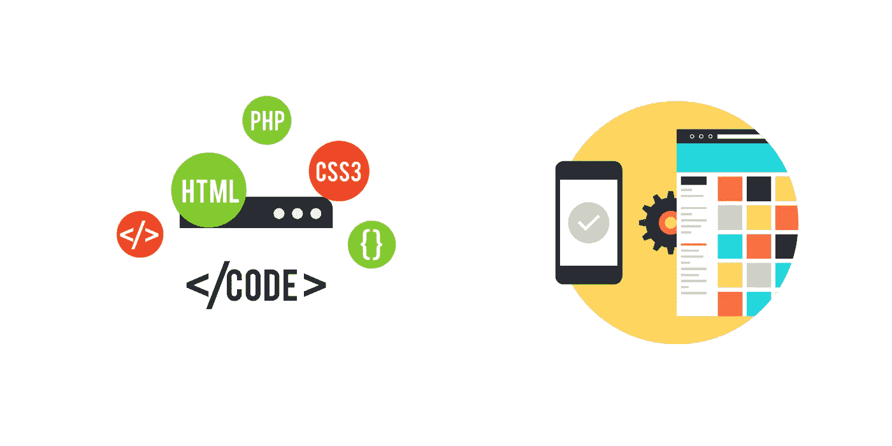

# 作为软件开发人员赚取额外收入的 4 种方法

> 原文：<https://medium.com/codex/4-ways-to-make-extra-income-as-a-software-developer-545f94e5710?source=collection_archive---------7----------------------->

## 作为一名开发人员，你有多余的时间或者想要更多的财务自由吗？

克里斯蒂娜@ wocintechchat.com 在 [Unsplash](https://unsplash.com?utm_source=medium&utm_medium=referral) 上的照片

作为一名程序员，你有大量额外的机会来增加收入。一份典型的软件开发人员的固定工作通常报酬很高，但这不应该成为你不能指望赚取一些额外收入的理由，所有这些都来自你自己家里或其他任何地方。

在这篇文章中，我们将探索我个人最喜欢的四种作为开发人员赚取额外收入的方法，所有这些方法都有可能随着时间的推移而增长。每种方法在难度上各不相同，也绝不是一夜暴富的方法，但它们可以很快开始，通过努力和坚持，你可以扩大这些收入来源，获得不错的收入。

# 提供自由职业服务

开发者增加收入的最常见方式可能是提供自由职业服务。它们很容易建立，你提供的服务完全取决于你自己。不要认为你必须成为一名专家或者在某个领域工作多年才能成为自由职业者。即使是初学者也可以提供一些基本服务，无论是为某人创建简单的用户界面，还是修复他人代码中的错误。这些小任务是获得额外收入和增长知识和经验的好方法。然而，如果你在你的工作领域更有经验，你可以提供更广泛和更复杂的服务，收取更高的价格。

一些可用的自由职业者服务

开始做起来很简单，你可以在许多在线网站上提供服务，并寻找额外的工作，如 Fiverr、PeoplePerHour、UpWork、Freelancer，甚至 LinkedIn 也非常适合寻找自由职业者的工作。虽然开始很容易，但获得客户和固定工作是这种方法变得更加困难的地方。一般来说，你做的工作越多，获得的正面评价越多，就越容易建立稳定的客户流，但最初获得这些工作和评价可能是一场斗争。然而，如果你投入工作并不断寻找职位，同时为你得到的工作提供出色的服务，你可以稳步地将这种方法扩展到你的任何目标。

# 构建网站或移动应用程序

根据你工作的软件开发领域和你在日常工作之外有多少时间，网站或应用程序开发可能是一个很大的收入来源。这种方法是难度较大的方法之一，在技能方面需要更高的准入门槛，但在更被动地获得额外收入方面也有持久的好处。

对于网站开发者来说，你可以根据你的爱好或兴趣来建立一个网站。假设是户外露营。你可以创建一个视觉上吸引人的网站，然后为网站编写内容。它可以是对你使用过的各种露营产品的评论，对你有帮助的特定设备的文章，或者只是你喜欢的露营地点变化的最新更新。有了这些帖子，你就可以为你提到的产品添加代销商链接或者投放现场广告。

如果你是一名应用程序开发人员，事情会稍微复杂一些。你可以开发一个自己想用的应用程序，也可以对需求较高的合适应用程序或服务领域进行更多的研究。一旦应用程序建立并发布，你可以通过广告、应用内购买或者会员按月或按年付费的订阅服务来赚钱。

如前所述，这种方法要困难得多。你必须自己建立网站或应用程序的流量，这可能需要一段时间。然而，这两种方式产生的收入主要是被动的，因为一旦投入运营，就不需要太多工作；网站需要发布新的内容来保持趣味性。如果出现任何问题，该应用程序需要更新或修复。你也可以随着时间的推移增加新的功能来吸引你的观众。

# 开始你自己的 YouTube 频道

另一个选择是，开始容易，但发展困难。然而，如果你坚持每周上传和高质量的内容，为你的目标受众提供价值，你的频道确实可以成功。该频道可以记录您学习新编程语言或框架的进展，或者根据您的专业知识提供有用的视频教程。通过这样做，你不仅在一个病毒式平台上建立了一个与你的内容互动的观众群，而且通过向其他人教授一个特定的主题或实践，你也增加了对该主题的理解。

一旦你拥有了一批吸引人的订户，你就可以开始通过广告或联盟营销将你的渠道货币化。对于广告，你需要满足在你的视频上放置谷歌广告的最低要求。要求是最少 1000 个订户和总共 4000 个观看小时。这些要求起初看起来令人望而生畏，但是通过持续的上传，这些可以在相对较短的时间内实现。对于联盟营销，你可以在你的视频描述中有一个链接，链接到你用来学习某个主题的课程或者你使用的某台电脑设备。确保它是真实的，让你的观众知道通过你的链接购买有利于渠道。

# 创建视频课程

这种方法可能是一个产生额外收入的好方法，也是一个非常被动的方法，因为一旦课程被创建和编辑，之后就没有那么多工作要做了。你可以在 Udemy 或 Skillshare 等已经建立的服务上主持课程。这样做可以让你的课程被大量的观众看到和购买，而不需要你自己提供广告，非常适合刚开始或者如果你不想花钱让别人看到你的课程。另一种方法是建立一个课程网站，你可以宣传和推销自己；这对于在社交媒体平台或 YouTube 上拥有固定受众的人来说尤其重要。只要确保你的课程对他人有价值，提供优秀的信息，看起来专业，并与你的学生互动。

## 摘要

作为一名开发人员，有很多方法可以利用你的技能和知识来赚取额外收入。以上是我最喜欢的一些，有不同的难度和承诺，让你看看它们是否适合你的生活方式。

如果你刚开始是一名开发人员，你可以找到更多关于我作为自由软件开发人员所犯的错误的信息。或者[关于如何开始做自由开发者的建议](https://oliver-ryan.medium.com/my-best-advice-on-starting-as-a-freelance-developer-373434a19fa1)。

**不隶属于提及的任何服务或平台**