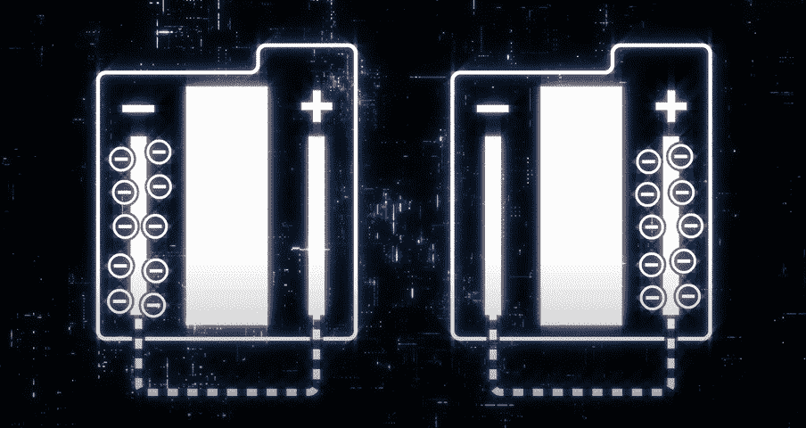

# 智能手机用户应该警惕的 4 大错误。

> 原文：<https://medium.com/codex/4-worst-mistakes-smartphone-owners-make-882b76f8a62f?source=collection_archive---------7----------------------->

最近，我看到了所有这些智能手机爆炸、电池从智能手机中凸出的事件，作为一个小工具爱好者，我觉得有义务为那些不精明的消费者写一篇信息丰富的文章，这样他们就可以更加安全。我并不是说消费者有错，原始设备制造商可以对到达你手中的有缺陷的产品负责。这篇文章只是为了确保你尽你所能来避免这一事故。

图片提供:Asurion

我们开始吧，好吗？

## 过热

毫无疑问，过热是电池损坏的最主要原因，有时甚至会导致爆炸。热量会逐渐改变电池的物理结构，从而导致电池以更快的速度退化。快速充电器除了加快速度之外什么也没做。

让我们展开一点。因此，电池有两个电极，一个(+ve)端和一个(-ve)端，自由电子在(-ve)端，现在这些电子通过指定的路径到达正极，为设备供电，在本例中为智能手机的主板供电。当我们将充电器连接到智能手机时，电子流是反向的，因此是一个完整的循环。快速充电器以比普通充电器更快的速度加热电池。

信用:Mrwhosetheboss

*   尽量不要在充电时使用智能手机，因为那只会增加热量。
*   不要将智能手机放在阳光直射的地方。相信我
*   记得在充电时移除任何外壳或后盖，因为这将有助于散热。
*   如果你认为你的智能手机过热，通过第三方应用程序或本机功能(如果你的智能手机有)检查电池温度。

## 物理损伤

这是非常危险的，因为它会导致电池化学和机械结构的变化。如果你的智能手机掉在地上，你捡起来看着屏幕，希望它没事，然后你打开显示屏检查一下。虽然看起来一切正常，但电池可能已经严重损坏。如果你注意到你的智能手机过热或不符合它以前的标准，很可能是电池受到了冲击，现在很容易发生故障。此外，弯曲智能手机会导致变形并导致爆炸。

信用:对 Mac 的崇拜

如果您在跌落后发现任何过热现象，请务必前往服务中心。

## 廉价充电器

相信我，你不会想在这个配件上省几块钱的，因为从长远来看它会有所不同。廉价的充电器没有高压安全措施，廉价的集成电路提供未经调节的电源，与采用优化充电和涓流充电等新技术的智能手机不兼容。有太多的事情需要避免。

相反，我不会说赞同，但苹果的无充电器举措被三星和 Pixel 采用，导致这种情况在更高的层面上发生。
另外，请不要混用充电线和适配器，因为它们有指定的电源，并且电缆设计有各自的电阻系数，以便与适配器完美同步。

## 电池退化

现在，让我们先把你的习惯弄好，好吗？我敢打赌，你会把你的手机充到 100%的电，然后摇着它，直到它发出最后一口气或者即将发出最后一口气。现在，这样做会降低你的电池和可怜的超时。

信用:Mrwhosetheboss

请允许我解释一下，一个电池在 0%和 100%时，处于其峰值压力和高度不稳定状态。正如灭霸所说，一切都应该完美平衡，这就是为什么当你拆箱时，你会看到 40-50%的新智能手机，因为这些手机可能会在仓库和货架上呆上几个月。现在回到充电，试着给你的手机充电到 85%最大值，当它达到 25%最低值时再充电。如果你储存了一部 100%或空的智能手机，它很可能看起来已经完全磨光了。

信用:比邦

好了，这就是这个故事，我希望你喜欢这个故事，并会考虑这些。如果你有，请考虑跟随我！祝你今天开心！玩的开心！
☮

如果你想通过把你的媒体故事变成播客来增加你的听众:

 [## 作家！！！你会喜欢这个的…

### 哦！还有播客听众！

medium.com](/writers-blokke/writers-youre-gonna-love-this-8f1fa2f1fddf) 

如果您对 Pegasus 间谍软件的工作原理感兴趣:

 [## 飞马间谍软件是如何工作的？

### 是的，它现在可能使用了一套完全不同的利用方式…

medium.com](/writers-blokke/how-did-does-pegasus-spyware-work-3f0867f5ef34) 

一直想进入编程领域？：

 [## 2021 年最值得学习的 6 种编程语言

### 对于初学者或改变职业的人来说，我们经常发现学习者问这个问题“什么编程…

medium.com](/writers-blokke/top-6-programming-languages-to-learn-in-2021-b06f4628f008) 

我想你会发现这很有趣:

 [## 你现在应该改变的 7 个 iPhone 设置

### 它们并不总是显而易见的…

medium.com](/macoclock/7-iphone-settings-you-should-change-right-now-b107c8664b34) 

*如果你喜欢我的作品，你可以给我买一辆*🍩 [*此处*](https://www.buymeacoffee.com/BhaveshRawat) *。*