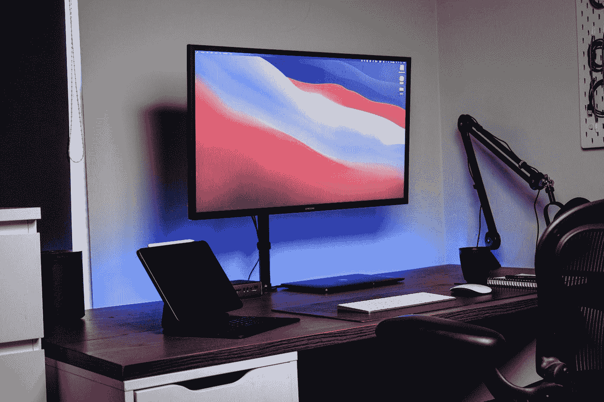

# 苹果的 5 个功能会让你沉迷于 macOS 和 iOS 的集成。

> 原文：<https://medium.com/codex/5-apple-features-that-will-get-you-addicted-to-a-macos-and-ios-integration-13daf929d416?source=collection_archive---------2----------------------->

詹姆斯·麦金文在 [Unsplash](https://unsplash.com?utm_source=medium&utm_medium=referral) 上的照片

拥有一台个人电脑有很多原因。在当今的数字时代，拥有一台笔记本电脑、平板电脑和/或手机对于交流和执行基本的日常功能至关重要。有时也希望远离尘嚣的生活会很美好。保持联系仍然至关重要。