# 数据科学中 EDA 需要了解的 5 个基本离散分布

> 原文：<https://medium.com/codex/5-basic-discrete-distributions-you-need-to-know-for-eda-in-data-science-83f3921cd1ee?source=collection_archive---------5----------------------->

## 二项式、泊松、几何、负二项式、超几何

探索数据时，您需要熟悉的一个基本概念是观察值是如何分布的。你可能会想，当这个世界上有这么多不同的东西时，我们如何对这些分布进行分类呢？令人惊讶的是，相对较少的发行版也是可能的。在这篇文章中，我们将首先研究离散模型，在接下来的文章中，我们将研究连续模型。在离散模型中，我们先来了解一下二项分布。

[KOBU 机构](https://unsplash.com/@kobuagency?utm_source=medium&utm_medium=referral)在 [Unsplash](https://unsplash.com?utm_source=medium&utm_medium=referral) 上拍摄的照片

# 二项分布

正如你们大多数人可能从它的名字中注意到的，二项式分布是 n 次试验的分布，每次试验只有两种可能的结果。所以经典的抛硬币给我们正面或反面，以及询问人们是否喜欢餐馆的调查都与二项分布有关。这些事件共有 4 个基本要求。那些是

> 1.试验次数是固定的
> 2。成功的概率是固定的
> 3。试验是相互独立的
> 4。两种结果是相互排斥的

在这些情况下，你可能会好奇的一件事是从 n 次试验中获得总共 k 次成功的概率。例如，通过投掷 10 枚硬币获得 6 个正面(成功)的概率是多少？你可以手工计算概率，但是有一个相对简单的公式你可以普遍使用。

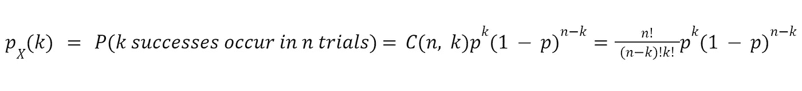

二项分布的 pdf:表示成功次数的随机变量/ n:总试验次数/ k:总成功次数/ p:成功概率

通过绘制这个 pdf，您可以直观地检查二项式分布是什么样子的。

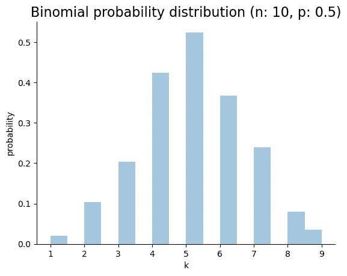

或者，您可能需要知道二项分布的期望值来评估集中趋势。例如，当你掷 10 枚硬币时，你得到的平均正面数是多少？你可以多次尝试同一个实验并计算平均值，但是一个更统计的方法是使用下面的公式。

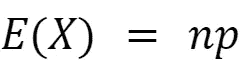

二项分布的期望值公式([证明](https://proofwiki.org/wiki/Expectation_of_Binomial_Distribution))

最后，有些情况下你需要知道二项分布的方差。在这种情况下，您可以使用我在之前的[帖子](/codex/easy-explanation-of-a-random-variable-and-fundamentals-of-a-distribution-4fd197bb7303)中提到的公式。但是为了更容易计算，可以使用下面的公式。

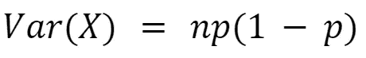

二项分布的方差([证明](https://proofwiki.org/wiki/Variance_of_Binomial_Distribution)

## 多项分布

与二项式模型不同，多项式模型有两个以上的结果。例如，石头、剪刀和布的分布是多项式分布，因为它包含 3 个结果。所以你可以认为我们可以把石头、剪刀和布变成 0、1 和 2。

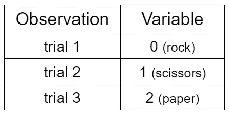

石头、剪刀和布的标签编码

然而，当你将这些数据提供给机器学习算法时，将它们编码为 0、1 和 2 是不合适的，因为算法可能会将它们解释为不正确的顺序。剪刀不比石头大。所以一个更好的方法是把一个多项式分布转化成许多个二项式分布。例如，石头剪刀布多项式分布将变成 3 个二项式分布，其中 is_rock、is_scissors 和 is_paper，每个二项式分布具有两个值 0 和 1。这被称为一个热编码。

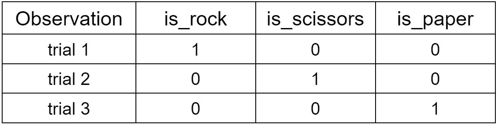

石头剪刀布的一个热门编码

# 泊松分布

二项式 pdf 的一个问题是，当我们假设 np 保持不变，n 接近无穷大时，由于乘数 C(n，k)会增加，因此很难计算。

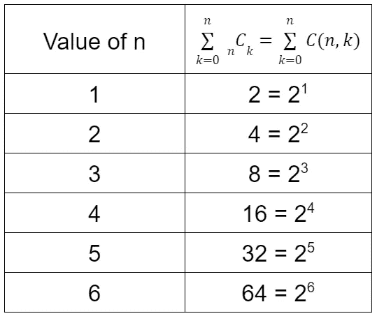

显示 C(n，k)之和如何呈指数增长的表格

因此，过去的数学家需要另一种方法，西莫恩·德尼·泊松提出了泊松极限。

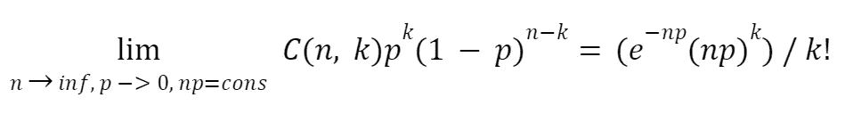

当 n 接近无穷大，p 接近 0 时泊松极限的方程([证明](https://en.wikipedia.org/wiki/Poisson_limit_theorem)

根据上面的等式，当我们用正的恒定速率λ代替 np 时，它就变成了泊松分布的 pdf。

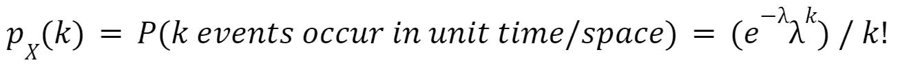

泊松分布的 pdf:单位时间或空间内发生的次数/ k:事件数/ λ:单位时间或空间内的恒定速率

尽管它是从二项式分布开始的，泊松分布的 pdf 因其其他解释而更为人所知。从上式可以看出随机变量 X 代表什么，泊松分布是用来解释某一事件在单位时间或空间内发生次数的概率。此外，稍微修改一下方程式，泊松分布也可以用来计算两个事件之间的等待时间。例如，100 年内两个国家之间发生的战争，你一天接到的电话数量，或者两颗流星之间的等待时间都属于泊松分布问题。这些事件必须遵循以下标准。

> 1.1 子区间内只有 1 个事件
> 2。事件独立发生
> 3。一个事件在子区间内发生的概率在整个区间内保持不变

因为这些标准都是普通的，泊松分布可以应用于各种各样的问题。而对于它的期望值和方差，都等于λ。

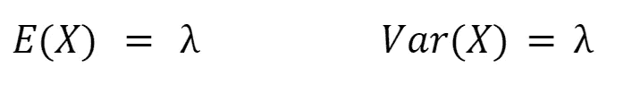

泊松分布的期望值和方差([期望值证明](https://proofwiki.org/wiki/Expectation_of_Poisson_Distribution) / [方差证明](https://proofwiki.org/wiki/Variance_of_Poisson_Distribution)

结合这两者，您可以绘制泊松分布图，并查看形状如何基于λ值变化。

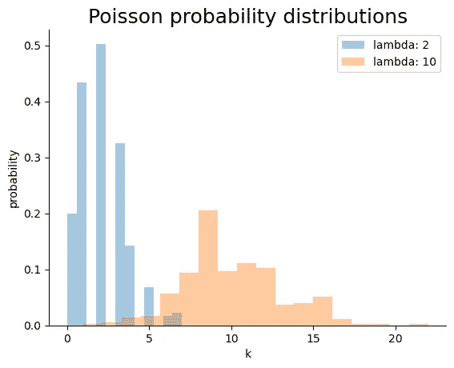

# 几何分布

另一种基于二项式模型的分布是几何分布。因此，几何分布的结构类似于二项分布，不同之处在于随机变量。

回想一下，二项式分布的随机变量是从 0 到 n 的成功次数。相比之下，几何分布的随机变量是 n 次二项式独立试验中第一次成功的试验。例如，当彩票中第一名的概率是 1/1000 时，你可以用几何模型计算第四次尝试中第一名的概率。显然，只有当你连续三次错失第一名，并在第四次尝试中获胜时，这种情况才会发生。把这个情景转换成概率，就变成了 999/1000×999/1000×999/1000×1/1000。这个公式可以推广到几何 pdf 中。

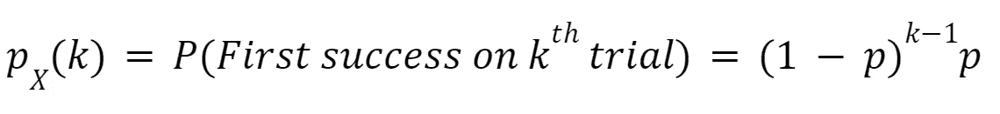

几何分布的 pdf:第一次成功的试验/ k:第一次成功的试验/ p:成功概率

当你绘制这个 pdf 时，它看起来像下面这样。

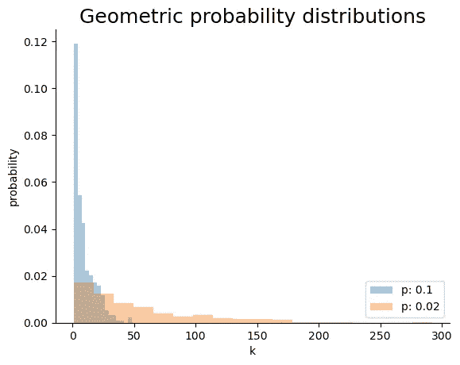

正如你所看到的，图表会因为概率值的不同而略有不同。和其他分布一样，需要一些假设。

> 1.每个试验有两个结果
> 2。每个试验都是独立的
> 3。p 保持不变

要计算它的期望值和方差，可以使用与上面相同的证明步骤。这是给那些想快速浏览它们的人的公式。

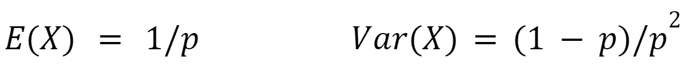

几何分布的期望值和方差([期望值证明](https://math.stackexchange.com/questions/605083/calculate-expectation-of-a-geometric-random-variable) / [方差证明](https://math.stackexchange.com/questions/1299465/proof-variance-of-geometric-distribution))

# 负二项分布

但是你并不总是对第一次成功感兴趣。有时候，你可能想知道成功发生的第 k 次试验。在这种情况下，您可以使用几何分布的广义版本，即负二项式分布。它将其随机变量设置为第 r 次成功发生的试验，因此 pdf 成为第 k 次试验中第 r 次成功发生的概率。

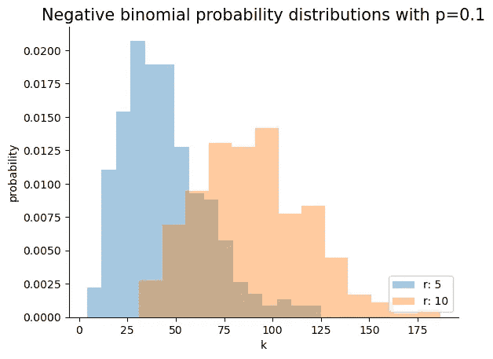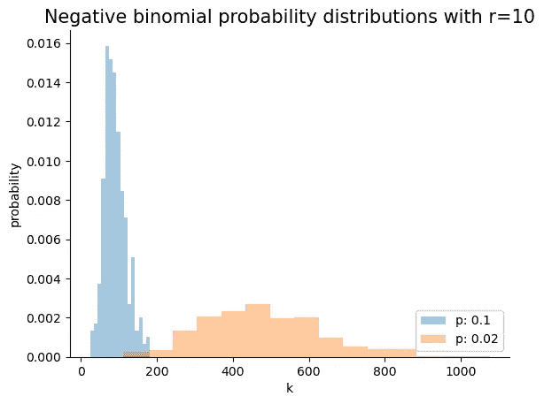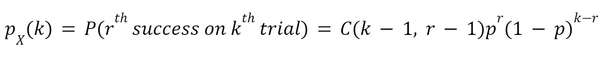

负二项分布的 pdf:第 r 次成功的试验/ k:第 r 次成功的试验/ p:成功概率

上面的公式是基于这样的思想形成的，即 r-1 次成功发生直到 k-1 次试验，使得最后一次成功可以发生在第 k 次试验。因为负二项分布是上面提到的几何分布的一般化版本，所以需要检查相同的假设。

> 1.每个试验有两个结果。每次试验都是独立的
> 3。p 保持不变

就像其他分布一样，期望值和方差的证明步骤的基本思想是相同的。

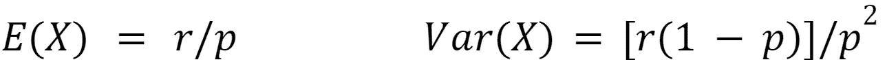

负二项分布的期望值和方差([期望值证明](https://math.stackexchange.com/questions/1672714/proof-for-the-calculation-of-mean-in-negative-binomial-distribution) / [方差证明](https://math.stackexchange.com/questions/1620945/variance-of-negative-binomial-distribution-without-moment-generating-series))

# 超几何分布

最后，我将谈论超几何分布，它在结构上不同于上面的分布。超几何分布是指在没有替换的情况下，来自有限总体的 n 次试验的成功次数。所以与上面的不同，超几何分布的试验是相互依赖的。因此，成功的概率随着你的进步而变化。所以在 pdf 中，它不是 p，而是由组合组成。

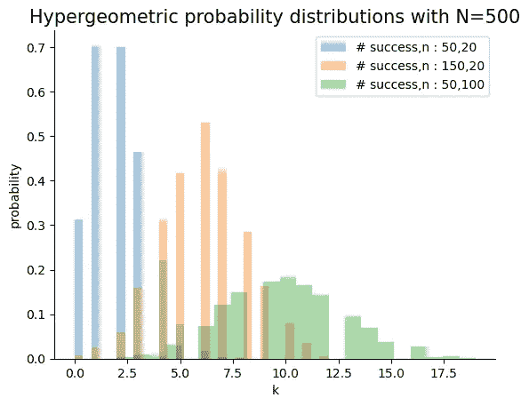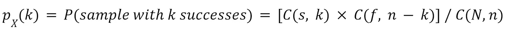

超几何分布的一个 pdf:样本成功的次数/ s:总体成功/ f:总体失败/ N = s+f:总体规模/ N:样本规模/ k:样本成功

根据上面的公式，随机变量 X 代表样本大小 N 中的成功次数，每个 r、w 和 N 代表成功、失败和总体大小。这个 pdf 在确定是否有太多缺陷产品或从人群中随机抽样的情况下是有用的。像其他分布一样，在使用这个分布之前需要检查一些条件。

> 1.人口规模是固定的
> 2。需要知道人口成功
> 3。不更换的取样
> 4。每个随机样本只有两种结果

正如从上面的许多分布中重复的，超几何分布的期望值和方差可以从一般的期望值和方差方程中导出。

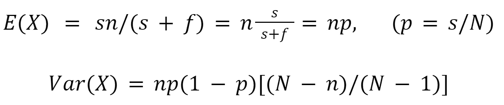

超几何分布的期望值和方差([期望值和方差证明](http://www.milefoot.com/math/stat/pdfd-hypergeometric.htm)

# 参考

[2] CFI 团队。“二项式分布。”*公司金融研究所*，2022 年 5 月 7 日，[https://Corporate Finance Institute . com/resources/knowledge/other/binomial-distribution/。](https://corporatefinanceinstitute.com/resources/knowledge/other/binomial-distribution/.)

[1] Larsen，Richard J .，和 Morris L. Marx。*数理统计及其应用简介*。第六版。