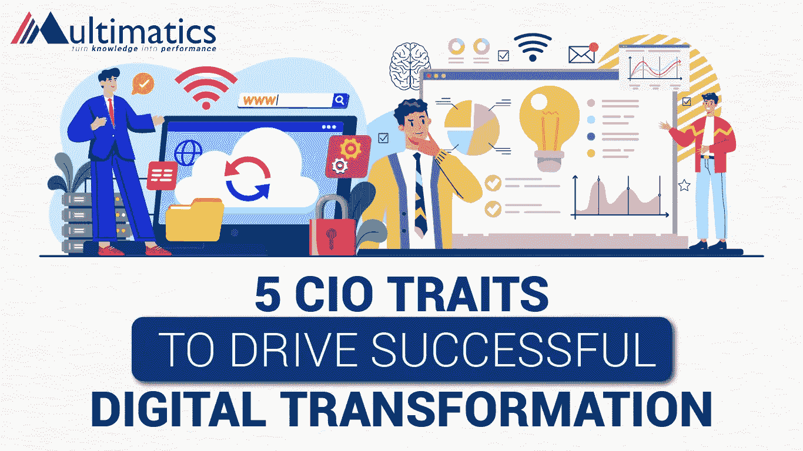

# 推动成功数字化转型的 5 个首席信息官特质

> 原文：<https://medium.com/codex/5-cio-traits-to-drive-successful-digital-transformation-cb7e70ae7840?source=collection_archive---------19----------------------->

**首席信息官如何推动数字化转型？**

作为组织中的首席信息官，他们肯定有几项职责来确保正在进行的数字化转型过程的成功。以下是首席信息官在组织中必须履行的部分职责。

1.  **着眼大局:**长期项目需要频繁的重置，以避免停滞不前。项目分割使得交付比一次性完成更多的价值成为可能。
2.  **推动持续变革:**首席信息官们必须通过测试有用的新技术、获取反馈并在必要时提供支持，来确保数字化变革活动持续进行。
3.  **管理变革阻力:**员工阻力会干扰您的数字化转型战略。首席信息官必须能够让员工了解变革的好处，同时激励他们接受变革。
4.  **加强网络安全:**将安全从 IT 问题转变为业务问题是首席信息官面临的主要挑战之一。首席信息官必须确保他们的业务有一个坚实的安全基础。

尽管数字化转型是一项企业范围内的业务战略，但首席信息官在整合战略和技术以推动流程和快速实现变革方面处于理想地位。因此，首席信息官必须预见数字化的可能性和危险，利用技术来适应不断变化的环境，并利用颠覆。要成为一名推动成功数字化转型的首席信息官，需要理解并接受这 5 个特质。

1.  **成为一个新亲者**
2.  **开发新的机会**
3.  **超越行业界限**
4.  **永远不要认为数字是结果**
5.  **关注技术驱动的机会**

总之，数字化转型需要领导者重新发明他们的方法，而不是简单地响应或回应业务需求。因此，首席信息官要大胆、不断地分析和评估商业价值、把握创新提供的价值，并能够将这些整合在一起，这是成功的数字化转型所需要的。

了解更多关于数字化转型及其如何影响现代技术的信息，从[网络安全](https://diginovation.multimatics.co.id/3-cybersecurity-priorities-for-digital-transformation.aspx)到 [IT 治理](https://diginovation.multimatics.co.id/accelerating-digital-transformation-in-governance.aspx)。

*现在就用 Multimatics 加速您的数字化转型！*