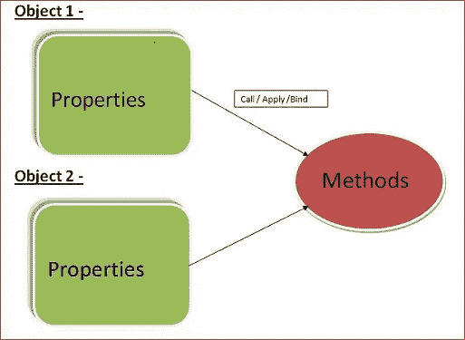

# 每个 JavaScript 程序员必须知道的 5 个概念|第 2 部分

> 原文：<https://medium.com/codex/5-concepts-every-javascript-programmer-must-know-part-2-be3e63d8cf26?source=collection_archive---------6----------------------->

## 这里是 JavaScript 开发人员必须知道的 5 个概念。


演职员表: [iStock](https://www.istockphoto.com/) 上的 [shapecharge](https://www.istockphoto.com/en/photo/digitally-enhanced-shot-of-two-attractive-businesswomen-working-in-the-office-gm1322205536-408240560?phrase=javascript)

以下是上一篇文章的第二部分。链接到之前的帖子—

[](https://javascript.plainenglish.io/5-concepts-every-javascript-programmer-must-know-6a5f6df325ce) [## 每个 JavaScript 程序员必须知道的 5 个概念

### 这里是 JavaScript 开发人员必须知道的 5 个概念。

javascript.plainenglish.io](https://javascript.plainenglish.io/5-concepts-every-javascript-programmer-must-know-6a5f6df325ce) 

# 1.)JavaScript 闭包

闭包是函数和声明该函数的词法环境的组合。

它是一个内部函数，可以访问外部(封闭)函数的变量——作用域链。闭包有三个作用域链:它可以访问自己的作用域(花括号中定义的变量)，可以访问外部函数的变量，还可以访问全局变量。

示例:

```
function User(name){  
      var displayName = function(greeting){
      console.log(greeting+' '+name);
   }
   return displayName;
}var myFunc = User('Raj');myFunc('Welcome ');    //Output: Welcome Raj
myFunc('Hello ');      //output: Hello Raj
```

在上面的例子中，我们有一个外部函数`User()`,它返回一个内部函数作为`displayName().`,内部函数将访问外部函数范围内的变量，即使在外部函数已经返回之后。

# 2.)记忆化

内存化是一种编程技术，它试图通过缓存以前计算的结果来提高函数的性能。因为 JavaScript 对象的行为类似于关联数组，所以它们是充当缓存的理想候选对象。每次调用内存化的函数时，它的参数都被用来索引缓存。如果数据存在，那么它可以被返回，而不需要执行整个函数。但是，如果数据没有被缓存，则执行该函数，并将结果添加到缓存中。

清晰的例子让你更容易理解记忆:

```
const memoizedAdd = () => {
        let cache = {};
        return (value) => {
            if (value in cache) {
                console.log('Fetching from cache');
                return cache[value];
            } else {
                console.log('Calculating result');
                let result = value + 10;
                cache[value] = result;
                return result;
            }
        }
    }// returned function from memoizedAdd
const newAdd = memoizedAdd();
console.log(newAdd(4)); //output: 14 calculated
console.log(newAdd(4)); //output: 14 cached
```

# 3.)应用、调用和绑定方法:

传统上，JS 有对象、属性和方法，所以每个对象都有属性和方法。

在 JavaScript 中，我们可以使用 call、apply、bind 方法，



考虑上面的图像，Object1 可以有它的属性，Object2 可以有它的属性，所以我们可以为这些对象编写一个公共方法，并在调用/应用/绑定方法中使用它。我希望你现在能明白为什么调用/应用/绑定方法使用。

让我们看看调用/应用/绑定方法的区别和代码

1.  呼叫方法:

考虑下面的代码，obj 有 num 的属性，使用 call 方法我们可以绑定 obj 来添加函数，

```
var obj={
   num: 2
}
var add = function(num2,num3,num4){
   return this.num + num2 + num3 + num4;
}
var arr=[3,4,5];//Call method 
console.log(add.call(obj,3,4,5));  //Output : 14//Apply method
console.log(add.apply(obj,arr));   //Output : 14//bind Method
var bound = add.bind(obj);
console.log(bound(3,4,5));         //output : 14
```

2.运用方法

同样，apply 方法也可以工作，但唯一的区别是使用 Apply 方法，传递的参数可以是一个数组，请参考下面的代码。

3.绑定方法:

bind 方法返回一个方法实例而不是结果值，之后需要执行一个带参数的绑定方法。

在上面的代码中简单解释了如何使用带有参数的调用/应用/绑定方法。

# 4.)回调函数:

回调函数意味着对可执行代码或一段可执行代码的引用，它作为参数传递给其他代码。

根据上面的定义，回调函数是作为参数传递给另一个函数的函数，然后在外部函数内部调用该函数来完成某种例程或操作。

```
function greeting(name) {
   console.log('Hello ' + name);
}
function processUserInput(callback) {
    //var name = prompt('Please enter your name.');
    name = 'raja';
    callback(name);
}
processUserInput(greeting); //output Hello Raja
```

在上面的 ab 程序中，函数 greeting 作为参数传递给 processUserInput 函数，所以我希望您现在已经理解了 JavaScript 中的回调函数。

# 5.)理解范围:

作用域是运行时代码中某个特定部分的变量、函数和对象的可访问性。换句话说，范围决定了代码区域中变量和其他资源的可见性。

根据上面对范围的定义，重点是限制变量的可见性，并不是在代码中的任何地方都有可用的东西。

范围主要以两种方式定义，

*   全球范围
*   局部范围

```
var greeting='Welcome to blog';
(function(){
  console.log(greeting); //Output: Welcome to blog
})();
```

考虑到上面的代码问候变量应该是全局范围的，它可以访问函数内部、

```
(function(){
   var greeting = 'Welcome to blog';
   console.log(greeting); //Output: Welcome to blog
})();console.log(greeting); //Output:Reference-Error greeting not defined
```

在上述局部范围的代码中，

在 JavaScript ES6 中的作用域级别变量中，更新了提升变量 let，var，const 类型检查，要了解作用域，还需要了解提升。

# 最后的想法

好吧，这是另一篇关于我的 5 大 JavaScript 概念的文章，每个 JavaScript 程序员都必须知道。这将有助于你事业的发展。之前帖子的链接在这里—

[](https://javascript.plainenglish.io/5-concepts-every-javascript-programmer-must-know-6a5f6df325ce) [## 每个 JavaScript 程序员必须知道的 5 个概念

### 这里是 JavaScript 开发人员必须知道的 5 个概念。

javascript.plainenglish.io](https://javascript.plainenglish.io/5-concepts-every-javascript-programmer-must-know-6a5f6df325ce) 

我希望这篇文章对你有所帮助，并让你学到一些新东西。与你的网络开发者朋友分享这篇精彩的文章😀。我将很快就这个话题写更多的文章。

*在我的下一篇文章中再见…*


GIF 来自 [GIPHY](https://media.giphy.com/media/YorwDAH66ln3O/giphy.gif)