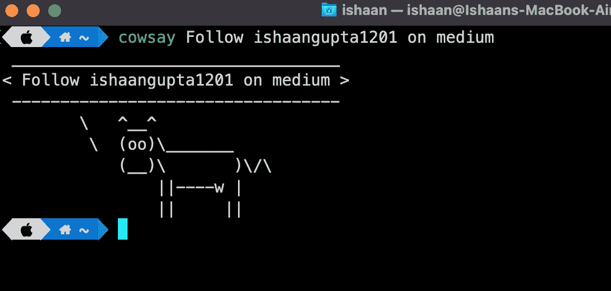
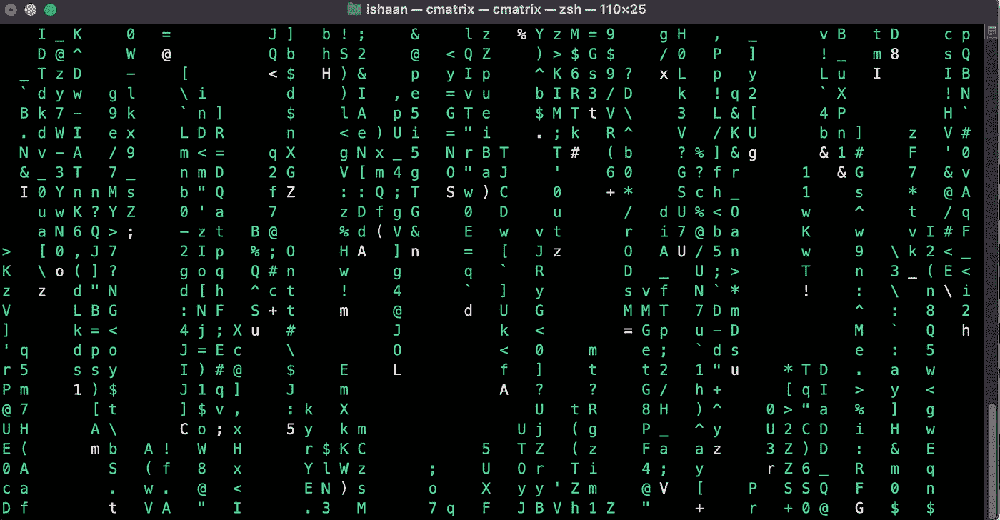
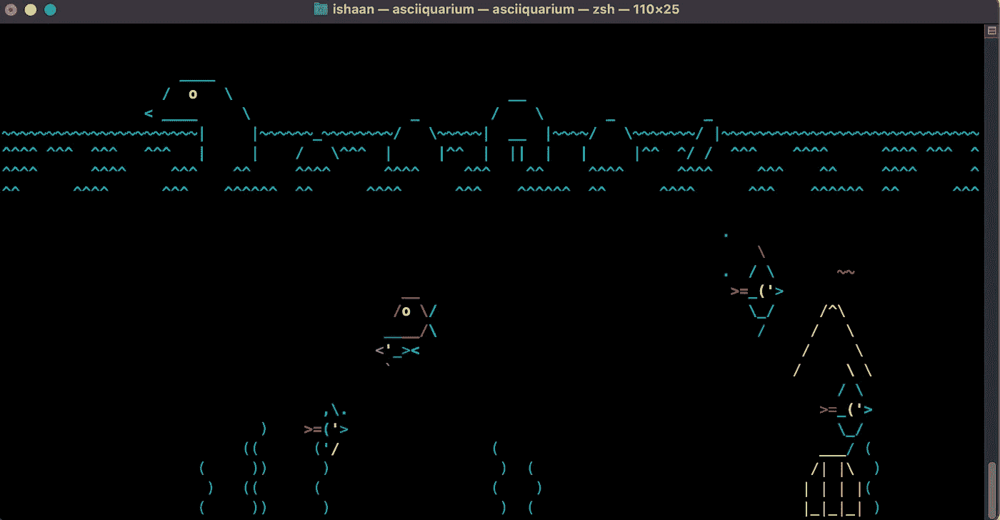
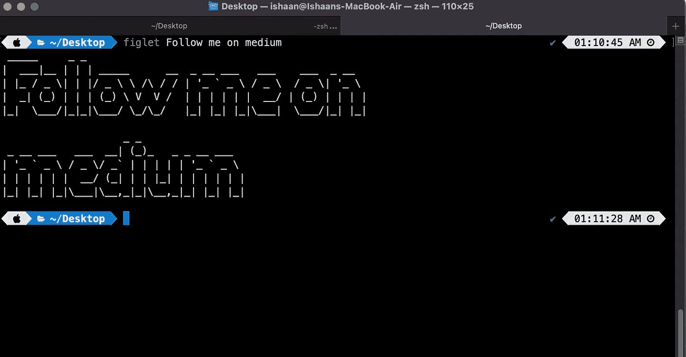
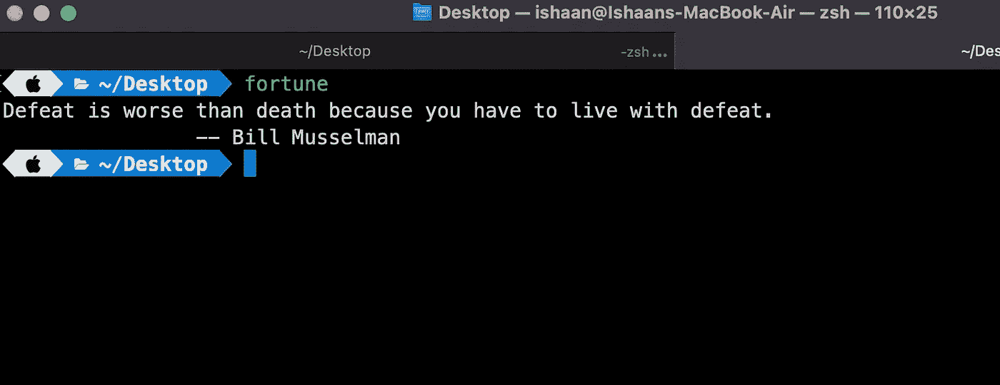

# 5 个很酷的 Linux 命令，让你的终端充满乐趣

> 原文：<https://medium.com/codex/5-cool-linux-commands-to-have-fun-on-your-terminal-9cd26deda3c6?source=collection_archive---------5----------------------->

Linux 命令行是计算机的文本界面。也被称为外壳、终端、控制台、命令提示符和许多其他程序，是一个旨在用**解释命令**的计算机程序。但它不仅是一个复杂而强大的命令的地方，也是一个有趣的游乐场。


freepik.com[的功劳](https://www.freepik.com/free-photo/bemused-young-lovely-brunette-woman-with-casual-hairstyle-keeping-her-mouth-wide-opened-while-looking-dazedly-front-raising-hand-her-face-while-posing-pink-wall_12469304.htm#query=suprised&position=12&from_view=search)

这是一些您可以在终端上使用的命令列表—

# 1.)xcowsay

xcowsay 命令接受一个文本，并显示一只说这个文本的奶牛。

**安装:**

```
For macOS:
brew install cowsay For linux:
sudo apt install xcowsay
```

**执行:**

```
cowsay Follow ishaangupta1201 on medium
```



# 2.)矩阵

对于那些想获得一个*【电影般的黑客】*终端的感觉来炫耀你的 Linux 技能的人？这是给你的！

**安装:**

```
For macOS:
brew install cmatrixFor linux:
sudo apt install cmatrix
```

**执行:**

```
cmatrix
```



# 3.)子囊

Asciiquarium 是 ASCII 艺术中的水族馆/海洋动画**这个程序使用 ASCII 艺术显示水族馆/海洋动画。**

**安装:**

```
For macOS:
brew install asciiquariumFor linux: 
snap install asciiquarium
```

**执行:**

```
asciiquarium
```



# 4.)figlet

figlet 命令通过在其配置中使用一些特殊字体，将普通终端文本转换成大而漂亮的字母

安装:

```
For macOS:
brew install figletFor linux:
sudo apt install figlet
```

执行:

```
figlet Follow me on medium
```



# 5.)财富

这个命令将通过使用高级深度学习和人工智能的力量来告诉你准确的命运。
( *开个玩笑，它会生成愚蠢的短语*)

**安装:**

```
For macOS:
brew install fortuneFor linux:
sudo apt install fortune
```

执行:

```
fortune
```



# 最后的想法

我希望这篇文章对你有所帮助，并且是值得的。请随意将这篇文章分享给你的程序员朋友。

**快乐编码！**