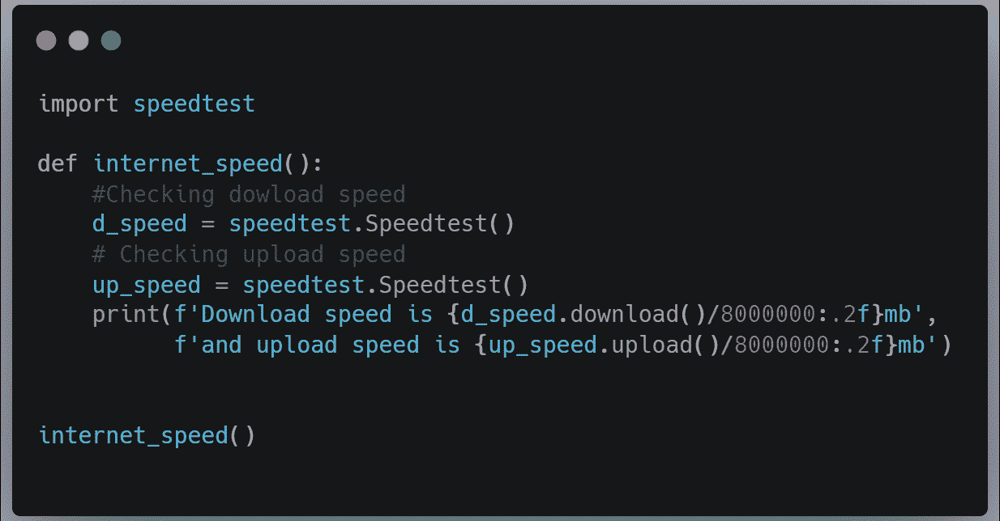
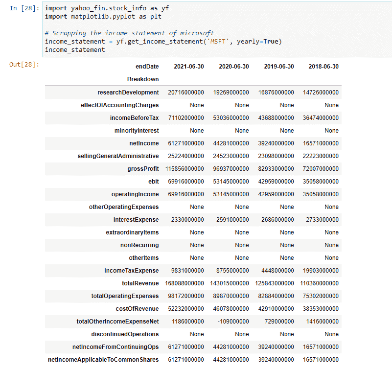
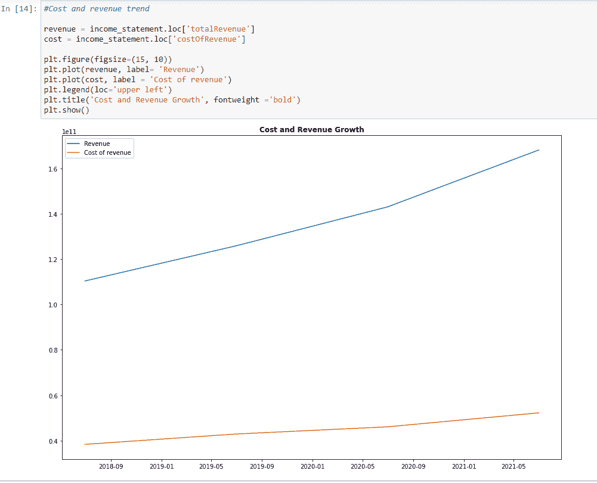
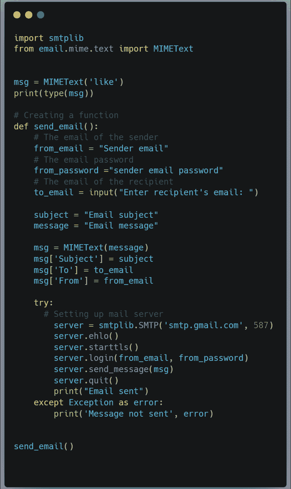
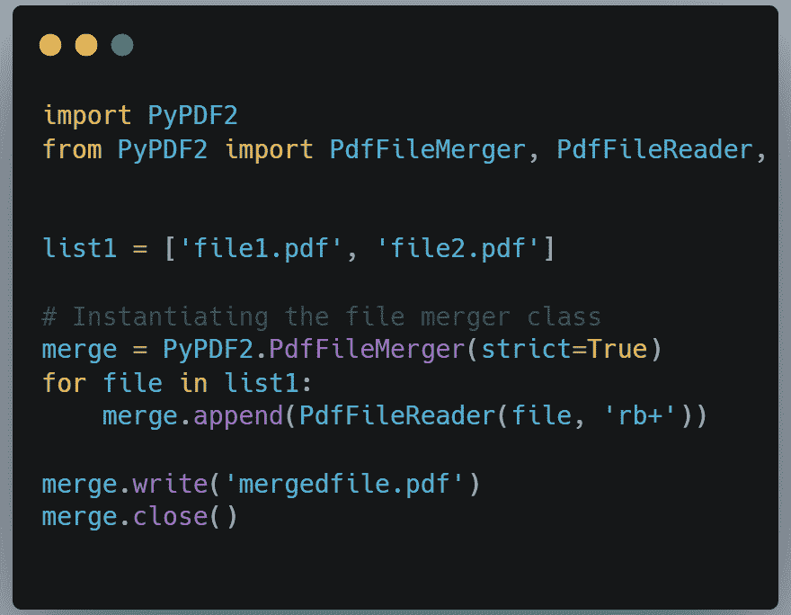
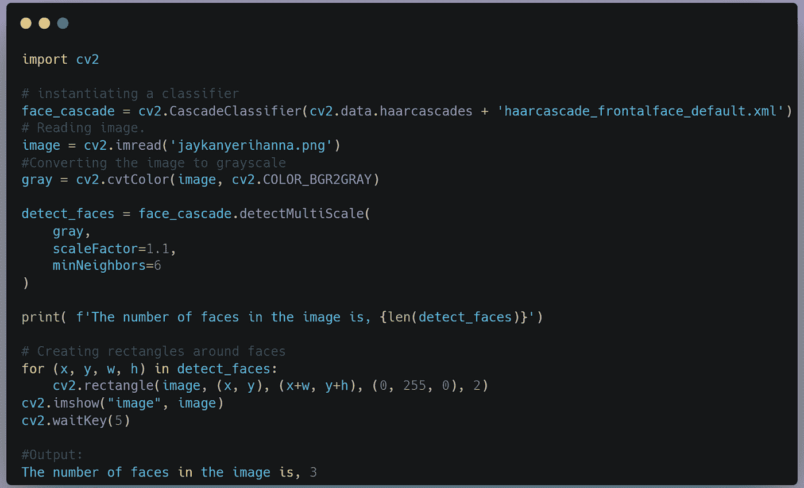

# 使用 Python 可以做的 5 件很酷的事情

> 原文：<https://medium.com/codex/5-cool-things-you-can-do-with-python-477646c6d93c?source=collection_archive---------5----------------------->

Matthias Groeneveld 摄影:[https://www . pexels . com/photo/red-dice-stacked-on-table-on-terrace-4200740/](https://www.pexels.com/photo/red-dice-stacked-on-table-on-terrace-4200740/)

Python 是一种通用编程语言，用于 web 开发、数据分析、数据科学、游戏开发等等。正是这种多功能性以及友好的语法使它成为如此强大的编程语言。在本文中，我们将探索 5 件你可能从未想过可以用 Python 做的事情。

# 1.检查互联网速度

Python 有一个模块，我们可以导入并使用它来检查网速。这个模块将检查互联网的下载和上传速度。首先，我们必须在机器上安装模块。使用 pip，我们可以运行 pip install speedtest-cli。要使用该模块，必须首先将其导入到我们的脚本中。在下面的代码中，我们将结果除以 8000000，将比特转换为兆字节，因为 *speedtest* 给出的结果是以比特为单位的。下面的代码返回互联网上传和下载速度。

# 2.下载和分析财务报表

有一个叫做 yahoo_fin 的 Python 包，用于抓取历史财务数据，如损益表、资产负债表、现金流量表、公司股息收益率等等。我们所需要的是一个报价器，我们已经准备好了。为了演示这个库是如何工作的，我们将尝试使用这个库来访问微软的历史损益表。微软的代码是 MSFT。下面是代码:

你可以在上面看到，只用了几行代码，我们就访问了微软的损益表。这些是年度结果(4 年)。如果我们想要季度结果，我们可以使用季度参数而不是年度参数。现在我们有了数据，我们可以用另外几行代码来分析它。假设我们想要可视化微软过去 4 年的收入和成本增长，这里是我们如何在另一个 Python 库 Matplotlib 的帮助下完成的。

从图表中我们可以看出，微软的收入增长速度一直比成本增长速度快得多。

# 3.发送电子邮件

Python 有一个名为 SMTPLIP 的内置模块，这是一个 SMTP(简单邮件传输协议)客户端，用于向任何互联网机器发送邮件。我们可以使用这个模块向单个或多个收件人发送不同类型的电子邮件。我们也可以附上文件。以下代码演示了我们如何使用该模块与 Gmail 应用程序协作发送电子邮件。这是一个发送文本邮件的基本代码。我们使用 email.mime 文本模块来创建一个文本对象，我们将在电子邮件中发送它。

# 4.合并 PDF 文件

Python 有几个模块可以用来合并和操作 PDF 文件。在本文中，我们将看看 PyPDF2 模块。PyPDF2 库用于合并、分割和水印 PDF 文件。下面是一个简单的代码，演示了我们如何使用 PyPDF2 合并多个 PDF 文件。您可以使用命令 Pip install PyPDF2 安装 PyPDF2。

我们已经将两个文件(文件 1 和文件 2)合并成一个名为 mergedfile.pdf 的文件。

# 5.检测图像中的人脸

Python 有一个名为 cv2 的库，用于视频和图像分析。我们可以使用该库来检测图像中的不同对象，包括人脸。为了演示如何使用该库，我们将使用该库来检测下图中的人脸:

我们导入这个库并实例化一个用于检测人脸的分类器。由于我们正在检测人脸，因此我们将加载预训练的 Haar cascode _ frontal face _ default . XML 分类器。下面是完整的代码:

我们可以从上面的代码中看到，在图像中发现了 3 张脸。下面是处理后的图像:

# 结论

这些是你可以用 Python 做的一些很酷的事情。请分享这个故事，鼓掌，评论。你也可以在 [Twitter](https://twitter.com/RealBenjizo) 和 [LinkedIn](https://www.linkedin.com/in/benjamin-b-phiri-45267b154/) 上关注我。