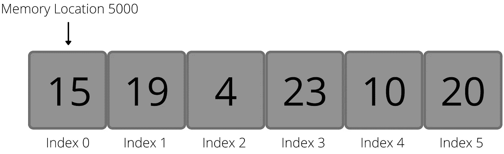
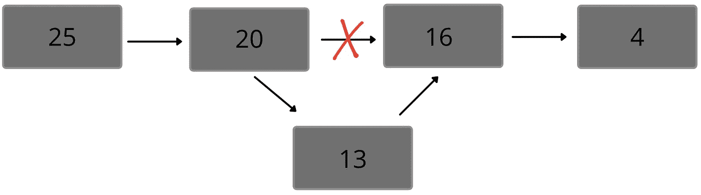
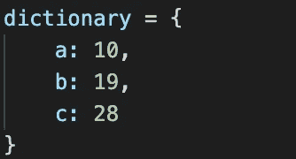
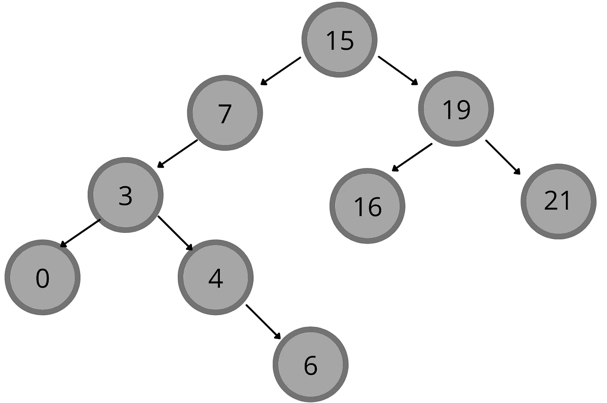

# 3 分钟 5 个数据结构

> 原文：<https://medium.com/codex/5-data-structures-in-3-minutes-b30883b10199?source=collection_archive---------4----------------------->

## 如果你的建筑是垃圾，你就拿不到钱

一个好的程序员的标志是理解他们所拥有的工具和实现，并且能够有效地使用它们来设计他们的代码。程序员使用的最重要的工具之一是数据结构。以下是每个程序员都需要的五种基本数据结构:

# ***1。数组——易搜索，难修改***

数组(或列表)是存储值的最基本的结构。数组按索引排序，第 I 个*索引指向第 I 个*位置加上数组在程序内存中的起始位置。**

**数组[3] =内存位置 5000 + 3**

这允许快速搜索数组中的元素，但是很难添加元素(因为数组会干扰程序其他部分的内存位置)。删除元素也很困难，因为删除中间的一个元素意味着更改后面所有元素的索引。

# 2.链表—难以搜索，易于修改

链表是数组的一个简单版本。每个元素存储它的值和一个指向下一个元素的内存位置的指针。

**在链表中添加元素**

这使得修改列表变得极其容易。在链表中间添加一个元素只是改变前一个元素的指针，并将该元素的指针设置为后一个元素。类似地，减去一个元素只是将前一个元素的指针直接指向后一个元素。但是，链表没有索引访问，所以在链表中找到第 *i-* 个元素更加困难。

# **3。堆栈/队列—单向数组，算法使用**

堆栈和队列就像单向数组。一堆就像自助餐厅里的一堆托盘。最后添加的元素是第一个取出(弹出)的元素。排队就像是去商店结账的队伍。添加的第一个元素是删除的第一个元素。

**堆栈和队列，不知道如何最小化介质上的图像:)**

理解栈和队列是超越实际实现的更加抽象和逻辑的结构是很重要的。在许多语言中，堆栈和队列不被认为是独立的数据类型。相反，数组用于表示堆栈和队列。

# 4.字典—基于关键字的快速搜索

计算机科学就像现实生活中的字典。它存储键值对。关键字就像一个单词，值就是相应的定义。

**键值对**

键值对存储在一个类似数组的结构中。给定密钥后，可以通过称为哈希的过程非常快速地搜索到值。

# 5.树——如果你的树很好，可以提高效率

树将数据存储为分层结构中的节点。不同类型的树有不同的节点排列规则。例如，在二叉查找树中，每个节点最多有两个子节点，左边的子节点的值小于父节点的值，右边的子节点的值大于父节点的值。

**二叉查找树(英国夏令时)**

与常规数组相比，二分搜索法树提高了查找值的速度。当使用树时，注意它的结构如何影响程序的效率总是很重要的。

非常感谢你的阅读，这是我在媒体上的第一篇文章！