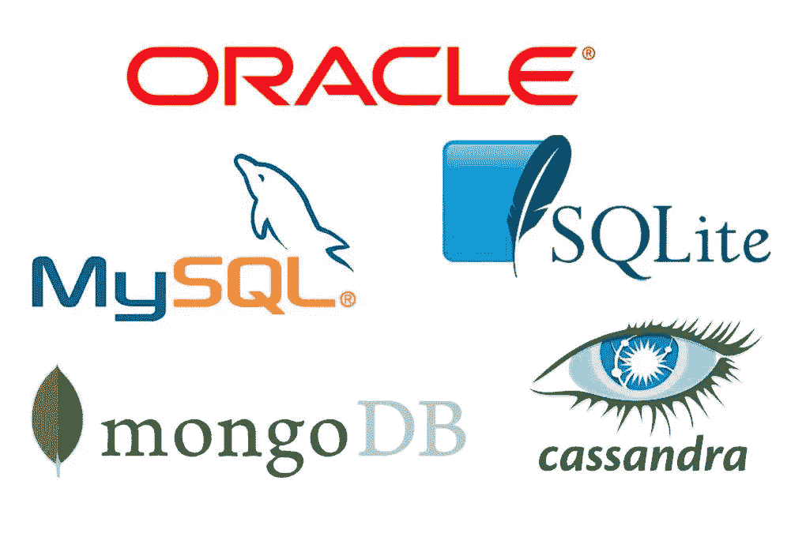

# 您应该了解的 5 个数据库引擎

> 原文：<https://medium.com/codex/5-database-engines-you-should-know-about-a6d88f280a2e?source=collection_archive---------26----------------------->

## 我们将讨论不同类型的引擎、它们的使用案例、优缺点等等。

图片来源:[https://feli PE-Garcia 0191 . medium . com/how-do-SQL-database-engines-work-5 eed 0716 a 532](https://felipe-garcia0191.medium.com/how-do-sql-database-engines-work-5eed0716a532)

在进入数据库引擎的世界之前，让我们先了解一下，**什么是数据库引擎？**

简单来说，就是软件**执行 CRUD 操作，负责磁盘存储。一些数据库引擎很简单，只负责存储和 CRUD，而复杂的引擎可以提供 ACID 支持和事务等功能。**

它们也被称为**存储引擎。数据库系统在这些数据库引擎上构建特性。**

现在我们知道了什么是数据库引擎，让我们开始讨论吧

# 米沙姆

MyISAM 用 C 语言编写，是 MySQL 的第一个数据库引擎。

*   ISAM 代表索引顺序存取法。在这个引擎中，我们创建的每个**索引都指向一行。**使用 B 树进行索引。
*   由于每个索引指向一行，**读操作很快**。甚至**插入操作也很快，因为我们将新记录附加到文件**的末尾，我们总是知道文件的末尾在哪里。但是，主要问题是更新和删除操作。当我们更新/删除现有的行时，我们改变了行的大小，这改变了偏移量，所有的索引指针都需要改变。这很贵。
*   它不提供事务支持。
*   数据库崩溃损坏了表，必须手动修复。
*   它只提供表级锁定。如果你想隔离，你只需要锁定整个表。

# **InnoDB**

*它取代了 MyISAM 成为 MySQL 和 MariaDB 的默认数据库引擎。*

*   在这个引擎中，B+树用于索引。每个索引指向一个主键，每个主键指向一行。如果没有主键，引擎会为您创建一个。
*   它支持事务，因此实现了 ACID 特性。
*   它还允许行级锁定，因此您不需要锁定整个表。这使得查询处理速度更快。
*   它还引入了许多新特性，比如外键、表空间和空间操作。

# SQLite

它由德韦恩·理查德·希普设计，用 C 语言编写

图片来源:[https://commons.wikimedia.org/wiki/File:SQLite370.svg](https://commons.wikimedia.org/wiki/File:SQLite370.svg)

它是使用最广泛的嵌入式数据库之一，用于 web 浏览器、移动应用程序、操作系统等。

*   它使用 B 树进行索引。
*   它允许所有的酸性特征
*   它允许表级锁定。它不需要行级锁定，因为它通常在本地使用，并且只有一个用户。
*   它允许并发读取和写入。

# LevelDB

它由两位谷歌工程师 Jeffery Dean 和 Sanjay Ghemawat 设计，用 C++语言编写。它的灵感来自于 Google BigTable。

*   它是 T2，而不是 SQL 数据库。它没有关系数据库模型，也不支持 SQL 查询。
*   它使用了**日志结构的合并树来索引**。它对高插入量非常有效**。(与 B 树不同，B 树可能需要在插入后重新平衡自身，这会使插入操作变慢)**
*   它不允许交易。
*   它是单线程的
*   文件有不同的级别，随着文件变大，级别也会合并。
*   它们还支持预写日志，以确保持久性。

# RocksDB

它是谷歌 LevelDB 的一个分支，由脸书进一步开发。它被用作 MySQL、MariaDB 和 Percona 的 MyRocks。它也被 MongoRocks 用于 MongoDB。

**与 LevelDB** 的相似性

*   它还使用日志结构的合并树
*   它也是键值对存储，不支持 SQL 查询。

**RocksDB 新增功能**

*   它允许交易。
*   它还使用多线程来提高性能。
*   其他功能包括地理空间索引、布隆过滤器、合并运算符等。