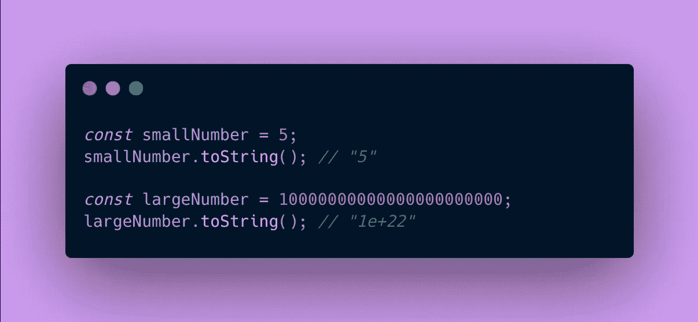
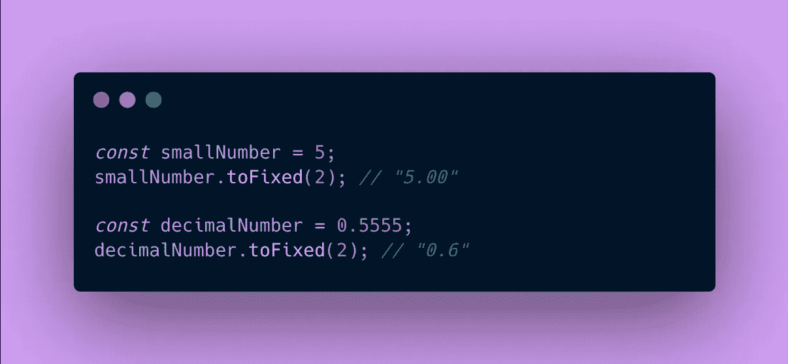
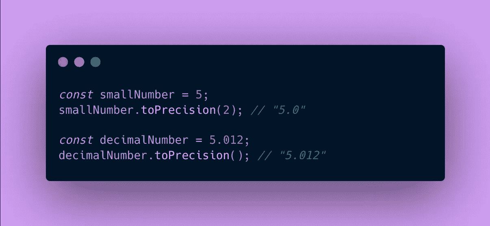
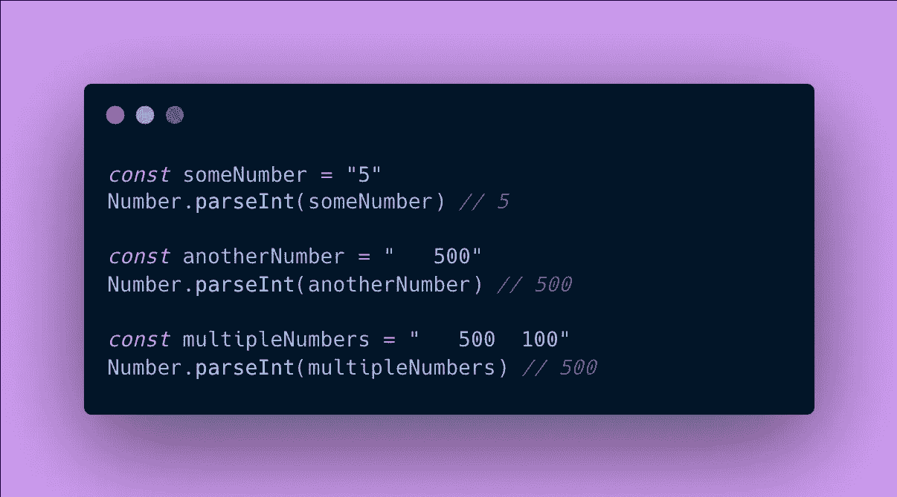
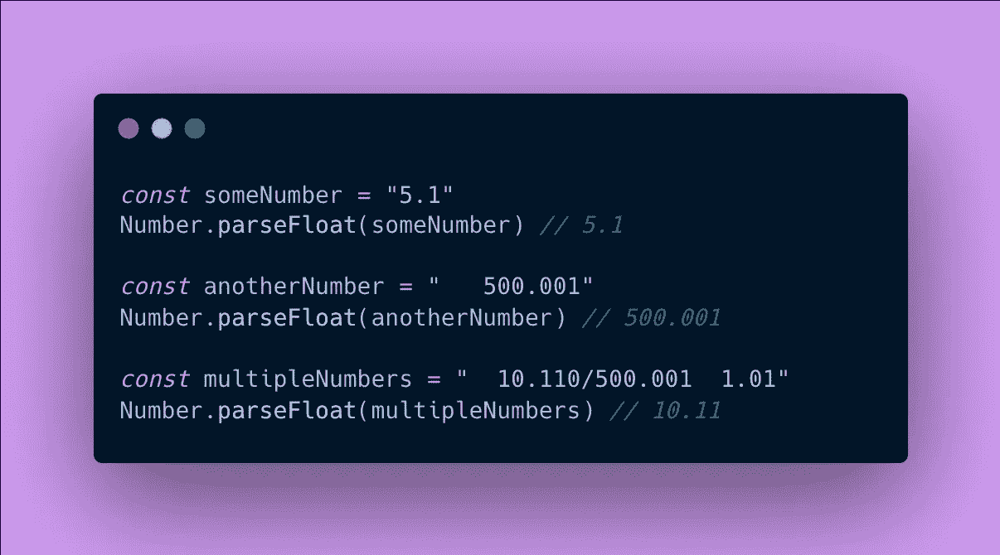

# 5 个必不可少的 JS 数字学习方法

> 原文：<https://medium.com/codex/5-essential-js-number-methods-to-learn-16d19434951f?source=collection_archive---------19----------------------->

图片来自 [Pixabay](https://pixabay.com//?utm_source=link-attribution&amp;utm_medium=referral&amp;utm_campaign=image&amp;utm_content=2124515) 的 [Prawny](https://pixabay.com/users/prawny-162579/?utm_source=link-attribution&amp;utm_medium=referral&amp;utm_campaign=image&amp;utm_content=2124515)

在 Javascript 中，数组、数字和日期等常用对象都有强大的内置方法。由于这个事实，在大多数情况下，我们不需要重新发明轮子。一个**数字**通常是每个程序员接触到的第一个对象(例如 1，2，3.3，4，-1)。以下是 Number 对象的常用方法。

## 数字方法

**1。toString()**

将数字转换为字符串。对于大于 21 位的整数，用科学记数法表示(如 1e+22)。

**2。toFixed( *位数* )**

固定小数点后出现的位数，并将其转换为字符串。如果`digits` 参数未指定，则默认设置为 0。

**3。top precision(*精度* )**

固定出现的总位数，并将其转换为字符串(不包括实际的小数)。

如果`precision` 参数未指定，默认输出将与 *toString()* 相同。

**4。parseInt( *字符串* )**

将字符串转换为整数。忽略数字字符串前的空格。该函数转换检测到的第一个整数，并忽略非整数字符之后的所有字符(如空格、小数、逗号等)。

与其他方法不同，要使用这种方法，我们使用`Number`后跟`.`。此外，还有一个名为`radix`的可选参数，但现在让我们忽略它。

**5。parseFloat()**

将字符串转换为包含小数的浮点数。忽略数字前的空格。和 *parseInt()* 一样，只转换第一个浮点字符串。

## 密码

## 结论

请随意复制和粘贴下面的代码，并尝试输入和输出。例如，像上面的例子中的 *toString()* 一样，有些数字太大了，无法用 number 对象来表示(例如 9007199254740993)。在这种情况下，使用 [*BigInt*](https://developer.mozilla.org/en-US/docs/Web/JavaScript/Reference/Global_Objects/BigInt) 。有机会一定要掌握这些数字方法的来龙去脉！