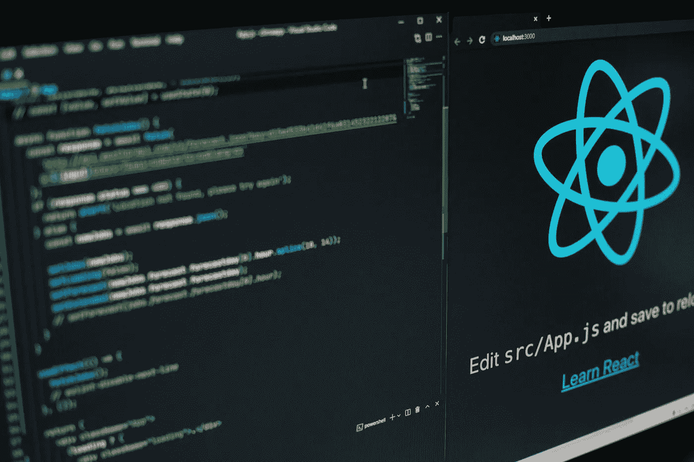

# 我离不开的 5 个伟大的 Javascript 库

> 原文：<https://medium.com/codex/5-great-javascript-libraries-i-cannot-live-without-222829ccae3d?source=collection_archive---------5----------------------->

## 从新技术到解决老问题。

由[劳塔罗·安德烈亚尼](https://unsplash.com/@lautaroandreani?utm_source=unsplash&utm_medium=referral&utm_content=creditCopyText)在 [Unsplash](https://unsplash.com/s/photos/javascript?utm_source=unsplash&utm_medium=referral&utm_content=creditCopyText) 上拍摄的照片

到现在为止，我喜欢用 Javascript 开发我的应用程序已经不是什么秘密了，无论是移动应用程序、dApp 还是简单的网站，每当我遇到特定的问题时，总有几个库是我忠实使用的。

本文将介绍这些库，它们解决的问题，在一些情况下，我还会列出一些替代方案。享受吧。

# 1.Axios

Axios 是目前为止我最喜欢的 HTTP 请求库。它是基于承诺的，这在处理这类请求时非常有用。它可以在前端或后端内部的任何地方使用。它允许非常简单的请求，比如简单的 GET，或者需要身份验证和主体的复杂请求。

# 2.NextJS

对于我的粉丝来说，这也不是什么新鲜事。它是一个用 React 实现 [JAMstack](https://jamstack.org/) 架构的库。类似于 NuxtJS 用于 Vue 或 GatsbyJS 也用于 React。

它只需要很少的开销，并且有大量的选项供您解决问题。由于 React 的实现，实现 API 或拥有复杂的视图结构非常容易，并且由于 JAMstack 架构，保持非常安全是非常容易的。

# 3.Web3

[Web3JS](https://web3js.readthedocs.io/en/v1.5.2/) 是*任何 dApps 的*基本库。连接区块链、发送事务、实现合同功能以及使用它们非常容易。它允许使用大量的选项。它允许基于承诺的契约交互，这在处理异步操作时非常有用。

# 4.洛达什

[Lodash](https://lodash.com/docs/4.17.15) 是一个非常有用的实用程序库，它可能拥有你在处理数组、对象或字符串时所需要的一切。这个库最大的优点是惊人的文档。虽然有些函数名一开始有点奇怪，但是文档会通过提供一个很棒的、最小的例子让你立刻知道这个函数是做什么的。

# 5.尾翼 CSS

[Tailwind](https://tailwindcss.com/) 是一个像 Bootstrap 或 Foundation 一样伟大的造型库，但是有更多的选项和创新。想要实现黑暗模式吗？足以把你的文本变成白色，只需要一个简单的前置就可以实现很好的响应和惊人的用户体验。

与其说它是一个 Javascript 库，不如说它更多地被用于样式化，但是它有很好的特性，比如黑暗模式、简单的动画和大量的优化，它也可以很容易地减少 Javascript 文件的大小。

# 结论

我是一个相当简单的程序员，我倾向于使用更大的库来解决我不想处理的问题，但是当我自己可以轻松地创建一些东西时，我会在检查 NPM 的任何库之前做它。

非常感谢你的阅读，祝你有美好的一天。

[支持我，支持 Medium，成为会员](https://mbvissers.medium.com/membership)。它帮了我很大的忙，它不会额外花费你，你可以阅读尽可能多的中等文章！

[在 Twitter 上关注我](https://twitter.com/0xmbvissers)跟上我。

点击这里查看我最新的 NFT 收藏。