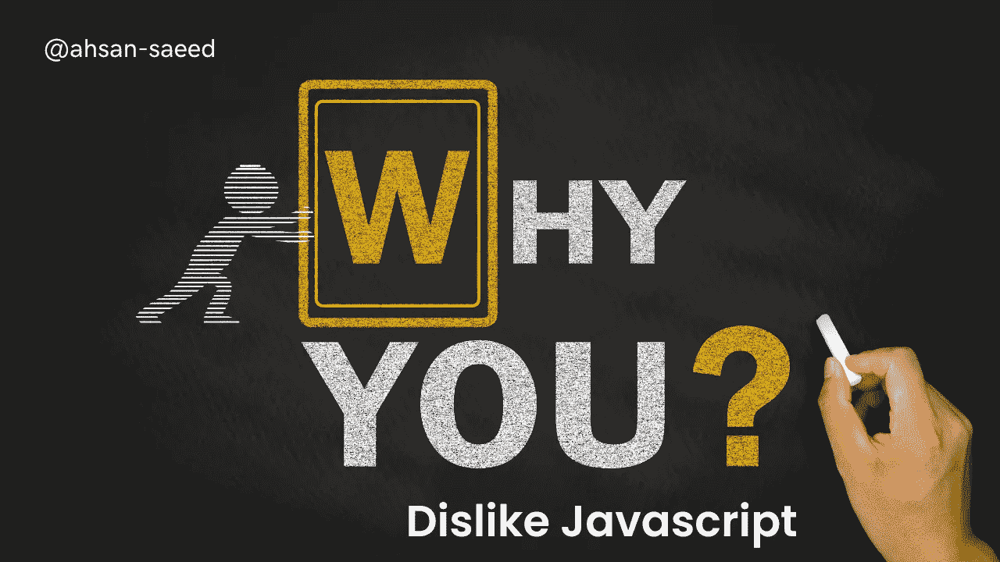

# 你可能不喜欢 JavaScript 语言的 5 个重要原因

> 原文：<https://medium.com/codex/5-important-reasons-why-you-may-dislike-javascript-language-6e4cde888323?source=collection_archive---------10----------------------->

您对学习 JavaScript 感兴趣，但是您听到了许多关于该语言的负面消息。你的朋友告诉你 JavaScript 是一种肮脏的语言，你应该学习另一种语言。你可能已经听到人们说他们不喜欢它，因为它很慢或者不支持某些特性。如果这听起来很熟悉，请继续阅读，了解为什么所有这些陈述可能…